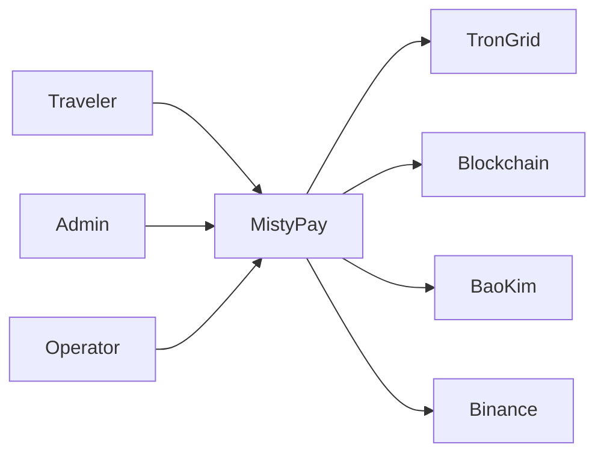
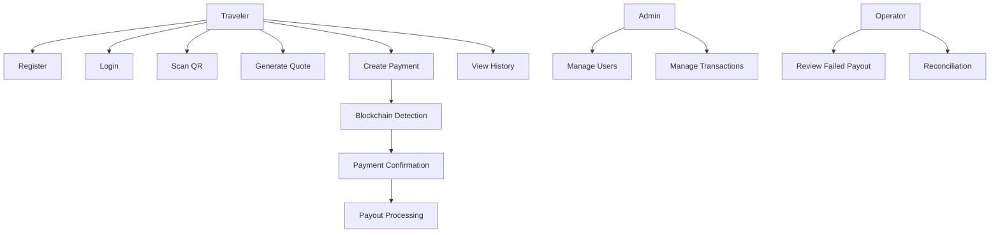

# MistyPay - Use Cases Document

> Version: 1.0
> Status: Draft - MVP Phase
> Product: MistyPay
> Product Owner: Le Vu Bao Nhat
> Last Updated: 2026

---

# 1. Document Purpose

This document defines all use cases for MistyPay MVP.

The objective is to:

- Define system behaviors
- Describe interactions between actors and the system
- Support architecture design
- Support database design
- Support API design
- Improve AI-assisted development accuracy

---

# 2. Actors

## Traveler

Primary application user.

Responsibilities:

- Register account
- Login
- Scan VietQR
- Make payment
- View transaction history
- Manage profile

---

## Admin

System administrator.

Responsibilities:

- Manage users
- Manage transactions
- Manage exchange rates
- Monitor platform health

---

## Operator

Operations staff.

Responsibilities:

- Monitor payouts
- Handle payout failures
- Reconcile transactions
- Resolve payment disputes

---

## External Systems

### Blockchain Network

Responsibilities:

```text
Receive USDT
Confirm Transactions
Provide Transaction Status
```

---

### TronGrid

Responsibilities:

```text
Monitor Wallet Activity
Read Blockchain Data
Verify Transactions
```

---

### PayOS / BaoKim

Responsibilities:

```text
Process Merchant Payout
Return Payout Status
```

---

### Binance Rate Provider

Responsibilities:

```text
Provide USDT/VND Exchange Rate
```

---

# 3. System Context Diagram



---

# 4. Traveler Use Cases

---

# UC-001 Register Account

## Goal

Allow new users to create an account.

---

## Primary Actor

Traveler

---

## Preconditions

```text
User does not have an account
```

---

## Main Flow

```text
1. Open Register Screen
2. Enter Email
3. Enter Password
4. Confirm Password
5. Select Country
6. Submit Registration
7. System Validates Data
8. Account Created
9. Redirect To Login
```

---

## Alternative Flows

### Email Already Exists

```text
1. User Submits Registration
2. System Detects Existing Email
3. Display Error
```

---

## Postconditions

```text
User Account Created
```

---

# UC-002 Login

## Goal

Allow user access to the platform.

---

## Primary Actor

Traveler

---

## Preconditions

```text
Account Exists
```

---

## Main Flow

```text
1. Open Login Screen
2. Enter Email
3. Enter Password
4. Submit Login
5. Validate Credentials
6. Generate Session
7. Redirect Home
```

---

## Alternative Flows

### Invalid Credentials

```text
Display Login Error
```

---

## Postconditions

```text
User Logged In
```

---

# UC-003 Forgot Password

## Goal

Recover account access.

---

## Primary Actor

Traveler

---

## Main Flow

```text
1. Select Forgot Password
2. Enter Email
3. Receive OTP
4. Verify OTP
5. Enter New Password
6. Password Updated
```

---

## Postconditions

```text
Password Updated
```

---

# UC-004 Setup Security PIN

## Goal

Create transaction PIN.

---

## Primary Actor

Traveler

---

## Main Flow

```text
1. Open Security Settings
2. Create PIN
3. Confirm PIN
4. Save PIN
```

---

## Postconditions

```text
PIN Activated
```

---

# UC-005 Scan VietQR

## Goal

Read merchant payment information.

---

## Primary Actor

Traveler

---

## Preconditions

```text
User Logged In
```

---

## Main Flow

```text
1. Open Scanner
2. Scan VietQR
3. System Parses QR
4. Extract Merchant Data
5. Display Merchant Information
```

---

## Alternative Flows

### Invalid QR

```text
Display Invalid QR Message
```

---

### Unsupported QR

```text
Display Unsupported QR Message
```

---

## Postconditions

```text
Merchant Data Loaded
```

---

# UC-006 Generate Payment Quote

## Goal

Calculate payment amount in USDT.

---

## Primary Actor

Traveler

---

## Preconditions

```text
Merchant Data Loaded
```

---

## Main Flow

```text
1. Enter VND Amount
2. Request Exchange Rate
3. Calculate Fees
4. Generate Quote
5. Display Quote
```

---

## Alternative Flows

### Rate Service Unavailable

```text
Display Service Error
```

---

## Postconditions

```text
Quote Created
```

---

# UC-007 Create Payment Order

## Goal

Create blockchain payment order.

---

## Primary Actor

Traveler

---

## Preconditions

```text
Valid Quote Exists
```

---

## Main Flow

```text
1. Review Quote
2. Confirm Payment
3. Enter PIN
4. Validate PIN
5. Create Order
6. Generate Wallet Address
7. Display Payment Instructions
```

---

## Alternative Flows

### Invalid PIN

```text
Display PIN Error
```

---

## Postconditions

```text
Order Created
Status = WAITING_PAYMENT
```

---

# UC-008 Complete Payment

## Goal

Send USDT to MistyPay.

---

## Primary Actor

Traveler

---

## Preconditions

```text
Payment Order Exists
```

---

## Main Flow

```text
1. Transfer USDT
2. Blockchain Detects Transaction
3. System Verifies Payment
4. Payment Confirmed
```

---

## Alternative Flows

### Wrong Amount

```text
Flag Transaction
Require Manual Review
```

---

### Payment Timeout

```text
Order Expired
```

---

## Postconditions

```text
Payment Confirmed
```

---

# UC-009 View Transaction History

## Goal

View previous transactions.

---

## Primary Actor

Traveler

---

## Main Flow

```text
1. Open History
2. View Transaction List
3. Select Transaction
4. View Details
```

---

## Postconditions

```text
Transaction Information Displayed
```

---

# UC-010 Update Profile

## Goal

Manage user profile.

---

## Primary Actor

Traveler

---

## Main Flow

```text
1. Open Profile
2. Edit Information
3. Save Changes
```

---

## Postconditions

```text
Profile Updated
```

---

# 5. Payment Processing Use Cases

---

# UC-011 Detect Blockchain Transaction

## Goal

Identify incoming payment.

---

## Primary Actor

TronGrid

---

## Main Flow

```text
1. Monitor Wallet
2. Detect Transaction
3. Read Transaction Data
4. Validate Payment
5. Update Status
```

---

## Postconditions

```text
PAYMENT_DETECTED
```

---

# UC-012 Confirm Blockchain Payment

## Goal

Confirm valid payment.

---

## Primary Actor

System

---

## Preconditions

```text
Transaction Detected
```

---

## Main Flow

```text
1. Verify Amount
2. Verify Wallet
3. Verify Order
4. Mark Payment Confirmed
```

---

## Postconditions

```text
PAYMENT_CONFIRMED
```

---

# UC-013 Process Merchant Payout

## Goal

Transfer VND to merchant.

---

## Primary Actor

System

---

## Secondary Actor

BaoKim / PayOS

---

## Preconditions

```text
Payment Confirmed
```

---

## Main Flow

```text
1. Create Payout Request
2. Submit To BaoKim
3. Process Payout
4. Receive Result
5. Update Status
```

---

## Alternative Flows

### Payout Failure

```text
Mark Payout Failed
Notify Operator
```

---

## Postconditions

```text
Merchant Receives VND
```

---

# 6. Admin Use Cases

---

# UC-014 View Dashboard

## Goal

Monitor system activity.

---

## Primary Actor

Admin

---

## Main Flow

```text
1. Login
2. Open Dashboard
3. View Metrics
```

---

## Dashboard Metrics

```text
Users
Transactions
Volume
Success Rate
```

---

# UC-015 Manage Users

## Goal

Administer user accounts.

---

## Primary Actor

Admin

---

## Main Flow

```text
1. Search User
2. View Profile
3. Suspend User
4. Reactivate User
```

---

# UC-016 Manage Transactions

## Goal

Review platform transactions.

---

## Primary Actor

Admin

---

## Main Flow

```text
1. Search Transaction
2. View Details
3. Review Status
```

---

# UC-017 Manage Exchange Rate

## Goal

Control displayed rates.

---

## Primary Actor

Admin

---

## Main Flow

```text
1. View Current Rate
2. Override Rate
3. Save Changes
```

---

# 7. Operator Use Cases

---

# UC-018 Review Failed Payout

## Goal

Handle payout failures.

---

## Primary Actor

Operator

---

## Main Flow

```text
1. Open Failed Payout Queue
2. Select Transaction
3. Investigate Error
4. Retry Payout
```

---

## Postconditions

```text
Payout Resolved
```

---

# UC-019 Reconciliation

## Goal

Verify platform balances.

---

## Primary Actor

Operator

---

## Main Flow

```text
1. Compare USDT Received
2. Compare VND Paid Out
3. Identify Differences
4. Generate Report
```

---

# 8. Use Case Relationship Diagram



---

# 9. MVP Use Cases Summary

## Traveler

```text
UC-001 Register
UC-002 Login
UC-003 Forgot Password
UC-004 Setup PIN
UC-005 Scan QR
UC-006 Generate Quote
UC-007 Create Payment Order
UC-008 Complete Payment
UC-009 View Transaction History
UC-010 Update Profile
```

---

## Admin

```text
UC-014 Dashboard
UC-015 Manage Users
UC-016 Manage Transactions
UC-017 Manage Exchange Rates
```

---

## Operator

```text
UC-018 Review Failed Payout
UC-019 Reconciliation
```

---

# 10. Future Use Cases (Post-MVP)

Not included in MVP:

```text
Merchant Registration
Merchant Dashboard
Referral Program
Cashback Program
Loyalty Program
Travel Services
Multi-Country Settlement
```

These use cases will be documented in future releases.
