# MistyPay - User Flow Document

> Version: 1.0
> Status: Draft - MVP Phase
> Product: MistyPay
> Product Owner: Le Vu Bao Nhat
> Last Updated: 2026

---

# 1. Document Purpose

This document describes all user interaction flows within MistyPay MVP.

The objective is to:

- Define user journeys
- Standardize application behavior
- Support UI/UX design
- Support backend implementation
- Improve AI-assisted development accuracy

---

# 2. User Roles

## Traveler

Primary user of MistyPay.

Responsibilities:

- Register account
- Login
- Scan VietQR
- Create payment
- View transaction history
- Manage profile

---

## Admin

System administrator.

Responsibilities:

- Monitor system
- Manage transactions
- Manage rates
- Manage users

---

## Operator

Operations staff.

Responsibilities:

- Handle payout failures
- Handle payment disputes
- Monitor settlement process

---

# 3. Application Entry Flow

## Objective

Allow users to access the application securely.

---

## Flow Diagram

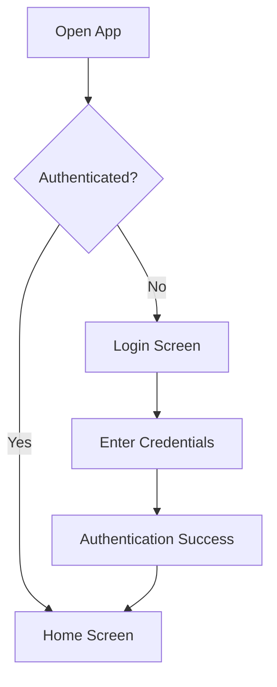

---

# 4. User Registration Flow

## Objective

Allow new users to create an account.

---

## Flow Diagram

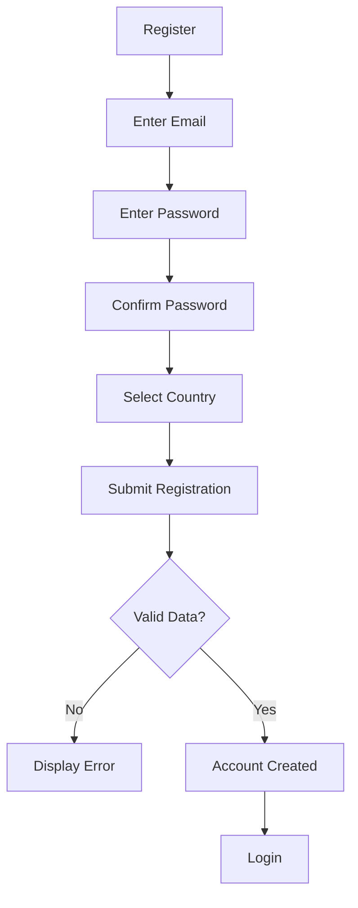

---

# 5. User Login Flow

## Objective

Allow users to access their accounts.

---

## Flow Diagram

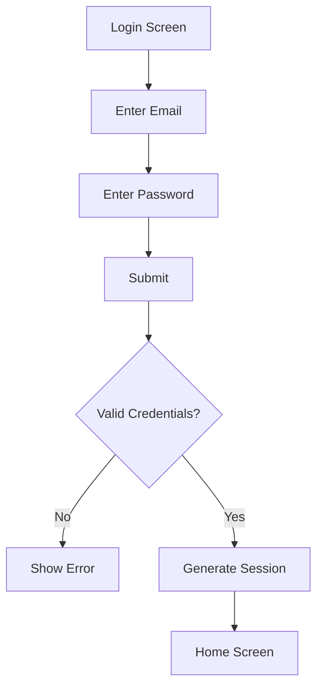

---

# 6. Forgot Password Flow

## Objective

Allow users to recover access.

---

## Flow Diagram

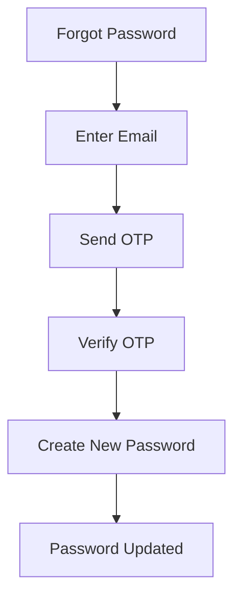

---

# 7. Home Screen Flow

## Objective

Provide quick access to core features.

---

## Available Actions

```text
Scan QR
History
Profile
```

---

## Flow Diagram

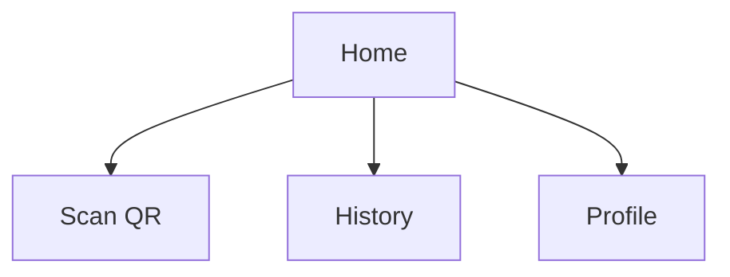

---

# 8. QR Payment Flow

## Objective

Allow travelers to pay Vietnamese merchants.

---

## High-Level Flow

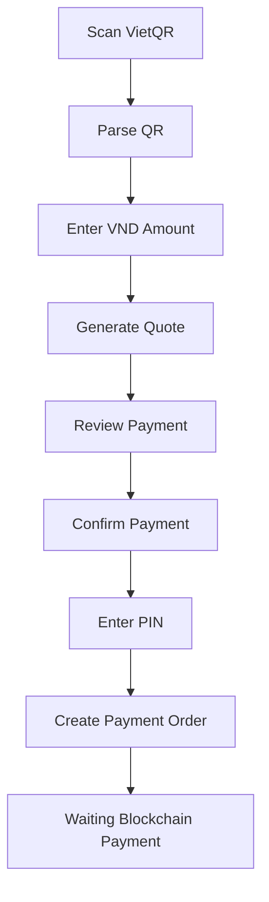

---

# 9. QR Parsing Flow

## Objective

Extract merchant information from QR.

---

## Flow Diagram

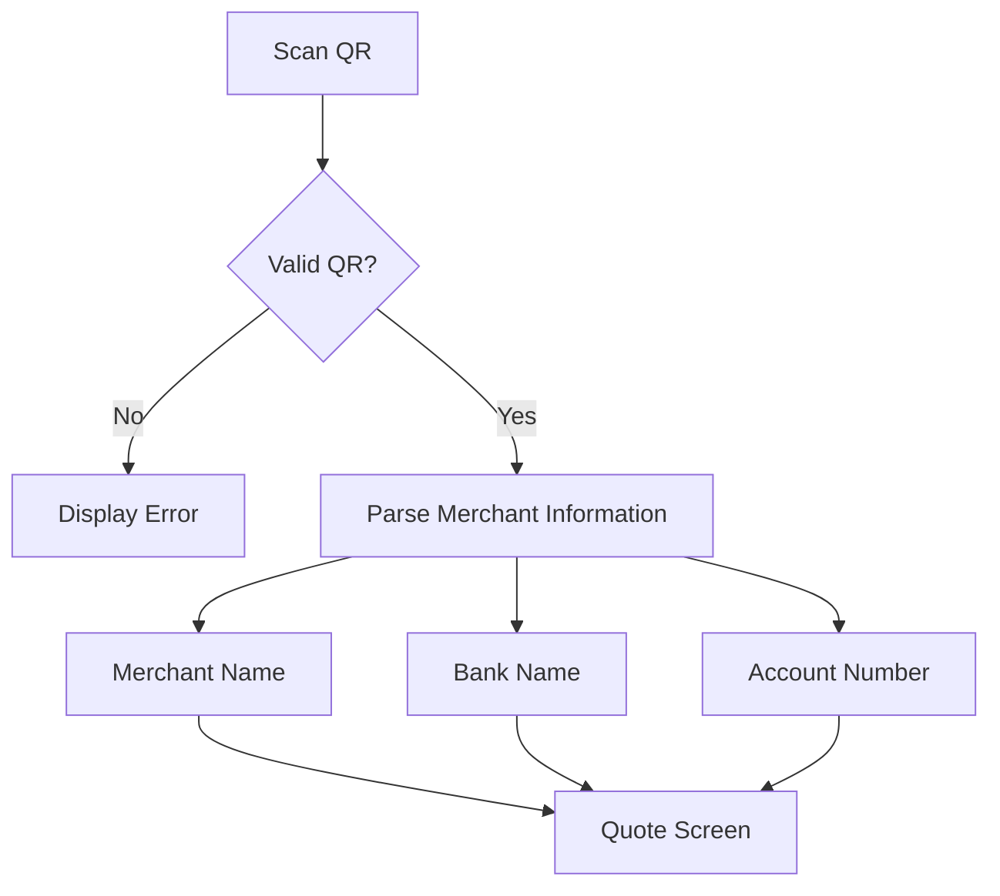

---

# 10. Payment Quote Flow

## Objective

Generate payment amount in USDT.

---

## Flow Diagram

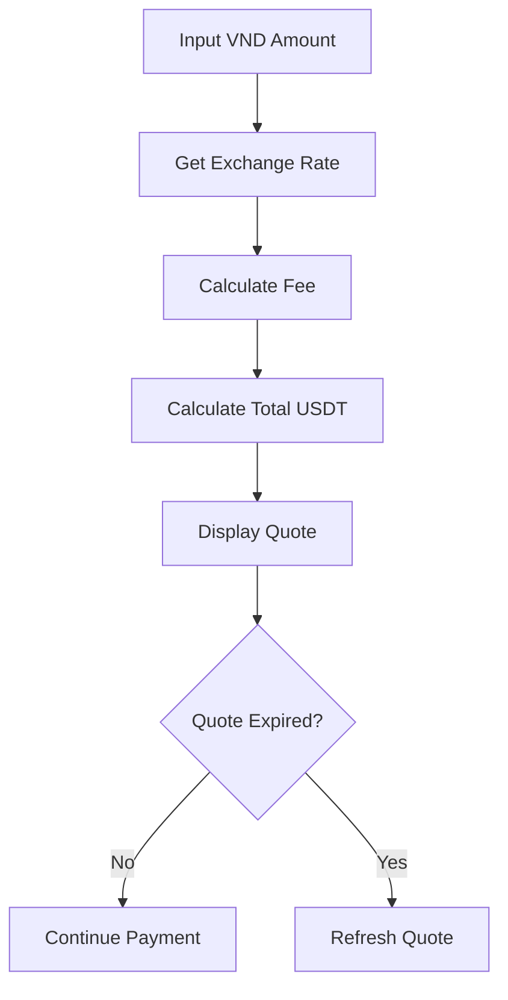

---

# 11. Payment Confirmation Flow

## Objective

Confirm payment intent.

---

## Flow Diagram

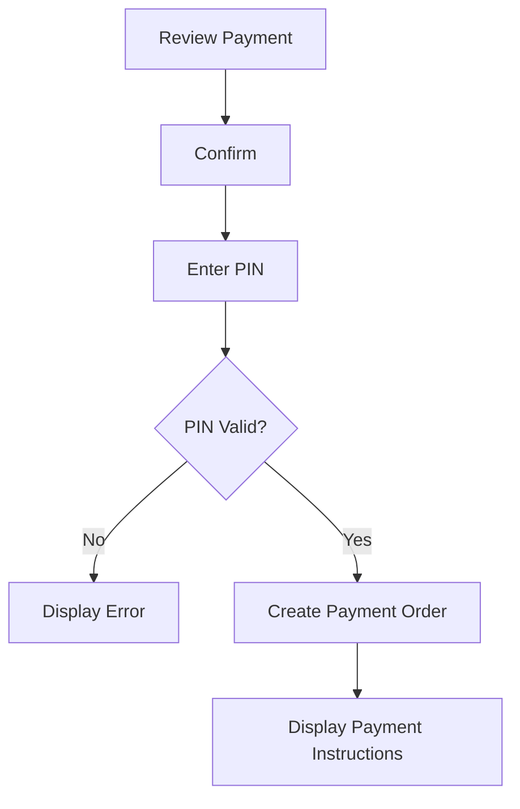

---

# 12. Blockchain Payment Flow

## Objective

Receive USDT from traveler.

---

## Flow Diagram

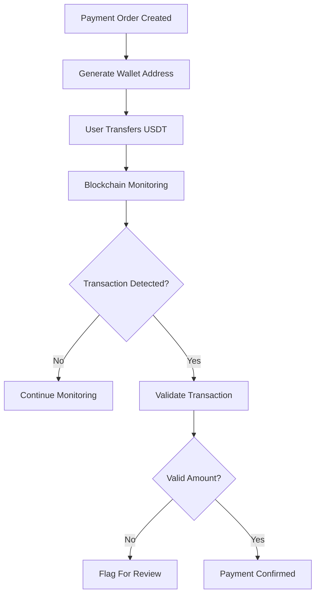

---

# 13. Payout Flow

## Objective

Send VND to merchant.

---

## Flow Diagram

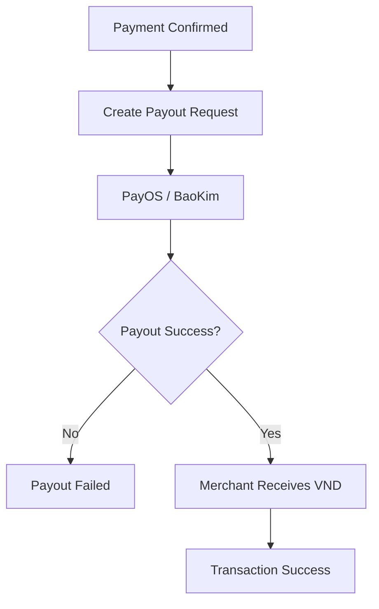

---

# 14. Complete Transaction Flow

## End-To-End User Journey

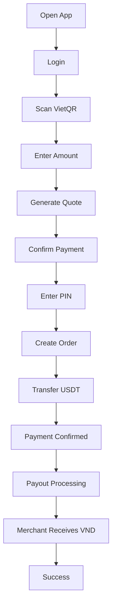

---

# 15. Transaction History Flow

## Objective

Allow users to view past payments.

---

## Flow Diagram

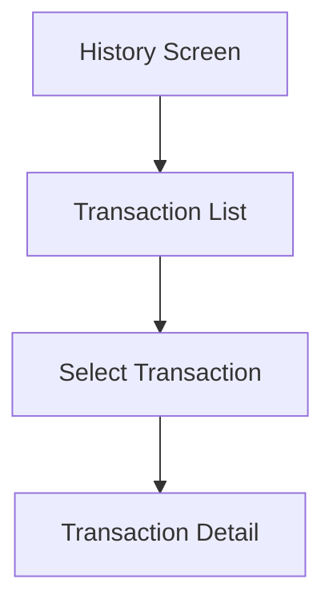

---

# 16. Transaction Detail Flow

## Objective

Display complete transaction information.

---

## Information Displayed

```text
Transaction ID
Merchant Name
Bank
VND Amount
USDT Amount
Rate
Fee
Status
Created Time
Completed Time
```

---

## Flow Diagram

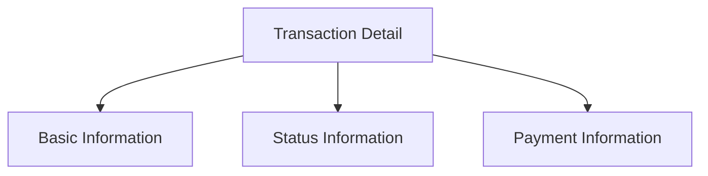

---

# 17. Profile Flow

## Objective

Allow users to manage account settings.

---

## Flow Diagram

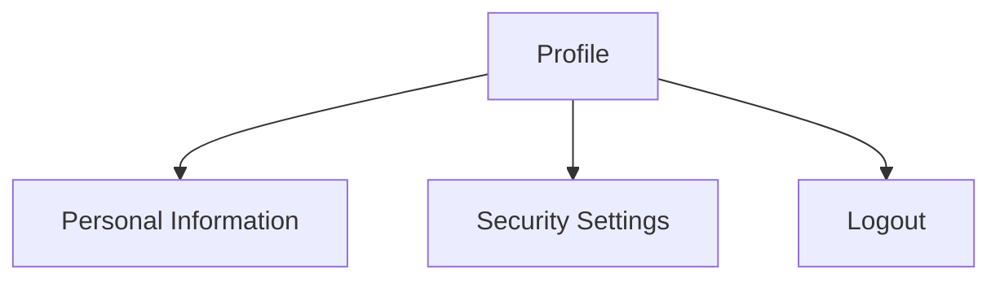

---

# 18. Security Flow

## Change Password

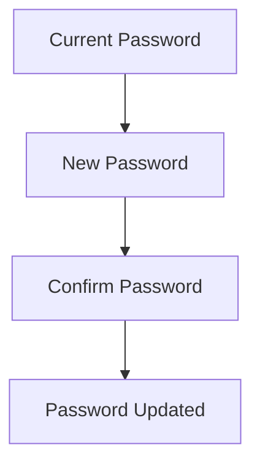

---

## Change PIN

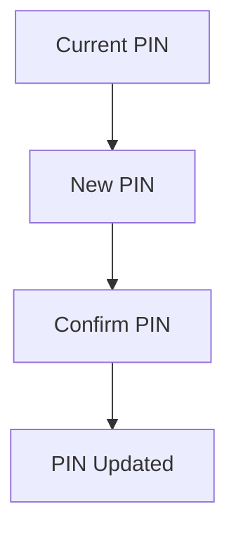

---

# 19. Error Handling Flows

## Invalid QR

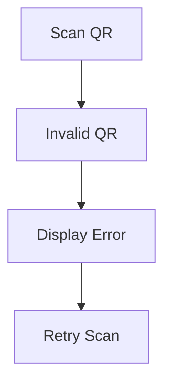

---

## Payment Timeout

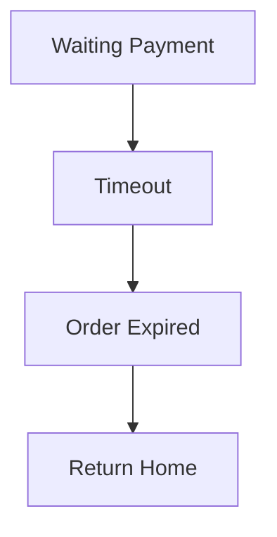

---

## Payout Failure

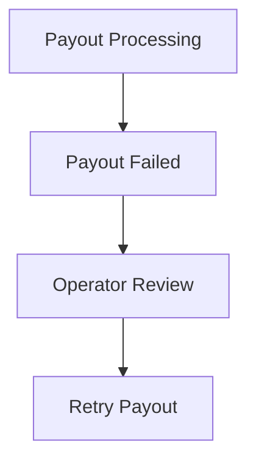

---

# 20. MVP User Flows Summary

## Traveler Flows

```text
Register
Login
Forgot Password
Scan QR
Create Payment
View History
Manage Profile
```

---

## Admin Flows

```text
Manage Users
Manage Transactions
Manage Rates
View Dashboard
```

---

## Operator Flows

```text
Review Failed Payments
Review Failed Payouts
Retry Payout
Reconciliation
```

---

# 21. Future Flows (Post-MVP)

Not included in MVP:

```text
Referral Program
Merchant Portal
Cashback
Loyalty Program
Travel Marketplace
eSIM Purchase
Hotel Booking
Multi-Country Payments
```

These flows will be defined in future versions after MVP validation.
