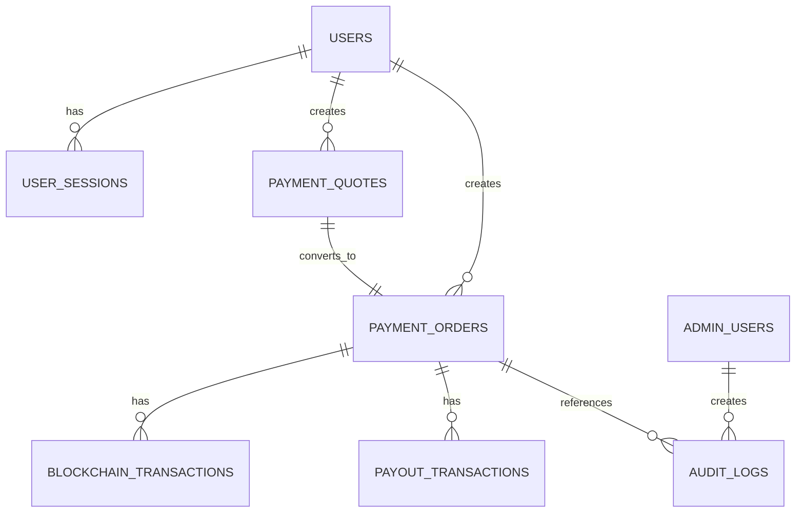

# MistyPay - Database Design Document

> Version: 1.0
> Status: Draft - MVP Phase
> Product: MistyPay
> Product Owner: Le Vu Bao Nhat
> Last Updated: 2026

---

# 1. Document Purpose

This document defines the initial database design for MistyPay MVP.

Objectives:

- Define core database tables
- Define relationships between entities
- Support backend development
- Support API design
- Support transaction processing
- Support AI-assisted development

---

# 2. Database Technology

## Primary Database

```text
PostgreSQL
```

## Reason

```text
Reliable
Relational
Transaction-safe
Good for financial data
Easy to scale for MVP
```

---

# 3. Design Principles

## P1. Transaction Safety

Payment, payout, and blockchain data must be stored with clear status tracking.

---

## P2. Auditability

Important actions must be traceable.

---

## P3. Separation of Concerns

Do not store all payment data in one table.

Separate:

```text
Quote
Payment Order
Blockchain Transaction
Payout Transaction
Audit Log
```

---

# 4. High-Level ERD



---

# 5. Core Tables

## 5.1 users

Stores traveler account information.

```sql
CREATE TABLE users (
  id UUID PRIMARY KEY,
  email VARCHAR(255) UNIQUE NOT NULL,
  password_hash TEXT NOT NULL,
  display_name VARCHAR(255),
  country VARCHAR(100),
  status VARCHAR(50) NOT NULL DEFAULT 'ACTIVE',
  pin_hash TEXT,
  created_at TIMESTAMP NOT NULL DEFAULT NOW(),
  updated_at TIMESTAMP NOT NULL DEFAULT NOW()
);
```

### Status Values

```text
ACTIVE
SUSPENDED
DELETED
```

---

## 5.2 user_sessions

Stores refresh/session information.

```sql
CREATE TABLE user_sessions (
  id UUID PRIMARY KEY,
  user_id UUID NOT NULL REFERENCES users(id),
  refresh_token_hash TEXT NOT NULL,
  device_id VARCHAR(255),
  device_name VARCHAR(255),
  ip_address VARCHAR(100),
  expires_at TIMESTAMP NOT NULL,
  created_at TIMESTAMP NOT NULL DEFAULT NOW()
);
```

---

## 5.3 admin_users

Stores admin/operator accounts.

```sql
CREATE TABLE admin_users (
  id UUID PRIMARY KEY,
  email VARCHAR(255) UNIQUE NOT NULL,
  password_hash TEXT NOT NULL,
  role VARCHAR(50) NOT NULL,
  status VARCHAR(50) NOT NULL DEFAULT 'ACTIVE',
  created_at TIMESTAMP NOT NULL DEFAULT NOW(),
  updated_at TIMESTAMP NOT NULL DEFAULT NOW()
);
```

### Role Values

```text
ADMIN
OPERATOR
```

---

# 6. Payment Tables

## 6.1 payment_quotes

Stores temporary quote information.

```sql
CREATE TABLE payment_quotes (
  id UUID PRIMARY KEY,
  user_id UUID NOT NULL REFERENCES users(id),

  merchant_bank_code VARCHAR(50),
  merchant_bank_name VARCHAR(255),
  merchant_account_number VARCHAR(100),
  merchant_account_name VARCHAR(255),

  amount_vnd NUMERIC(18, 2) NOT NULL,
  rate_usdt_vnd NUMERIC(18, 6) NOT NULL,
  service_fee_usdt NUMERIC(18, 6) NOT NULL DEFAULT 0,
  network_fee_usdt NUMERIC(18, 6) NOT NULL DEFAULT 0,
  total_usdt NUMERIC(18, 6) NOT NULL,

  status VARCHAR(50) NOT NULL DEFAULT 'QUOTE_CREATED',
  expires_at TIMESTAMP NOT NULL,

  created_at TIMESTAMP NOT NULL DEFAULT NOW(),
  updated_at TIMESTAMP NOT NULL DEFAULT NOW()
);
```

### Status Values

```text
QUOTE_CREATED
QUOTE_EXPIRED
QUOTE_USED
```

---

## 6.2 payment_orders

Stores main payment order.

```sql
CREATE TABLE payment_orders (
  id UUID PRIMARY KEY,
  user_id UUID NOT NULL REFERENCES users(id),
  quote_id UUID NOT NULL REFERENCES payment_quotes(id),

  order_code VARCHAR(100) UNIQUE NOT NULL,

  amount_vnd NUMERIC(18, 2) NOT NULL,
  required_usdt NUMERIC(18, 6) NOT NULL,
  received_usdt NUMERIC(18, 6) DEFAULT 0,

  merchant_bank_code VARCHAR(50),
  merchant_bank_name VARCHAR(255),
  merchant_account_number VARCHAR(100),
  merchant_account_name VARCHAR(255),

  payment_status VARCHAR(50) NOT NULL DEFAULT 'WAITING_USDT',
  payout_status VARCHAR(50),
  final_status VARCHAR(50),

  expires_at TIMESTAMP NOT NULL,
  completed_at TIMESTAMP,

  created_at TIMESTAMP NOT NULL DEFAULT NOW(),
  updated_at TIMESTAMP NOT NULL DEFAULT NOW()
);
```

### Payment Status Values

```text
WAITING_USDT
USDT_DETECTED
USDT_CONFIRMED
UNDERPAID
OVERPAID
EXPIRED
```

### Payout Status Values

```text
PAYOUT_PENDING
PAYOUT_PROCESSING
PAYOUT_SUCCESS
PAYOUT_FAILED
```

### Final Status Values

```text
SUCCESS
FAILED
REFUND_REQUIRED
CANCELLED
MANUAL_REVIEW
```

---

# 7. Blockchain Tables

## 7.1 blockchain_transactions

Stores blockchain transaction records.

```sql
CREATE TABLE blockchain_transactions (
  id UUID PRIMARY KEY,
  payment_order_id UUID REFERENCES payment_orders(id),

  network VARCHAR(50) NOT NULL,
  token_symbol VARCHAR(50) NOT NULL,
  tx_hash VARCHAR(255) UNIQUE NOT NULL,
  from_address VARCHAR(255),
  to_address VARCHAR(255) NOT NULL,
  amount NUMERIC(18, 6) NOT NULL,

  block_number BIGINT,
  confirmations INT DEFAULT 0,

  status VARCHAR(50) NOT NULL DEFAULT 'DETECTED',
  detected_at TIMESTAMP NOT NULL DEFAULT NOW(),
  confirmed_at TIMESTAMP,

  raw_payload JSONB,

  created_at TIMESTAMP NOT NULL DEFAULT NOW(),
  updated_at TIMESTAMP NOT NULL DEFAULT NOW()
);
```

### Status Values

```text
DETECTED
CONFIRMED
FAILED
IGNORED
```

---

## 7.2 system_wallets

Stores system wallet configuration.

```sql
CREATE TABLE system_wallets (
  id UUID PRIMARY KEY,
  network VARCHAR(50) NOT NULL,
  token_symbol VARCHAR(50) NOT NULL,
  wallet_address VARCHAR(255) NOT NULL,
  wallet_type VARCHAR(50) NOT NULL,
  status VARCHAR(50) NOT NULL DEFAULT 'ACTIVE',
  created_at TIMESTAMP NOT NULL DEFAULT NOW(),
  updated_at TIMESTAMP NOT NULL DEFAULT NOW()
);
```

### Wallet Type Values

```text
SETTLEMENT
TREASURY
COLD
HOT
```

---

# 8. Payout Tables

## 8.1 payout_transactions

Stores merchant payout information.

```sql
CREATE TABLE payout_transactions (
  id UUID PRIMARY KEY,
  payment_order_id UUID NOT NULL REFERENCES payment_orders(id),

  provider VARCHAR(50) NOT NULL,
  provider_reference VARCHAR(255),

  bank_code VARCHAR(50) NOT NULL,
  bank_name VARCHAR(255),
  account_number VARCHAR(100) NOT NULL,
  account_name VARCHAR(255),

  amount_vnd NUMERIC(18, 2) NOT NULL,

  status VARCHAR(50) NOT NULL DEFAULT 'PAYOUT_PENDING',
  retry_count INT NOT NULL DEFAULT 0,
  error_code VARCHAR(100),
  error_message TEXT,

  requested_at TIMESTAMP,
  completed_at TIMESTAMP,

  raw_request JSONB,
  raw_response JSONB,

  created_at TIMESTAMP NOT NULL DEFAULT NOW(),
  updated_at TIMESTAMP NOT NULL DEFAULT NOW()
);
```

### Provider Values

```text
PAYOS
BAOKIM
```

### Status Values

```text
PAYOUT_PENDING
PAYOUT_PROCESSING
PAYOUT_SUCCESS
PAYOUT_FAILED
```

---

# 9. Rate Tables

## 9.1 rate_snapshots

Stores exchange rate records.

```sql
CREATE TABLE rate_snapshots (
  id UUID PRIMARY KEY,

  base_currency VARCHAR(20) NOT NULL,
  quote_currency VARCHAR(20) NOT NULL,
  rate NUMERIC(18, 6) NOT NULL,

  provider VARCHAR(100) NOT NULL,
  source_payload JSONB,

  created_at TIMESTAMP NOT NULL DEFAULT NOW()
);
```

### Example

```text
Base: USDT
Quote: VND
Rate: 26000
Provider: BINANCE
```

---

# 10. Audit Tables

## 10.1 audit_logs

Stores admin/operator/system actions.

```sql
CREATE TABLE audit_logs (
  id UUID PRIMARY KEY,

  actor_type VARCHAR(50) NOT NULL,
  actor_id UUID,
  action VARCHAR(100) NOT NULL,

  entity_type VARCHAR(100),
  entity_id UUID,

  metadata JSONB,

  ip_address VARCHAR(100),
  user_agent TEXT,

  created_at TIMESTAMP NOT NULL DEFAULT NOW()
);
```

### Actor Type Values

```text
USER
ADMIN
OPERATOR
SYSTEM
```

---

# 11. Notification Tables

## 11.1 notifications

Stores user notifications.

```sql
CREATE TABLE notifications (
  id UUID PRIMARY KEY,
  user_id UUID NOT NULL REFERENCES users(id),

  title VARCHAR(255) NOT NULL,
  message TEXT NOT NULL,
  type VARCHAR(50) NOT NULL,

  is_read BOOLEAN NOT NULL DEFAULT FALSE,

  created_at TIMESTAMP NOT NULL DEFAULT NOW(),
  read_at TIMESTAMP
);
```

### Type Values

```text
PAYMENT
PAYOUT
SYSTEM
SECURITY
```

---

# 12. Important Relationships

## User to Payment Quote

```text
One user can create many quotes.
```

```text
users.id
↓
payment_quotes.user_id
```

---

## Quote to Payment Order

```text
One quote can convert into one payment order.
```

```text
payment_quotes.id
↓
payment_orders.quote_id
```

---

## Payment Order to Blockchain Transaction

```text
One payment order can have one or many blockchain transactions.
```

Reason:

```text
User may send multiple payments
User may underpay then send additional amount
Duplicate payments may happen
```

---

## Payment Order to Payout Transaction

```text
One payment order can have one or many payout attempts.
```

Reason:

```text
Payout retry
Provider timeout
Manual retry
```

---

# 13. Index Recommendations

```sql
CREATE INDEX idx_users_email ON users(email);

CREATE INDEX idx_payment_quotes_user_id ON payment_quotes(user_id);
CREATE INDEX idx_payment_quotes_status ON payment_quotes(status);

CREATE INDEX idx_payment_orders_user_id ON payment_orders(user_id);
CREATE INDEX idx_payment_orders_order_code ON payment_orders(order_code);
CREATE INDEX idx_payment_orders_payment_status ON payment_orders(payment_status);
CREATE INDEX idx_payment_orders_final_status ON payment_orders(final_status);

CREATE INDEX idx_blockchain_tx_hash ON blockchain_transactions(tx_hash);
CREATE INDEX idx_blockchain_payment_order_id ON blockchain_transactions(payment_order_id);

CREATE INDEX idx_payout_payment_order_id ON payout_transactions(payment_order_id);
CREATE INDEX idx_payout_status ON payout_transactions(status);

CREATE INDEX idx_audit_logs_actor ON audit_logs(actor_type, actor_id);
CREATE INDEX idx_audit_logs_entity ON audit_logs(entity_type, entity_id);
```

---

# 14. Data Type Guidelines

## Money

Use:

```text
NUMERIC
```

Do not use:

```text
FLOAT
DOUBLE
```

Reason:

```text
Avoid rounding errors
```

---

## IDs

Use:

```text
UUID
```

Reason:

```text
Harder to guess
Better for distributed systems later
```

---

## Time

Use:

```text
TIMESTAMP WITH TIME ZONE
```

Recommended in actual implementation.

---

# 15. MVP Simplification

For early MVP, the required tables are:

```text
users
payment_quotes
payment_orders
blockchain_transactions
payout_transactions
rate_snapshots
audit_logs
```

Optional MVP tables:

```text
notifications
system_wallets
user_sessions
admin_users
```

---

# 16. Future Tables

Future versions may include:

```text
merchants
merchant_bank_accounts
referrals
promotions
cashback_rewards
kyc_profiles
risk_scores
treasury_balances
settlement_batches
```

---

# 17. Database Summary

## Core Data Groups

```text
User Data
Payment Data
Blockchain Data
Payout Data
Rate Data
Audit Data
Notification Data
```

---

## Most Important Tables

```text
payment_orders
blockchain_transactions
payout_transactions
```

These three tables form the core transaction backbone of MistyPay.
