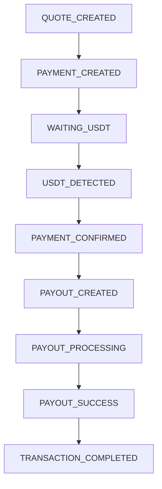
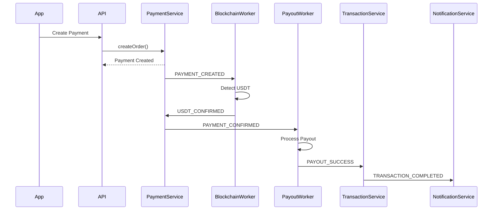
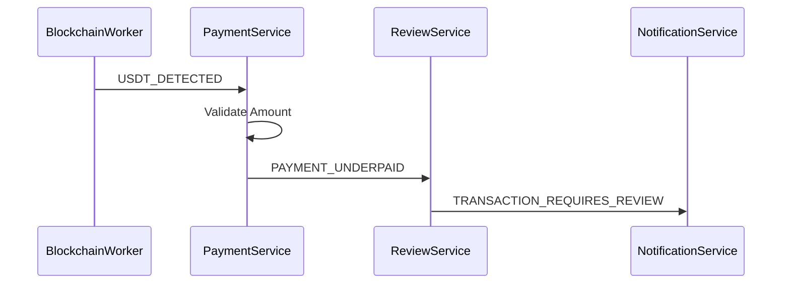
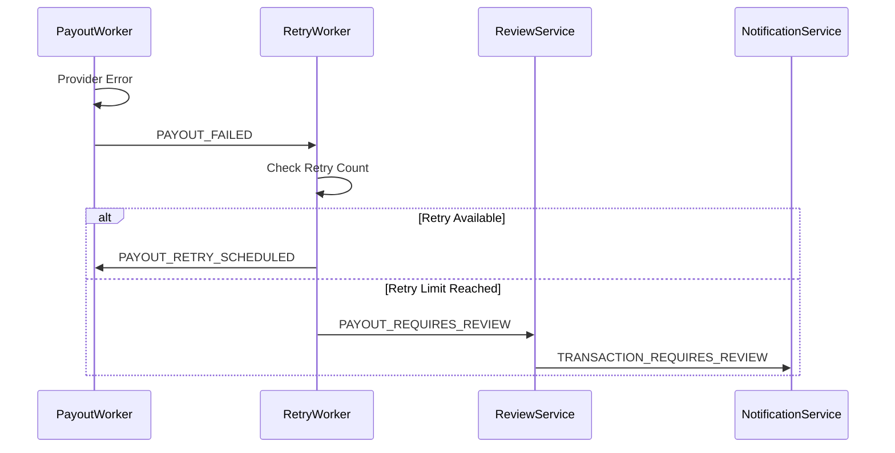

# MistyPay - Event Driven Architecture Document

> Version: 1.0
> Status: Draft - MVP Phase
> Product: MistyPay
> Architecture Style: Modular Monolith + Event-Driven Workers
> Last Updated: 2026

---

# 1. Document Purpose

This document defines the event-driven architecture for MistyPay MVP.

Objectives:

- Define business events
- Define event producers and consumers
- Define async processing rules
- Define queue usage
- Support NestJS + BullMQ implementation
- Reduce payment and payout inconsistency

---

# 2. Why Event-Driven Architecture?

MistyPay contains several asynchronous processes:

```text
Blockchain monitoring
Payment validation
Payout processing
Retry logic
Notifications
Reconciliation
```

These processes should not run directly inside normal API requests.

Instead:

```text
API creates state
↓
Event is emitted
↓
Worker processes event
↓
Database is updated
```

---

# 3. Core Principle

No external money movement should depend only on a frontend request.

For example:

```text
User confirms payment
```

should only create:

```text
Payment Order
```

It should not directly execute payout.

Payout should only happen after:

```text
USDT_CONFIRMED
```

event.

---

# 4. High-Level Event Flow



---

# 5. Core Event List

## Quote Events

```text
QUOTE_CREATED
QUOTE_EXPIRED
QUOTE_USED
```

---

## Payment Events

```text
PAYMENT_CREATED
PAYMENT_EXPIRED
USDT_DETECTED
USDT_CONFIRMED
PAYMENT_UNDERPAID
PAYMENT_OVERPAID
PAYMENT_REQUIRES_REVIEW
```

---

## Payout Events

```text
PAYOUT_CREATED
PAYOUT_PROCESSING
PAYOUT_SUCCESS
PAYOUT_FAILED
PAYOUT_RETRY_SCHEDULED
PAYOUT_REQUIRES_REVIEW
```

---

## Transaction Events

```text
TRANSACTION_COMPLETED
TRANSACTION_FAILED
TRANSACTION_REQUIRES_REVIEW
```

---

## Operational Events

```text
RECONCILIATION_STARTED
RECONCILIATION_COMPLETED
TREASURY_LOW_BALANCE
TREASURY_MISMATCH
```

---

# 6. Event Producers

| Producer              | Events                                                              |
| --------------------- | ------------------------------------------------------------------- |
| Quote Service         | QUOTE_CREATED, QUOTE_EXPIRED, QUOTE_USED                            |
| Payment Service       | PAYMENT_CREATED, PAYMENT_EXPIRED                                    |
| Blockchain Worker     | USDT_DETECTED, USDT_CONFIRMED, PAYMENT_UNDERPAID, PAYMENT_OVERPAID  |
| Payout Worker         | PAYOUT_CREATED, PAYOUT_PROCESSING, PAYOUT_SUCCESS, PAYOUT_FAILED    |
| Reconciliation Worker | RECONCILIATION_STARTED, RECONCILIATION_COMPLETED, TREASURY_MISMATCH |
| Treasury Service      | TREASURY_LOW_BALANCE                                                |

---

# 7. Event Consumers

| Event                 | Consumer                   |
| --------------------- | -------------------------- |
| PAYMENT_CREATED       | Blockchain Worker          |
| USDT_CONFIRMED        | Payout Worker              |
| PAYMENT_UNDERPAID     | Manual Review Service      |
| PAYMENT_OVERPAID      | Manual Review Service      |
| PAYOUT_FAILED         | Payout Retry Worker        |
| PAYOUT_SUCCESS        | Transaction Service        |
| TRANSACTION_COMPLETED | Notification Service       |
| TREASURY_LOW_BALANCE  | Admin Notification Service |
| TREASURY_MISMATCH     | Operator Alert Service     |

---

# 8. Queue Architecture

## Queue Engine

```text
Redis + BullMQ
```

---

## Queues

```text
blockchain_queue
payout_queue
notification_queue
reconciliation_queue
review_queue
```

---

# 9. Queue Responsibility

## blockchain_queue

Processes:

```text
Monitor payment orders
Detect USDT payments
Validate blockchain transactions
```

---

## payout_queue

Processes:

```text
Create payout
Submit payout to provider
Retry failed payout
```

---

## notification_queue

Processes:

```text
Payment status notifications
Success notifications
Failure notifications
```

---

## reconciliation_queue

Processes:

```text
Daily reconciliation
Missing record detection
Treasury matching
```

---

## review_queue

Processes:

```text
Underpaid transactions
Overpaid transactions
Suspicious payments
Expired payments with late USDT
```

---

# 10. Event Payload Standard

All events should follow:

```json
{
  "eventId": "uuid",
  "eventType": "PAYMENT_CONFIRMED",
  "aggregateType": "PAYMENT_ORDER",
  "aggregateId": "uuid",
  "occurredAt": "2026-01-01T10:00:00Z",
  "payload": {},
  "metadata": {
    "source": "BlockchainWorker",
    "correlationId": "uuid"
  }
}
```

---

# 11. Important Event Payloads

## QUOTE_CREATED

```json
{
  "quoteId": "uuid",
  "userId": "uuid",
  "amountVnd": 500000,
  "totalUsdt": 19.43,
  "expiresAt": "2026-01-01T10:01:00Z"
}
```

---

## PAYMENT_CREATED

```json
{
  "paymentId": "uuid",
  "quoteId": "uuid",
  "userId": "uuid",
  "requiredUsdt": 19.43,
  "walletAddress": "TRON_ADDRESS",
  "expiresAt": "2026-01-01T10:05:00Z"
}
```

---

## USDT_DETECTED

```json
{
  "paymentId": "uuid",
  "txHash": "abc123",
  "amount": 19.43,
  "network": "TRON",
  "token": "USDT"
}
```

---

## USDT_CONFIRMED

```json
{
  "paymentId": "uuid",
  "txHash": "abc123",
  "confirmedAmount": 19.43
}
```

---

## PAYOUT_CREATED

```json
{
  "paymentId": "uuid",
  "payoutId": "uuid",
  "amountVnd": 500000,
  "bankCode": "970422",
  "accountNumber": "123456789"
}
```

---

## PAYOUT_SUCCESS

```json
{
  "paymentId": "uuid",
  "payoutId": "uuid",
  "providerReference": "BK123456",
  "amountVnd": 500000
}
```

---

# 12. Event Flow - Successful Payment



---

# 13. Event Flow - Underpaid Payment



---

# 14. Event Flow - Payout Failed



---

# 15. Idempotency Rules

## Rule 1

Each event must have unique:

```text
eventId
```

---

## Rule 2

Blockchain transaction must be unique by:

```text
tx_hash
```

---

## Rule 3

Payout must be unique by:

```text
orderCode
```

---

## Rule 4

A payment order can only reach:

```text
SUCCESS
```

once.

---

# 16. Event Persistence

MVP should store important events in:

```text
audit_logs
```

Future version may introduce:

```text
event_logs
```

Recommended future table:

```sql
CREATE TABLE event_logs (
  id UUID PRIMARY KEY,
  event_type VARCHAR(100) NOT NULL,
  aggregate_type VARCHAR(100),
  aggregate_id UUID,
  payload JSONB,
  metadata JSONB,
  created_at TIMESTAMP NOT NULL DEFAULT NOW()
);
```

---

# 17. Retry Rules

## Blockchain Events

Retry when:

```text
TronGrid unavailable
Network timeout
Temporary provider error
```

Do not retry when:

```text
Wrong token
Wrong network
Duplicate tx_hash
```

---

## Payout Events

Retry when:

```text
Provider timeout
Provider unavailable
Temporary error
```

Do not retry when:

```text
Invalid bank account
Duplicate payout
Manual review required
```

---

# 18. Event Failure Handling

## Failed Event Processing

If event handler fails:

```text
Retry according to queue policy
```

---

## Max Retry Reached

Move to:

```text
Manual Review
```

or

```text
Dead Letter Queue
```

---

# 19. Dead Letter Queue

## Purpose

Store failed jobs that cannot be processed automatically.

---

## Recommended Queues

```text
blockchain_dlq
payout_dlq
notification_dlq
```

---

## Operator Action

```text
Review
Retry
Resolve
Cancel
```

---

# 20. Event Ordering Rules

Important order:

```text
PAYMENT_CREATED
↓
USDT_DETECTED
↓
USDT_CONFIRMED
↓
PAYOUT_CREATED
↓
PAYOUT_SUCCESS
↓
TRANSACTION_COMPLETED
```

System must reject invalid transitions.

Example:

```text
PAYOUT_CREATED
```

cannot happen before:

```text
USDT_CONFIRMED
```

---

# 21. Event-State Mapping

| Event                       | State Change                                           |
| --------------------------- | ------------------------------------------------------ |
| QUOTE_CREATED               | quote_status = QUOTE_CREATED                           |
| QUOTE_EXPIRED               | quote_status = QUOTE_EXPIRED                           |
| PAYMENT_CREATED             | payment_status = WAITING_USDT                          |
| USDT_DETECTED               | payment_status = USDT_DETECTED                         |
| USDT_CONFIRMED              | payment_status = USDT_CONFIRMED                        |
| PAYMENT_UNDERPAID           | payment_status = UNDERPAID                             |
| PAYMENT_OVERPAID            | payment_status = OVERPAID                              |
| PAYOUT_CREATED              | payout_status = PAYOUT_PENDING                         |
| PAYOUT_PROCESSING           | payout_status = PAYOUT_PROCESSING                      |
| PAYOUT_SUCCESS              | payout_status = PAYOUT_SUCCESS, final_status = SUCCESS |
| PAYOUT_FAILED               | payout_status = PAYOUT_FAILED                          |
| TRANSACTION_COMPLETED       | final_status = SUCCESS                                 |
| TRANSACTION_REQUIRES_REVIEW | final_status = MANUAL_REVIEW                           |

---

# 22. Monitoring Metrics

Track:

```text
Events Created
Events Processed
Events Failed
Queue Delay
Retry Count
DLQ Count
```

---

# 23. Critical Event Alerts

Alert immediately when:

```text
PAYOUT_FAILED
PAYOUT_REQUIRES_REVIEW
TREASURY_LOW_BALANCE
TREASURY_MISMATCH
DUPLICATE_PAYOUT_ATTEMPT
```

---

# 24. MVP Implementation Notes

For MVP, events can be implemented using:

```text
NestJS EventEmitter
+
BullMQ
```

Recommended usage:

```text
Synchronous domain event:
NestJS EventEmitter

Async job:
BullMQ
```

Example:

```text
USDT_CONFIRMED
↓
Add payout job to BullMQ
```

---

# 25. Future Enhancements

Future versions may add:

```text
Kafka
RabbitMQ
Event Store
Outbox Pattern
Saga Pattern
```

Not required for MVP.

---

# 26. Architecture Summary

MistyPay uses event-driven processing for:

```text
Blockchain monitoring
Payment confirmation
Payout processing
Notifications
Reconciliation
Manual review
```

Core rule:

```text
Money movement must happen through controlled events,
not direct frontend-triggered execution.
```
