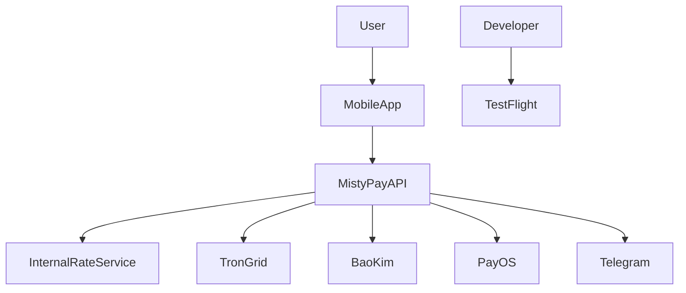
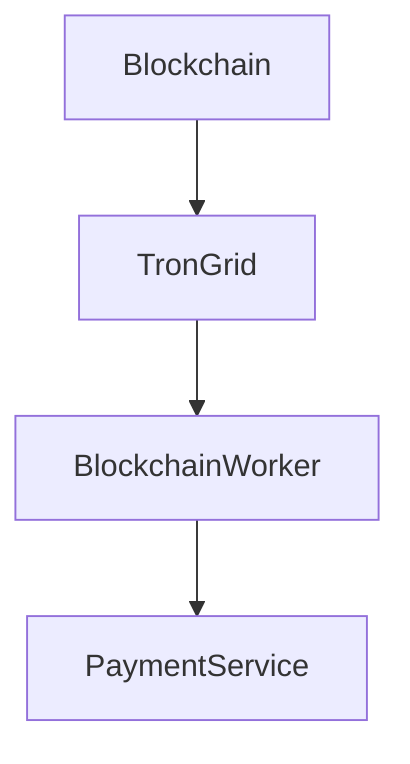
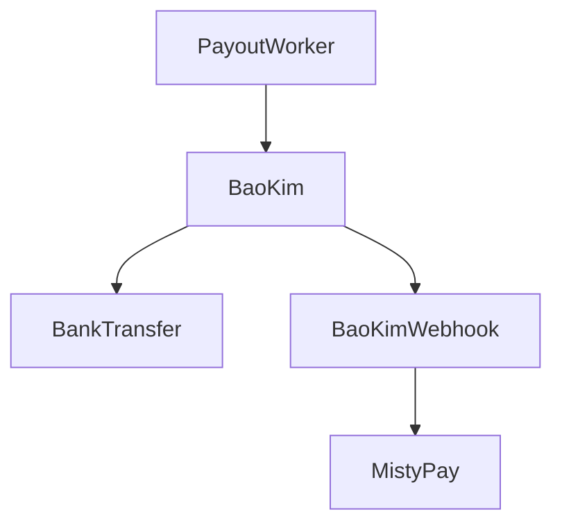
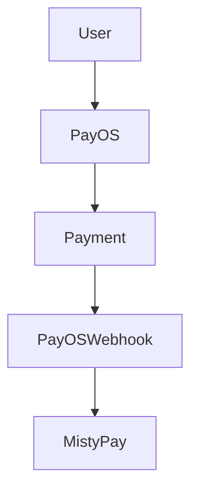
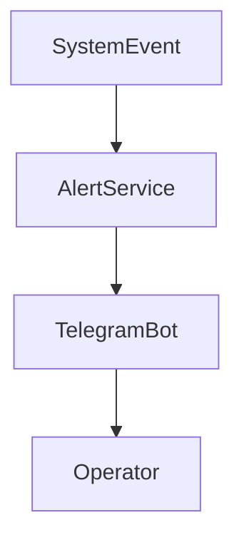

# MistyPay - External Integrations Document

> Version: 1.0
> Status: Draft - MVP Phase
> Product: MistyPay
> Last Updated: 2026

---

# 1. Document Purpose

This document defines all third-party services and external integrations used by MistyPay.

Objectives:

- Centralize integration knowledge
- Define provider responsibilities
- Standardize integration architecture
- Support development and operations
- Support onboarding of new developers
- Support future compliance reviews

---

# 2. Integration Overview

## MVP Integrations

```text
Internal Exchange Rate Service
TronGrid
BaoKim
PayOS
Telegram
Apple TestFlight
```

---

## Future Integrations

```text
Firebase
Email Provider
KYC Provider
AML Provider
Analytics Platform
Push Notification Provider
```

---

# 3. Integration Architecture



---

# 4. Integration Classification

| Service       | Type          | Criticality |
| ------------- | ------------- | ----------- |
| Internal Rate | Business Core | High        |
| TronGrid      | Blockchain    | Critical    |
| BaoKim        | Payout        | Critical    |
| PayOS         | Payment       | Medium      |
| Telegram      | Monitoring    | Medium      |
| TestFlight    | Distribution  | Low         |

---

# 5. Internal Exchange Rate Service

## Purpose

Provide:

```text
USDT/VND Exchange Rate
```

for quote generation.

---

## Ownership

```text
MistyPay
```

---

## Data Source

MVP:

```text
Admin Managed
```

---

## Future

Possible sources:

```text
Binance
OKX
Bybit
OTC Aggregation
```

---

## Failure Impact

```text
New Quotes Cannot Be Generated
```

---

## Fallback

```text
Use Last Active Rate
```

---

# 6. TronGrid Integration

## Purpose

Monitor:

```text
TRC20 USDT Transactions
```

---

## Usage

```text
Blockchain Detection
Transaction Verification
Wallet Monitoring
```

---

## Network

```text
TRON
```

---

## Environment Variable

```env
TRON_GRID_API_KEY=
TRON_GRID_API_URL=
```

---

## Criticality

```text
Critical
```

---

## Failure Impact

```text
Cannot Detect New Payments
```

---

## Recovery

```text
Retry Polling

Backfill Transactions
```

---

# 7. TronGrid Data Flow



---

# 8. BaoKim Integration

## Purpose

Execute:

```text
Merchant Payouts
```

---

## Usage

```text
Bank Transfer
Payout Status Tracking
```

---

## Environment Variables

```env
BAOKIM_CLIENT_ID=
BAOKIM_CLIENT_SECRET=
BAOKIM_API_KEY=
BAOKIM_WEBHOOK_SECRET=
```

---

## Criticality

```text
Critical
```

---

## Failure Impact

```text
Payout Delays
```

---

## Fallback

```text
Queue Pending Payouts
Manual Review
```

---

# 9. BaoKim Flow



---

# 10. PayOS Integration

## Purpose

Future:

```text
Top-Up
Merchant Funding
Operational Funding
```

---

## MVP Status

```text
Optional
```

---

## Environment Variables

```env
PAYOS_CLIENT_ID=
PAYOS_API_KEY=
PAYOS_CHECKSUM_KEY=
```

---

## Criticality

```text
Medium
```

---

## Failure Impact

```text
Top-up unavailable
```

---

# 11. PayOS Flow



---

# 12. Telegram Integration

## Purpose

Send:

```text
Operational Alerts
Security Alerts
Treasury Alerts
```

---

## Example Alerts

```text
TREASURY_LOW_BALANCE

TREASURY_MISMATCH

PAYOUT_FAILED

DATABASE_DOWN
```

---

## Environment Variables

```env
TELEGRAM_BOT_TOKEN=
TELEGRAM_CHAT_ID=
```

---

## Criticality

```text
Medium
```

---

## Failure Impact

```text
Monitoring Visibility Reduced
```

---

# 13. Telegram Flow



---

# 14. Apple TestFlight

## Purpose

Distribute:

```text
Beta Builds
Internal Testing Builds
```

---

## Usage Phase

```text
Pre-Production
```

---

## Criticality

```text
Low
```

---

## Failure Impact

```text
Testing Delayed
```

---

# 15. Apple Developer Requirements

Required:

```text
Apple Developer Account
```

---

Recommended:

```text
Organization Account
```

---

# 16. Integration Health Monitoring

Monitor:

```text
TronGrid Availability

BaoKim Availability

PayOS Availability

Telegram Delivery
```

---

# 17. Integration Status Model

Possible statuses:

```text
HEALTHY

DEGRADED

UNAVAILABLE
```

---

# 18. Integration Alerts

Generate alert when:

```text
Provider Timeout

Repeated API Failures

Webhook Failures

Authentication Errors
```

---

# 19. Integration Retry Policy

## TronGrid

```text
Retry Automatically
```

---

## BaoKim

```text
Retry Up To 3 Times
```

---

## PayOS

```text
Retry According To Provider Rules
```

---

# 20. Integration Security

Never expose:

```text
API Keys

Provider Secrets

Webhook Secrets
```

---

Store only in:

```text
Environment Variables
Secret Manager
```

---

# 21. Integration Audit Requirements

Log:

```text
Provider Requests

Provider Responses

Webhook Events

Authentication Errors
```

---

# 22. Integration Dependency Matrix

| Integration   | Required for MVP | Notes                 |
| ------------- | ---------------- | --------------------- |
| Internal Rate | Yes              | Core quote generation |
| TronGrid      | Yes              | Blockchain monitoring |
| BaoKim        | Yes              | Merchant payouts      |
| Telegram      | Yes              | Monitoring            |
| PayOS         | Optional         | Future top-up         |
| TestFlight    | Testing Only     | Beta distribution     |

---

# 23. Failure Scenarios

## TronGrid Down

Impact:

```text
Payment detection delayed
```

---

Response:

```text
Continue polling
Backfill later
```

---

## BaoKim Down

Impact:

```text
Payout delay
```

---

Response:

```text
Queue payouts
Retry
```

---

## Telegram Down

Impact:

```text
Alert visibility reduced
```

---

Response:

```text
Store logs
Retry notifications
```

---

# 24. Future Integration Roadmap

Phase 2:

```text
Firebase Analytics

Push Notifications

Email Service
```

---

Phase 3:

```text
KYC Provider

AML Screening

Risk Intelligence
```

---

# 25. Integration Ownership

| Integration   | Owner           |
| ------------- | --------------- |
| Internal Rate | MistyPay        |
| TronGrid      | Blockchain Team |
| BaoKim        | Operations      |
| PayOS         | Operations      |
| Telegram      | Infrastructure  |
| TestFlight    | Mobile Team     |

---

# 26. Integration Summary

Core MVP Integrations:

```text
Internal Rate
TronGrid
BaoKim
Telegram
```

Optional MVP:

```text
PayOS
```

Testing:

```text
TestFlight
```

---

# 27. Final Principle

For MistyPay:

```text
External services can fail.

Core business logic must remain controlled by MistyPay.
```

---

```text
Providers execute actions.

MistyPay owns decisions.
```
