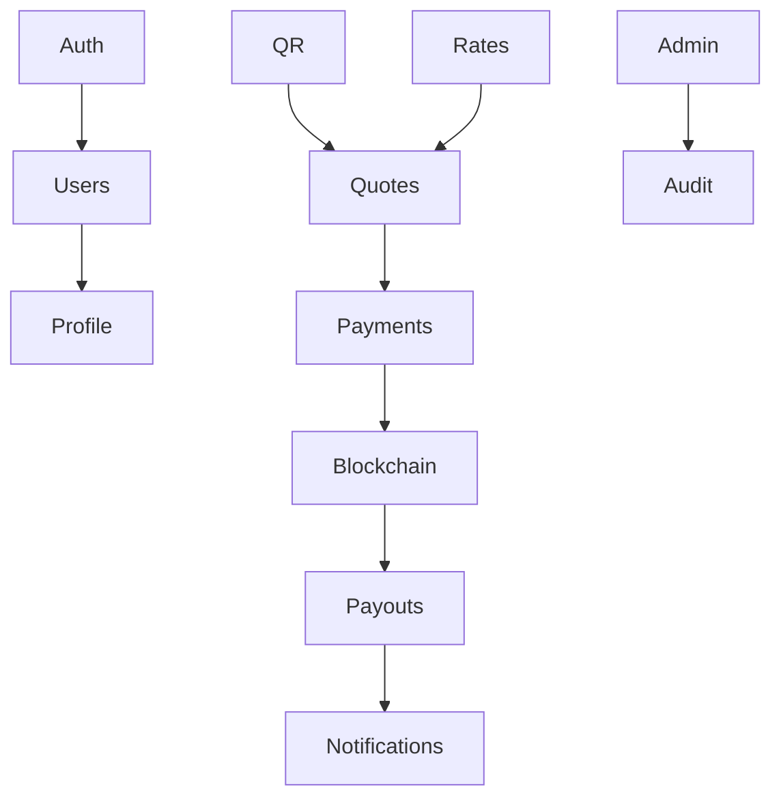
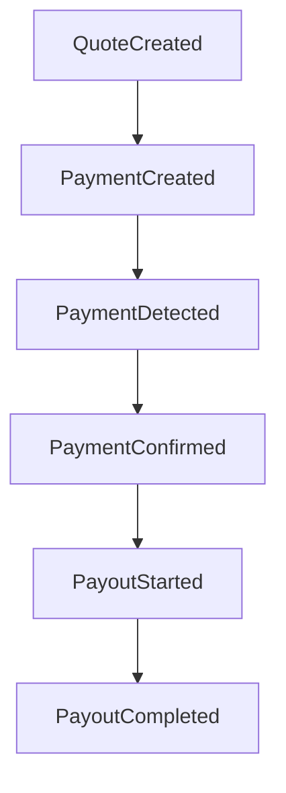

# MistyPay - Module Architecture Document

> Version: 1.0
> Status: Draft - MVP Phase
> Product: MistyPay
> Product Owner: Le Vu Bao Nhat
> Last Updated: 2026

---

# 1. Document Purpose

This document defines the internal module architecture of MistyPay.

Objectives:

- Define application modules
- Define module responsibilities
- Define module boundaries
- Define dependencies
- Support backend implementation
- Support AI-assisted development

---

# 2. Architecture Strategy

## Architectural Style

```text
Modular Monolith
```

Each business domain is isolated into its own module.

Benefits:

```text
Clear Responsibility
Easy Maintenance
Easy Scaling
AI Friendly
```

---

# 3. Module Overview



---

# 4. Folder Structure

## Backend Structure

```text
src/

├── auth/
├── users/
├── profile/
├── qr/
├── rates/
├── quotes/
├── payments/
├── blockchain/
├── payouts/
├── notifications/
├── admin/
├── audit/
│
├── common/
├── config/
├── database/
├── infrastructure/
└── main.ts
```

---

# 5. Auth Module

## Purpose

Manage authentication and authorization.

---

## Responsibilities

```text
Register
Login
Refresh Token
Logout
Password Reset
PIN Verification
```

---

## Controllers

```text
AuthController
```

---

## Services

```text
AuthService
PasswordService
PinService
TokenService
```

---

## Database Tables

```text
users
user_sessions
```

---

## Exposed APIs

```http
POST /auth/register

POST /auth/login

POST /auth/refresh

POST /auth/logout

POST /auth/forgot-password

POST /auth/reset-password
```

---

# 6. Users Module

## Purpose

Manage user accounts.

---

## Responsibilities

```text
User Profile
User Status
Country
Preferences
```

---

## Controllers

```text
UsersController
```

---

## Services

```text
UsersService
```

---

## Tables

```text
users
```

---

## APIs

```http
GET /users/me

PATCH /users/me
```

---

# 7. Profile Module

## Purpose

Manage user settings.

---

## Responsibilities

```text
Profile Management
Security Settings
PIN Management
```

---

## APIs

```http
GET /profile

PATCH /profile

PATCH /profile/pin
```

---

# 8. QR Module

## Purpose

Handle VietQR processing.

---

## Responsibilities

```text
Parse QR
Validate QR
Extract Merchant Data
```

---

## Controllers

```text
QrController
```

---

## Services

```text
QrParserService
QrValidationService
```

---

## APIs

```http
POST /qr/parse
```

---

## Output Example

```json
{
  "merchantName": "NGUYEN VAN A",
  "bank": "MB Bank",
  "accountNumber": "123456789"
}
```

---

# 9. Rates Module

## Purpose

Manage exchange rates.

---

## Responsibilities

```text
Fetch Rates
Cache Rates
Provide Rates
```

---

## External Integration

```text
Binance API
```

---

## Services

```text
RateProviderService
RateCacheService
```

---

## APIs

```http
GET /rates/current
```

---

# 10. Quotes Module

## Purpose

Generate payment quotes.

---

## Responsibilities

```text
Fee Calculation
Quote Calculation
Quote Expiration
```

---

## Dependencies

```text
QR Module
Rates Module
```

---

## Tables

```text
payment_quotes
```

---

## APIs

```http
POST /quotes
```

---

## Example Response

```json
{
  "vndAmount": 500000,
  "rate": 26000,
  "fee": 0.2,
  "usdtAmount": 19.43,
  "expiresAt": "2026-01-01T00:00:00Z"
}
```

---

# 11. Payments Module

## Purpose

Manage payment orders.

---

## Responsibilities

```text
Create Payment Order
Track Order Status
Handle Expiration
```

---

## Dependencies

```text
Quotes Module
```

---

## Tables

```text
payment_orders
```

---

## APIs

```http
POST /payments

GET /payments/:id
```

---

## Statuses

```text
CREATED

WAITING_PAYMENT

EXPIRED
```

---

# 12. Blockchain Module

## Purpose

Monitor USDT transactions.

---

## Responsibilities

```text
Monitor Wallet
Detect Payments
Verify Transactions
```

---

## External Systems

```text
TronGrid
TRON Network
```

---

## Services

```text
WalletMonitorService
TransactionValidationService
BlockchainListenerService
```

---

## Tables

```text
blockchain_transactions
```

---

## Internal Events

```text
PAYMENT_DETECTED

PAYMENT_CONFIRMED
```

---

# 13. Payout Module

## Purpose

Send VND to merchants.

---

## Responsibilities

```text
Create Payout
Track Payout
Retry Failed Payout
```

---

## Dependencies

```text
Blockchain Module
```

---

## External Systems

```text
BaoKim
PayOS
```

---

## Tables

```text
payout_transactions
```

---

## APIs

```http
POST /payouts/retry
```

---

## Statuses

```text
PAYOUT_PENDING

PAYOUT_PROCESSING

PAYOUT_SUCCESS

PAYOUT_FAILED
```

---

# 14. Notification Module

## Purpose

Notify users about transaction updates.

---

## Responsibilities

```text
Push Notifications
Email Notifications
Transaction Updates
```

---

## Future Channels

```text
Firebase Push

Email

SMS
```

---

## Events

```text
PAYMENT_CREATED

PAYMENT_CONFIRMED

PAYOUT_SUCCESS

PAYOUT_FAILED
```

---

# 15. Admin Module

## Purpose

Provide administrative capabilities.

---

## Responsibilities

```text
User Management

Transaction Management

Rate Management

Dashboard
```

---

## Controllers

```text
AdminUsersController

AdminTransactionsController

AdminRatesController
```

---

## APIs

```http
GET /admin/dashboard

GET /admin/users

GET /admin/transactions

PATCH /admin/users/:id/suspend
```

---

# 16. Audit Module

## Purpose

Track system activities.

---

## Responsibilities

```text
Admin Logs

Operator Logs

Rate Changes

Payout Actions
```

---

## Tables

```text
audit_logs
```

---

## Example Events

```text
USER_SUSPENDED

RATE_UPDATED

PAYOUT_RETRIED

ADMIN_LOGIN
```

---

# 17. Common Module

## Purpose

Shared application resources.

---

## Components

```text
BaseEntity

ResponseDTO

ExceptionFilters

Guards

Interceptors

Decorators

Utilities
```

---

# 18. Infrastructure Module

## Purpose

External integrations and system services.

---

## Components

```text
Redis

BullMQ

TronGrid

BaoKim

PayOS

Binance
```

---

# 19. Module Dependency Rules

## Allowed

```text
QR
↓
Quotes
↓
Payments
↓
Blockchain
↓
Payouts
```

---

## Forbidden

Example:

```text
Payout Module
↓
Directly Access User Module Database
```

Must go through service layer.

---

# 20. Internal Event Flow



---

# 21. Future Modules

Not included in MVP.

---

## Merchant Module

```text
Merchant Registration
Merchant Dashboard
Merchant Analytics
```

---

## Referral Module

```text
Referral Tracking
Referral Rewards
```

---

## Promotion Module

```text
Promo Codes
Campaigns
Cashback
```

---

## Risk Module

```text
Fraud Detection
Risk Scoring
AML Monitoring
```

---

# 22. Module Summary

## MVP Modules

```text
Auth

Users

Profile

QR

Rates

Quotes

Payments

Blockchain

Payouts

Notifications

Admin

Audit
```

---

## Supporting Modules

```text
Common

Infrastructure
```

---

## Architecture Pattern

```text
Modular Monolith
```

---

## Development Priority

Phase 1:

```text
Auth
Users
QR
Rates
Quotes
```

---

Phase 2:

```text
Payments
Blockchain
Payouts
```

---

Phase 3:

```text
Notifications
Admin
Audit
```
