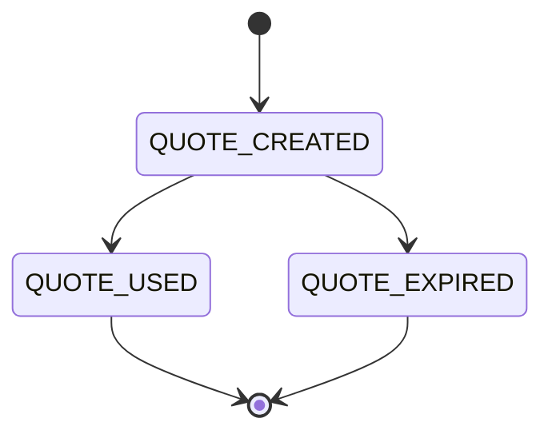
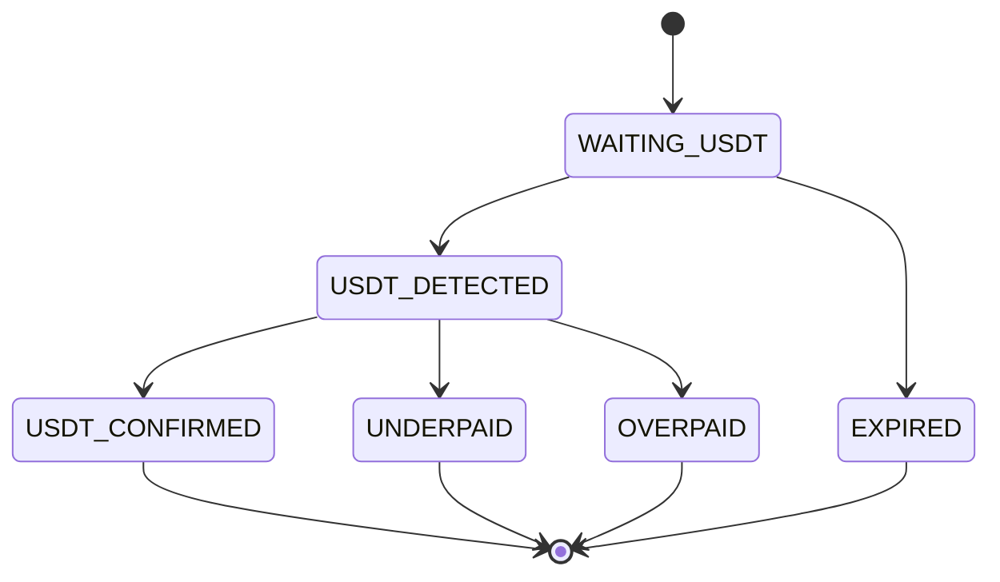
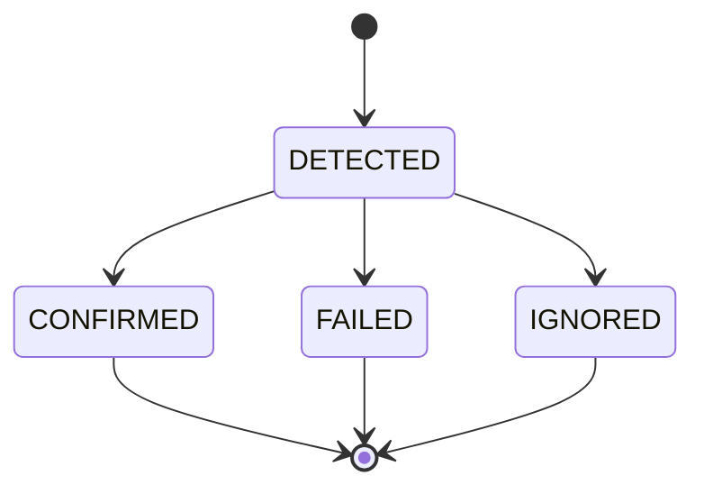
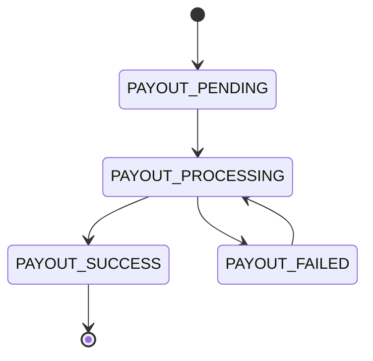
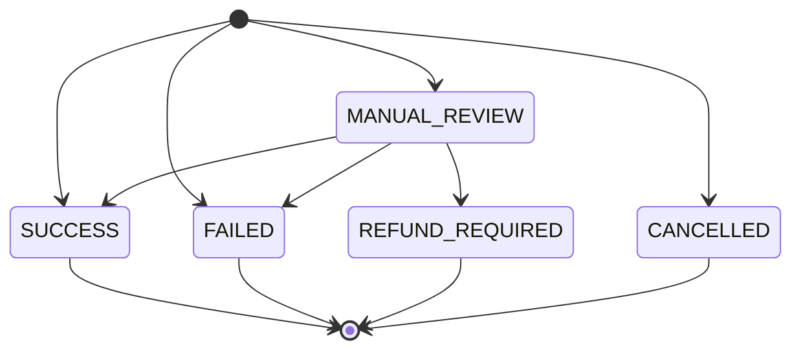
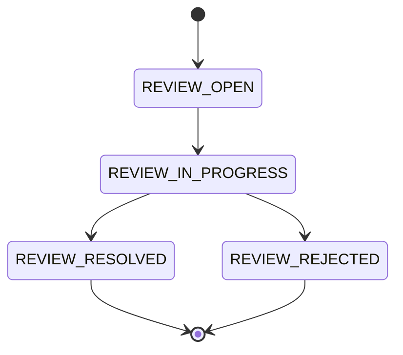
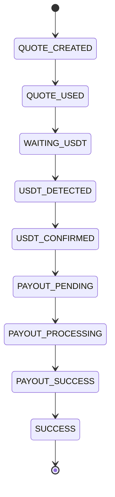
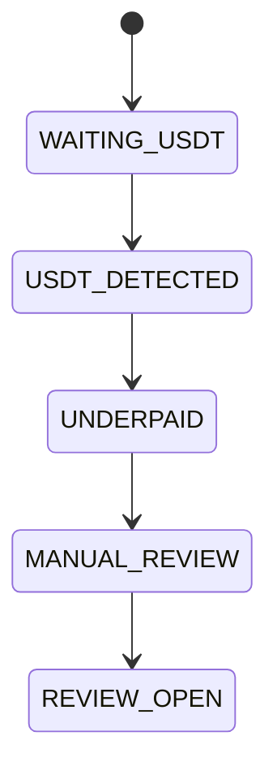
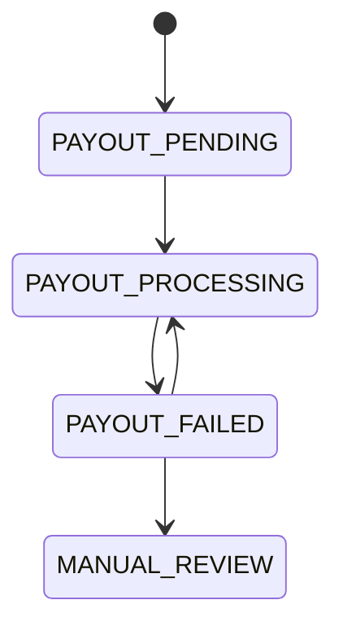

# MistyPay - State Machine Document

> Version: 1.0
> Status: Draft - MVP Phase
> Product: MistyPay
> Last Updated: 2026

---

# 1. Document Purpose

This document defines all core state machines used in MistyPay.

Objectives:

- Centralize all system states
- Prevent invalid state transitions
- Support backend implementation
- Support database design
- Support event-driven processing
- Support AI-assisted development

---

# 2. State Machine Scope

This document covers:

```text
Quote State Machine
Payment State Machine
Blockchain Transaction State Machine
Payout State Machine
Transaction Final State Machine
Manual Review State Machine
```

---

# 3. General Rules

## Rule 1

Every state transition must be explicit.

---

## Rule 2

Invalid transitions must be rejected.

---

## Rule 3

Every financial state transition must create an audit log.

---

## Rule 4

Final states should not be changed unless handled by an admin/operator with audit logging.

---

# 4. Quote State Machine

## States

```text
QUOTE_CREATED
QUOTE_USED
QUOTE_EXPIRED
```

---

## Diagram



---

## State Definitions

### QUOTE_CREATED

Quote has been created and is still valid.

---

### QUOTE_USED

Quote has been converted into a payment order.

---

### QUOTE_EXPIRED

Quote expired before payment order creation.

---

## Transition Rules

| Current State | Event               | Next State    |
| ------------- | ------------------- | ------------- |
| QUOTE_CREATED | USER_CONFIRMS_QUOTE | QUOTE_USED    |
| QUOTE_CREATED | QUOTE_TIMEOUT       | QUOTE_EXPIRED |

---

# 5. Payment State Machine

## States

```text
WAITING_USDT
USDT_DETECTED
USDT_CONFIRMED
UNDERPAID
OVERPAID
EXPIRED
```

---

## Diagram



---

## State Definitions

### WAITING_USDT

Payment order has been created and is waiting for USDT.

---

### USDT_DETECTED

Incoming USDT transaction has been detected.

---

### USDT_CONFIRMED

USDT payment has been validated successfully.

---

### UNDERPAID

Received USDT is lower than required.

---

### OVERPAID

Received USDT is higher than required.

---

### EXPIRED

Payment order expired before valid USDT was received.

---

## Transition Rules

| Current State | Event            | Next State     |
| ------------- | ---------------- | -------------- |
| WAITING_USDT  | USDT_TX_DETECTED | USDT_DETECTED  |
| WAITING_USDT  | PAYMENT_TIMEOUT  | EXPIRED        |
| USDT_DETECTED | AMOUNT_VALID     | USDT_CONFIRMED |
| USDT_DETECTED | AMOUNT_TOO_LOW   | UNDERPAID      |
| USDT_DETECTED | AMOUNT_TOO_HIGH  | OVERPAID       |

---

# 6. Blockchain Transaction State Machine

## States

```text
DETECTED
CONFIRMED
FAILED
IGNORED
```

---

## Diagram



---

## State Definitions

### DETECTED

Blockchain transaction has been detected.

---

### CONFIRMED

Blockchain transaction has passed validation.

---

### FAILED

Blockchain transaction failed validation.

---

### IGNORED

Blockchain transaction is duplicate or irrelevant.

---

## Transition Rules

| Current State | Event              | Next State |
| ------------- | ------------------ | ---------- |
| DETECTED      | VALIDATION_SUCCESS | CONFIRMED  |
| DETECTED      | VALIDATION_FAILED  | FAILED     |
| DETECTED      | DUPLICATE_TX       | IGNORED    |

---

# 7. Payout State Machine

## States

```text
PAYOUT_PENDING
PAYOUT_PROCESSING
PAYOUT_SUCCESS
PAYOUT_FAILED
```

---

## Diagram



---

## State Definitions

### PAYOUT_PENDING

Payout job has been created but not yet processed.

---

### PAYOUT_PROCESSING

Payout provider is processing the transfer.

---

### PAYOUT_SUCCESS

Merchant has received VND.

---

### PAYOUT_FAILED

Payout failed or provider returned an error.

---

## Transition Rules

| Current State     | Event                | Next State        |
| ----------------- | -------------------- | ----------------- |
| PAYOUT_PENDING    | WORKER_STARTS_PAYOUT | PAYOUT_PROCESSING |
| PAYOUT_PROCESSING | PROVIDER_SUCCESS     | PAYOUT_SUCCESS    |
| PAYOUT_PROCESSING | PROVIDER_FAILED      | PAYOUT_FAILED     |
| PAYOUT_FAILED     | RETRY_PAYOUT         | PAYOUT_PROCESSING |

---

# 8. Final Transaction State Machine

## States

```text
SUCCESS
FAILED
MANUAL_REVIEW
REFUND_REQUIRED
CANCELLED
```

---

## Diagram



---

## State Definitions

### SUCCESS

USDT received and VND payout completed.

---

### FAILED

Transaction failed and cannot continue automatically.

---

### MANUAL_REVIEW

Transaction requires operator review.

---

### REFUND_REQUIRED

User needs refund or manual settlement.

---

### CANCELLED

Transaction was cancelled before financial processing.

---

## Transition Rules

| Trigger                       | Final State     |
| ----------------------------- | --------------- |
| PAYOUT_SUCCESS                | SUCCESS         |
| UNDERPAID                     | MANUAL_REVIEW   |
| OVERPAID                      | MANUAL_REVIEW   |
| PAYOUT_FAILED_MAX_RETRY       | MANUAL_REVIEW   |
| PAYMENT_EXPIRED_WITHOUT_FUNDS | CANCELLED       |
| OPERATOR_REJECTS              | FAILED          |
| OPERATOR_MARKS_REFUND         | REFUND_REQUIRED |

---

# 9. Manual Review State Machine

## States

```text
REVIEW_OPEN
REVIEW_IN_PROGRESS
REVIEW_RESOLVED
REVIEW_REJECTED
```

---

## Diagram



---

## State Definitions

### REVIEW_OPEN

Review item has been created.

---

### REVIEW_IN_PROGRESS

Operator is reviewing the case.

---

### REVIEW_RESOLVED

Issue has been resolved.

---

### REVIEW_REJECTED

Case was rejected or marked invalid.

---

# 10. Complete Successful Flow



---

# 11. Underpaid Flow



---

# 12. Payout Failed Flow



---

# 13. Invalid Transition Examples

## Example 1

Invalid:

```text
WAITING_USDT
↓
PAYOUT_PROCESSING
```

Reason:

```text
USDT has not been confirmed.
```

---

## Example 2

Invalid:

```text
PAYOUT_SUCCESS
↓
PAYOUT_PROCESSING
```

Reason:

```text
Successful payout is final.
```

---

## Example 3

Invalid:

```text
QUOTE_EXPIRED
↓
QUOTE_USED
```

Reason:

```text
Expired quote cannot be used.
```

---

# 14. Database Mapping

## payment_quotes

```text
status
```

Values:

```text
QUOTE_CREATED
QUOTE_USED
QUOTE_EXPIRED
```

---

## payment_orders

```text
payment_status
payout_status
final_status
```

---

## blockchain_transactions

```text
status
```

Values:

```text
DETECTED
CONFIRMED
FAILED
IGNORED
```

---

## payout_transactions

```text
status
```

Values:

```text
PAYOUT_PENDING
PAYOUT_PROCESSING
PAYOUT_SUCCESS
PAYOUT_FAILED
```

---

## manual_reviews

```text
status
```

Values:

```text
REVIEW_OPEN
REVIEW_IN_PROGRESS
REVIEW_RESOLVED
REVIEW_REJECTED
```

---

# 15. Event Mapping

| Event                       | Affected State Machine            |
| --------------------------- | --------------------------------- |
| QUOTE_CREATED               | Quote                             |
| QUOTE_EXPIRED               | Quote                             |
| PAYMENT_CREATED             | Payment                           |
| USDT_DETECTED               | Payment + Blockchain              |
| USDT_CONFIRMED              | Payment + Blockchain              |
| PAYMENT_UNDERPAID           | Payment + Final Transaction       |
| PAYMENT_OVERPAID            | Payment + Final Transaction       |
| PAYOUT_CREATED              | Payout                            |
| PAYOUT_SUCCESS              | Payout + Final Transaction        |
| PAYOUT_FAILED               | Payout                            |
| TRANSACTION_COMPLETED       | Final Transaction                 |
| TRANSACTION_REQUIRES_REVIEW | Final Transaction + Manual Review |

---

# 16. Implementation Notes

## Backend Rule

All state changes should be handled through service methods.

Avoid direct update like:

```text
payment.status = "SUCCESS"
```

Prefer:

```text
paymentStateService.transition(paymentId, event)
```

---

## Audit Rule

Every state transition involving money must create an audit log.

Examples:

```text
USDT_CONFIRMED
PAYOUT_PROCESSING
PAYOUT_SUCCESS
MANUAL_REVIEW
```

---

## Idempotency Rule

Repeated events should not produce duplicate state transitions.

Example:

```text
Same tx_hash detected twice
↓
No second payout
```

---

# 17. MVP State Summary

Most important states for MVP:

```text
QUOTE_CREATED
QUOTE_USED
WAITING_USDT
USDT_DETECTED
USDT_CONFIRMED
PAYOUT_PENDING
PAYOUT_PROCESSING
PAYOUT_SUCCESS
SUCCESS
MANUAL_REVIEW
```

---

# 18. Final Principle

State machines protect MistyPay from inconsistent financial behavior.

Core rule:

```text
No payout without USDT_CONFIRMED.
No SUCCESS without PAYOUT_SUCCESS.
No duplicate payout under any condition.
```
