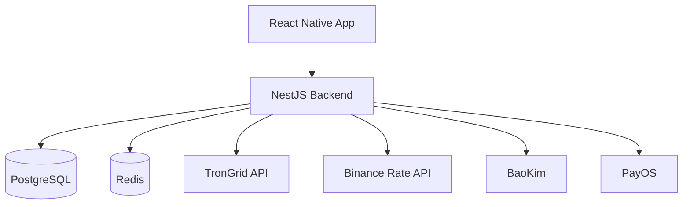
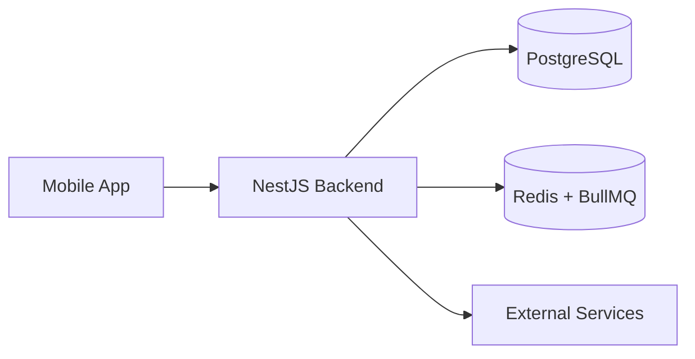
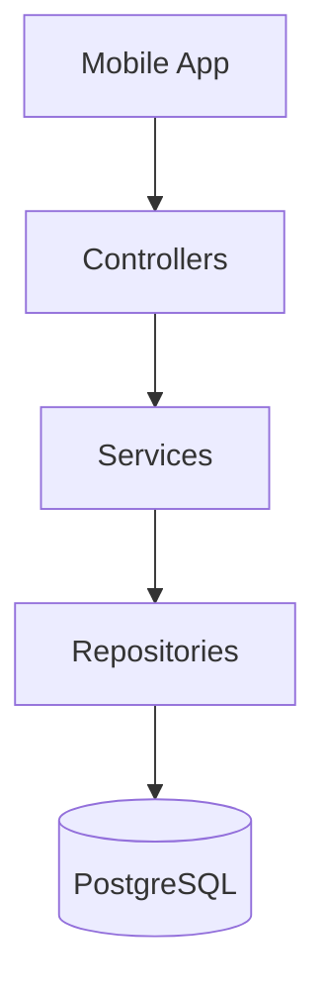
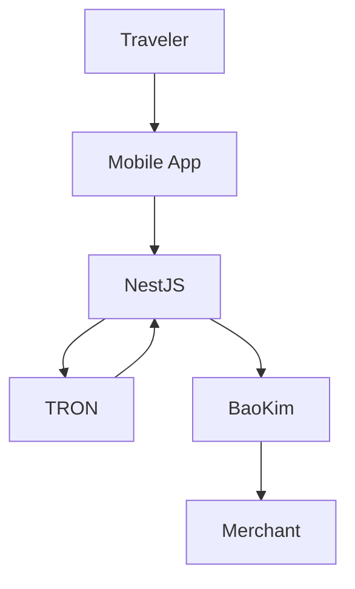
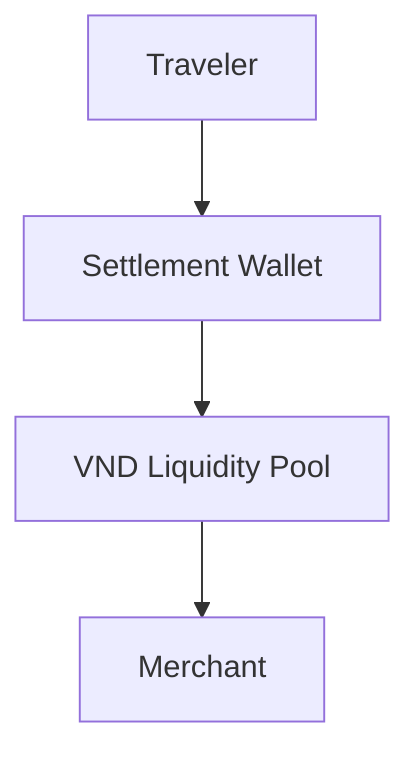
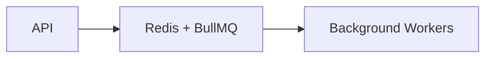
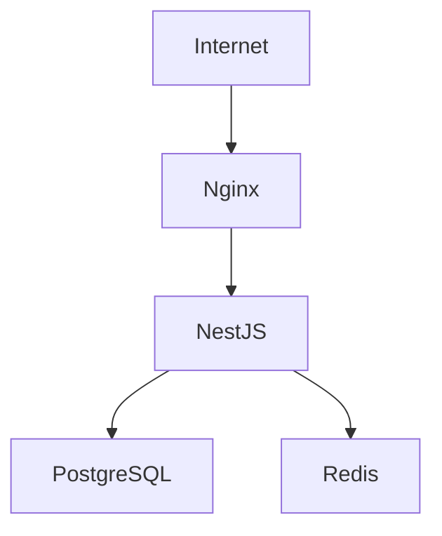

# MistyPay - System Architecture Document

> Version: 1.0
> Status: Draft - MVP Phase
> Product: MistyPay
> Product Owner: Le Vu Bao Nhat
> Last Updated: 2026

---

# 1. Document Purpose

This document defines the high-level architecture of MistyPay.

Objectives:

- Define system boundaries
- Define major components
- Define integrations
- Define communication flows
- Support backend development
- Support infrastructure planning
- Support AI-assisted development

---

# 2. Architecture Principles

## P1. MVP First

Architecture should prioritize:

```text
Simple
Maintainable
Extensible
```

Avoid:

```text
Microservices
Event Streaming Platforms
Kubernetes
Service Mesh
```

during MVP.

---

## P2. Modular Monolith

MVP architecture follows:

```text
Modular Monolith
```

instead of:

```text
Microservices
```

Benefits:

```text
Faster Development
Lower Cost
Simpler Deployment
Easier Maintenance
```

---

## P3. Scale Later

MVP target:

```text
0 - 10,000 Users
```

System should support growth without requiring major redesign.

---

# 3. High-Level Architecture



---

# 4. Logical Architecture



---

# 5. Technology Stack

## Mobile Application

### Framework

```text
React Native
```

### Runtime

```text
Expo
```

### Language

```text
TypeScript
```

---

## Backend

### Framework

```text
NestJS
```

### Language

```text
TypeScript
```

### API Style

```text
REST API
```

---

## Database

### Engine

```text
PostgreSQL
```

Purpose:

```text
Users
Transactions
Quotes
Payouts
Audit Logs
```

---

## Cache & Queue

### Redis

Purpose:

```text
Caching
Session Data
Temporary Data
```

---

### BullMQ

Purpose:

```text
Payout Queue
Blockchain Queue
Notification Queue
Retry Queue
```

---

## Infrastructure

### Operating System

```text
Ubuntu Server
```

### Reverse Proxy

```text
Nginx
```

### Process Manager

```text
PM2
```

---

# 6. Application Layer Architecture



---

# 7. Core Business Components

## Authentication Component

Responsibilities:

```text
Registration
Login
JWT
PIN Verification
Password Reset
```

---

## QR Component

Responsibilities:

```text
QR Parsing
Merchant Information Extraction
QR Validation
```

---

## Quote Component

Responsibilities:

```text
Exchange Rate Retrieval
Fee Calculation
Quote Generation
```

---

## Payment Component

Responsibilities:

```text
Payment Order Creation
Order Tracking
Status Updates
```

---

## Blockchain Component

Responsibilities:

```text
Wallet Monitoring
Transaction Detection
Transaction Verification
```

---

## Payout Component

Responsibilities:

```text
Create Payout Request
Monitor Payout Status
Retry Failed Payout
```

---

## Notification Component

Responsibilities:

```text
Push Notifications
Email Notifications
Transaction Updates
```

---

# 8. External Systems

## TronGrid

Purpose:

```text
Blockchain Monitoring
Transaction Verification
Wallet Activity Tracking
```

---

## Binance Rate API

Purpose:

```text
USDT/VND Exchange Rate
```

---

## BaoKim

Purpose:

```text
Merchant Payout
```

---

## PayOS

Purpose:

```text
Payout Infrastructure
Payment Services
```

---

# 9. Payment Architecture

## Payment Lifecycle



---

# 10. Blockchain Settlement Architecture

## Concept

Traveler pays:

```text
USDT
```

System receives:

```text
USDT
```

Merchant receives:

```text
VND
```

---

## Settlement Flow



---

# 11. VND Liquidity Pool

## Purpose

Provide instant payouts.

---

## Initial MVP Design

```text
BaoKim Personal Wallet
```

acts as:

```text
VND Treasury
```

---

## Future Design

```text
Business Wallet
Corporate Bank Account
Treasury Management
```

---

# 12. Queue Architecture

## Purpose

Prevent blocking requests.

---

## Queues

### Blockchain Queue

Responsibilities:

```text
Transaction Monitoring
Transaction Validation
```

---

### Payout Queue

Responsibilities:

```text
Create Payout
Retry Failed Payout
```

---

### Notification Queue

Responsibilities:

```text
Send Notifications
Send Emails
```

---

## Queue Flow



---

# 13. Security Architecture

## Authentication

```text
JWT Access Token
JWT Refresh Token
```

---

## Password Security

```text
Bcrypt Hashing
```

---

## PIN Security

```text
Encrypted Storage
```

---

## Transport Security

```text
HTTPS Only
TLS
```

---

## API Protection

```text
Rate Limiting
IP Protection
Request Validation
```

---

# 14. Deployment Architecture

## MVP Deployment



---

## Recommended VPS

Initial deployment:

```text
4 vCPU
8 GB RAM
100 GB SSD
Ubuntu 24.04
```

Examples:

```text
Vultr
Hetzner
Contabo
DigitalOcean
```

---

# 15. Logging Architecture

## Application Logs

Capture:

```text
API Requests
API Errors
Authentication Events
```

---

## Payment Logs

Capture:

```text
Payment Orders
Blockchain Events
Payout Events
```

---

## Audit Logs

Capture:

```text
Admin Actions
Operator Actions
Rate Changes
```

---

# 16. Monitoring Architecture

## Metrics

Monitor:

```text
CPU
RAM
Disk
```

---

## Application Metrics

Monitor:

```text
API Latency
API Error Rate
Success Rate
```

---

## Business Metrics

Monitor:

```text
Transaction Count
Transaction Volume
Payout Success Rate
```

---

# 17. Future Architecture Evolution

## Phase 1

Current MVP

```text
Modular Monolith
```

---

## Phase 2

Growth Stage

Possible additions:

```text
Admin Portal
Merchant Portal
Analytics
```

---

## Phase 3

Scale Stage

Possible migration:

```text
Microservices
Dedicated Blockchain Service
Dedicated Payout Service
```

Only when necessary.

---

# 18. Architecture Summary

## Frontend

```text
React Native
Expo
TypeScript
```

---

## Backend

```text
NestJS
REST API
TypeScript
```

---

## Database

```text
PostgreSQL
```

---

## Cache & Queue

```text
Redis
BullMQ
```

---

## Blockchain

```text
TRON
TronGrid
USDT TRC20
```

---

## Payment

```text
BaoKim
PayOS
```

---

## Infrastructure

```text
Ubuntu
Nginx
PM2
```

---

## Architecture Style

```text
Modular Monolith
```

Target:

```text
0 - 10,000 Users
```
