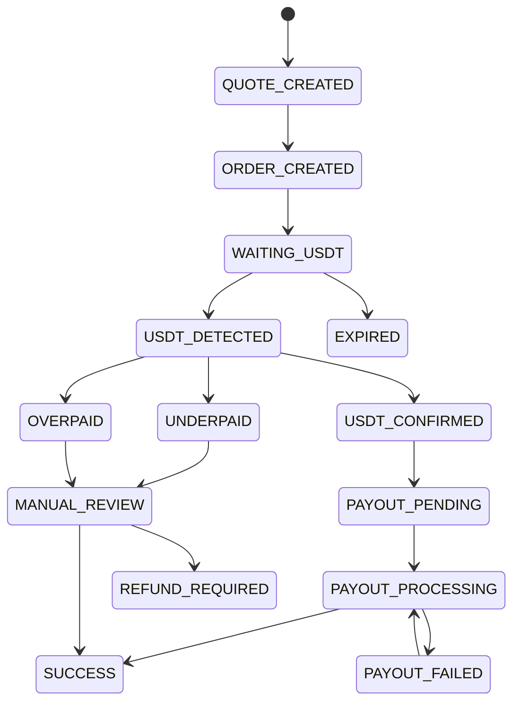
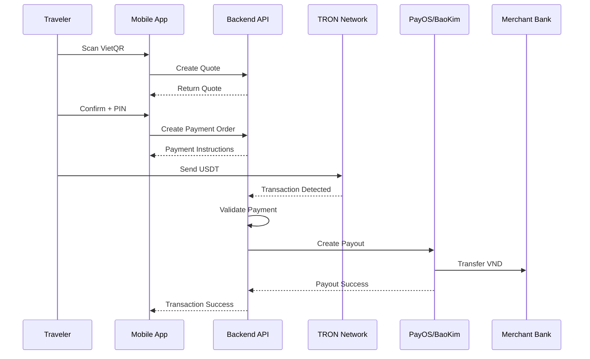

# MistyPay - Transaction State Machine Document

> Version: 1.0
> Status: Draft - MVP Phase
> Product: MistyPay
> Product Owner: Le Vu Bao Nhat
> Last Updated: 2026

---

# 1. Document Purpose

This document defines the transaction lifecycle of MistyPay.

The objective is to:

- Standardize transaction statuses
- Prevent inconsistent payment states
- Support backend implementation
- Support database design
- Support payout processing
- Support blockchain monitoring
- Support AI-assisted development

---

# 2. Core Concept

A MistyPay transaction has three major parts:

```text
Quote
↓
USDT Payment
↓
VND Payout
```

The system must track the full lifecycle from user quote creation to merchant payout completion.

---

# 3. Main Transaction Lifecycle



---

# 4. Transaction Status List

## Quote Status

```text
QUOTE_CREATED
QUOTE_EXPIRED
```

---

## Payment Order Status

```text
ORDER_CREATED
WAITING_USDT
USDT_DETECTED
USDT_CONFIRMED
UNDERPAID
OVERPAID
EXPIRED
```

---

## Payout Status

```text
PAYOUT_PENDING
PAYOUT_PROCESSING
PAYOUT_SUCCESS
PAYOUT_FAILED
```

---

## Final Status

```text
SUCCESS
FAILED
REFUND_REQUIRED
CANCELLED
```

---

# 5. Status Definitions

---

## QUOTE_CREATED

### Meaning

A payment quote has been generated.

### Trigger

```text
User enters VND amount
System calculates USDT amount
```

### Next Possible States

```text
ORDER_CREATED
QUOTE_EXPIRED
```

---

## QUOTE_EXPIRED

### Meaning

The quote expired before user created an order.

### Trigger

```text
Quote expiration time reached
```

### Final?

```text
Yes
```

---

## ORDER_CREATED

### Meaning

User confirmed the quote and created a payment order.

### Trigger

```text
User confirms quote
User passes PIN verification
```

### Next State

```text
WAITING_USDT
```

---

## WAITING_USDT

### Meaning

System is waiting for incoming USDT payment.

### Trigger

```text
Payment order created
```

### Next Possible States

```text
USDT_DETECTED
EXPIRED
```

---

## USDT_DETECTED

### Meaning

An incoming USDT transaction has been detected.

### Trigger

```text
Blockchain monitor detects transaction
```

### Next Possible States

```text
USDT_CONFIRMED
UNDERPAID
OVERPAID
MANUAL_REVIEW
```

---

## USDT_CONFIRMED

### Meaning

USDT transaction is valid and accepted.

### Validation Rules

```text
Correct token
Correct network
Correct wallet
Correct amount
Within expiration time
```

### Next State

```text
PAYOUT_PENDING
```

---

## UNDERPAID

### Meaning

User sent less USDT than required.

### Example

```text
Required: 19.43 USDT
Received: 19.00 USDT
```

### Next State

```text
MANUAL_REVIEW
```

---

## OVERPAID

### Meaning

User sent more USDT than required.

### Example

```text
Required: 19.43 USDT
Received: 20.00 USDT
```

### Next State

```text
MANUAL_REVIEW
```

---

## EXPIRED

### Meaning

User did not complete USDT transfer before timeout.

### Trigger

```text
Payment order expiration reached
```

### Final?

```text
Yes
```

---

## PAYOUT_PENDING

### Meaning

USDT payment is confirmed and payout is ready to start.

### Trigger

```text
USDT_CONFIRMED
```

### Next State

```text
PAYOUT_PROCESSING
```

---

## PAYOUT_PROCESSING

### Meaning

System is sending VND to merchant.

### Trigger

```text
Payout worker starts processing
```

### Next Possible States

```text
SUCCESS
PAYOUT_FAILED
```

---

## PAYOUT_FAILED

### Meaning

Payout request failed.

### Example Causes

```text
BaoKim error
PayOS timeout
Invalid bank account
Insufficient VND liquidity
```

### Next Possible States

```text
PAYOUT_PROCESSING
MANUAL_REVIEW
FAILED
```

---

## SUCCESS

### Meaning

Transaction completed successfully.

### Requirements

```text
USDT payment confirmed
VND payout completed
```

### Final?

```text
Yes
```

---

## FAILED

### Meaning

Transaction failed and cannot be automatically recovered.

### Final?

```text
Yes
```

---

## REFUND_REQUIRED

### Meaning

User payment requires refund or manual settlement.

### Typical Cases

```text
Wrong amount
Payment after expiration
Duplicate payment
Payout impossible
```

### Final?

```text
No
```

Requires operator handling.

---

## MANUAL_REVIEW

### Meaning

Transaction requires human review.

### Typical Cases

```text
Underpaid
Overpaid
Suspicious transaction
Payout repeatedly failed
```

### Next Possible States

```text
SUCCESS
FAILED
REFUND_REQUIRED
PAYOUT_PROCESSING
```

---

# 6. Happy Path Flow



---

# 7. Expiration Rules

## Quote Expiration

```text
Default: 60 seconds
```

If quote expires:

```text
QUOTE_CREATED
↓
QUOTE_EXPIRED
```

---

## Payment Order Expiration

```text
Default: 5 minutes
```

If no USDT received:

```text
WAITING_USDT
↓
EXPIRED
```

---

# 8. Amount Matching Rules

## Exact Match

```text
received_usdt == required_usdt
```

Result:

```text
USDT_CONFIRMED
```

---

## Underpaid

```text
received_usdt < required_usdt
```

Result:

```text
UNDERPAID
```

---

## Overpaid

```text
received_usdt > required_usdt
```

Result:

```text
OVERPAID
```

---

## Tolerance

MVP recommended tolerance:

```text
0.01 USDT
```

Example:

```text
Required: 19.4300
Received: 19.4299
```

Can be treated as valid if within tolerance.

---

# 9. Payout Retry Rules

## Retry Attempts

```text
Max Retry: 3
```

---

## Retry Delay

```text
Attempt 1: Immediately
Attempt 2: After 30 seconds
Attempt 3: After 2 minutes
```

---

## If All Retries Fail

```text
PAYOUT_FAILED
↓
MANUAL_REVIEW
```

---

# 10. Manual Review Rules

Transactions should enter manual review when:

```text
Underpaid
Overpaid
Duplicate payment
Suspicious payment
Payout failed after max retries
Payment received after expiration
```

---

# 11. State Transition Table

| Current State     | Event                     | Next State        |
| ----------------- | ------------------------- | ----------------- |
| QUOTE_CREATED     | User confirms quote       | ORDER_CREATED     |
| QUOTE_CREATED     | Quote timeout             | QUOTE_EXPIRED     |
| ORDER_CREATED     | Order initialized         | WAITING_USDT      |
| WAITING_USDT      | USDT transaction detected | USDT_DETECTED     |
| WAITING_USDT      | Order timeout             | EXPIRED           |
| USDT_DETECTED     | Amount valid              | USDT_CONFIRMED    |
| USDT_DETECTED     | Amount too low            | UNDERPAID         |
| USDT_DETECTED     | Amount too high           | OVERPAID          |
| USDT_CONFIRMED    | Ready for payout          | PAYOUT_PENDING    |
| PAYOUT_PENDING    | Worker starts payout      | PAYOUT_PROCESSING |
| PAYOUT_PROCESSING | Payout success            | SUCCESS           |
| PAYOUT_PROCESSING | Payout failed             | PAYOUT_FAILED     |
| PAYOUT_FAILED     | Retry payout              | PAYOUT_PROCESSING |
| PAYOUT_FAILED     | Max retry reached         | MANUAL_REVIEW     |
| UNDERPAID         | Requires review           | MANUAL_REVIEW     |
| OVERPAID          | Requires review           | MANUAL_REVIEW     |
| MANUAL_REVIEW     | Operator approves         | PAYOUT_PROCESSING |
| MANUAL_REVIEW     | Operator rejects          | FAILED            |
| MANUAL_REVIEW     | Refund needed             | REFUND_REQUIRED   |

---

# 12. Database Status Fields

Recommended fields for transaction tables:

```text
quote_status
payment_status
blockchain_status
payout_status
final_status
```

---

## Example

```json
{
  "quote_status": "QUOTE_CREATED",
  "payment_status": "WAITING_USDT",
  "blockchain_status": null,
  "payout_status": null,
  "final_status": null
}
```

---

## Successful Transaction Example

```json
{
  "quote_status": "QUOTE_CREATED",
  "payment_status": "USDT_CONFIRMED",
  "blockchain_status": "CONFIRMED",
  "payout_status": "PAYOUT_SUCCESS",
  "final_status": "SUCCESS"
}
```

---

# 13. Worker Responsibilities

## Expiration Worker

Responsibilities:

```text
Expire quotes
Expire unpaid orders
```

---

## Blockchain Worker

Responsibilities:

```text
Monitor wallet
Detect transactions
Validate payment amount
Update payment status
```

---

## Payout Worker

Responsibilities:

```text
Process payout
Retry failed payout
Update payout status
```

---

## Notification Worker

Responsibilities:

```text
Notify user about status changes
```

---

# 14. User-Facing Status Mapping

Internal status should be mapped to simple user-facing messages.

| Internal Status   | User Message              |
| ----------------- | ------------------------- |
| WAITING_USDT      | Waiting for payment       |
| USDT_DETECTED     | Payment detected          |
| USDT_CONFIRMED    | Payment confirmed         |
| PAYOUT_PROCESSING | Sending money to merchant |
| SUCCESS           | Payment successful        |
| EXPIRED           | Payment expired           |
| PAYOUT_FAILED     | Payment is being reviewed |
| MANUAL_REVIEW     | Under review              |
| REFUND_REQUIRED   | Refund required           |

---

# 15. Admin / Operator Actions

## Retry Payout

Allowed from:

```text
PAYOUT_FAILED
MANUAL_REVIEW
```

---

## Mark As Resolved

Allowed from:

```text
MANUAL_REVIEW
REFUND_REQUIRED
```

---

## Cancel Transaction

Allowed from:

```text
WAITING_USDT
MANUAL_REVIEW
```

---

# 16. MVP Simplification

For MVP, the system may simplify states as:

```text
CREATED
WAITING_PAYMENT
PAYMENT_CONFIRMED
PAYOUT_PROCESSING
SUCCESS
FAILED
MANUAL_REVIEW
```

However, internal logs should still record detailed events.

---

# 17. Future Enhancements

Future versions may include:

```text
Risk Scoring
KYC-Based Limits
Auto Refund
Multi-Chain Support
Merchant Confirmation
Advanced Treasury Management
```
