# MistyPay - Screen Flow Document

> Version: 1.0
> Status: Draft - MVP Phase
> Product: MistyPay
> Product Owner: Le Vu Bao Nhat
> Last Updated: 2026

---

# 1. Document Purpose

This document defines all screens and navigation flows within MistyPay MVP.

Objectives:

- Define screen structure
- Define user navigation
- Support UI/UX design
- Support React Navigation / Expo Router implementation
- Support AI-assisted development

---

# 2. Navigation Strategy

## Navigation Pattern

MistyPay uses:

```text
Stack Navigation
+
Bottom Tab Navigation
```

---

## MVP Navigation Structure

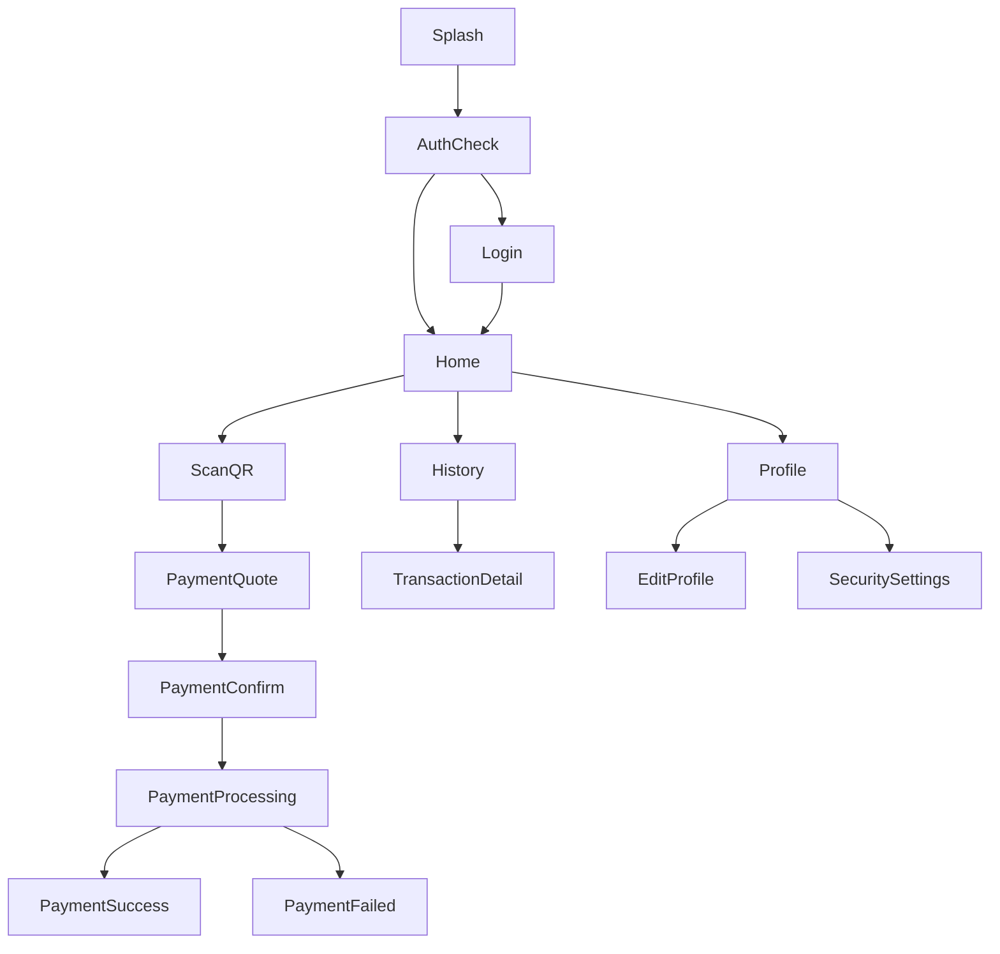

---

# 3. Navigation Map

## Global Navigation

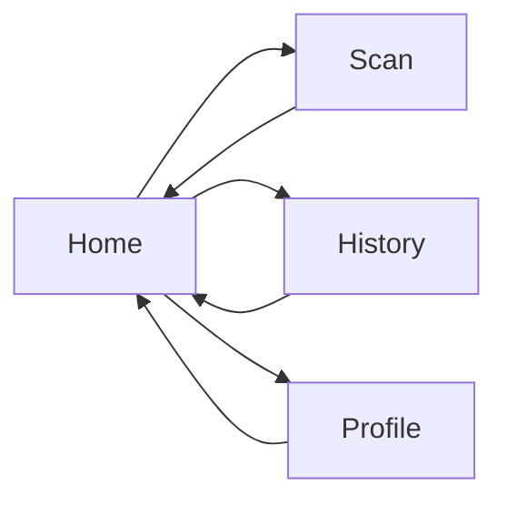

---

# 4. Screen Inventory

## Authentication

```text
S001 - Splash Screen
S002 - Login Screen
S003 - Register Screen
S004 - Forgot Password Screen
S005 - Reset Password Screen
```

---

## Main Application

```text
S101 - Home Screen
S102 - Scan QR Screen
S103 - Payment Quote Screen
S104 - Payment Confirmation Screen
S105 - Payment Processing Screen
S106 - Payment Success Screen
S107 - Payment Failed Screen
```

---

## Transactions

```text
S201 - Transaction History Screen
S202 - Transaction Detail Screen
```

---

## Profile

```text
S301 - Profile Screen
S302 - Edit Profile Screen
S303 - Security Settings Screen
S304 - Change PIN Screen
S305 - Change Password Screen
```

---

# 5. Authentication Screens

---

# S001 - Splash Screen

## Purpose

Initial application loading.

---

## Components

```text
Logo
Loading Indicator
```

---

## Navigation

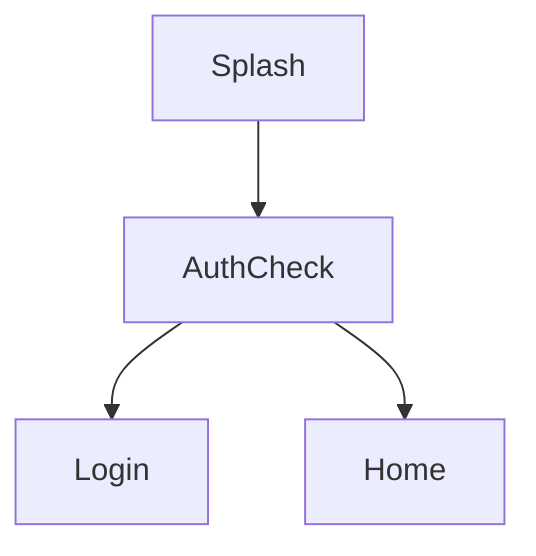

---

## Conditions

### User Logged In

```text
Navigate Home
```

### User Not Logged In

```text
Navigate Login
```

---

# S002 - Login Screen

## Purpose

Authenticate user.

---

## Components

```text
Email Input
Password Input
Login Button
Register Link
Forgot Password Link
```

---

## Actions

### Login Success

```text
Navigate Home
```

---

### Forgot Password

```text
Navigate Forgot Password
```

---

### Register

```text
Navigate Register
```

---

## Navigation

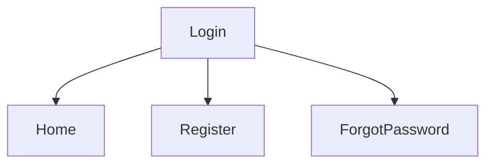

---

# S003 - Register Screen

## Purpose

Create account.

---

## Components

```text
Email
Password
Confirm Password
Country Selector
Register Button
```

---

## Navigation

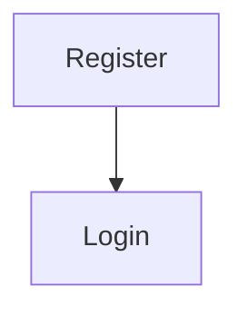

---

# S004 - Forgot Password Screen

## Purpose

Recover account.

---

## Components

```text
Email Input
Send OTP Button
```

---

## Navigation

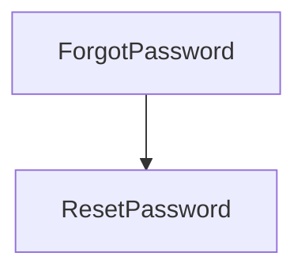

---

# S005 - Reset Password Screen

## Purpose

Set new password.

---

## Components

```text
OTP Input
New Password
Confirm Password
Submit Button
```

---

## Navigation

```text
Back To Login
```

---

# 6. Main Application Screens

---

# S101 - Home Screen

## Purpose

Main dashboard.

---

## Components

### Header

```text
Welcome Message
User Name
```

---

### Rate Card

```text
Current USDT/VND Rate
Last Updated
```

---

### Quick Actions

```text
Scan QR
History
Profile
```

---

### Recent Transactions

```text
Latest Transactions
```

---

## Navigation

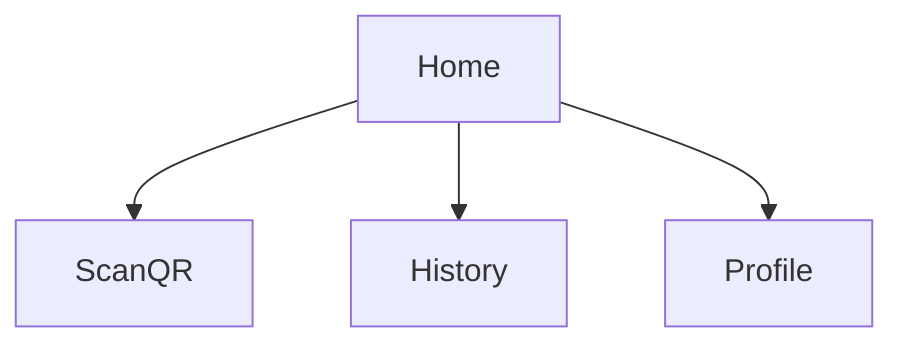

---

# S102 - Scan QR Screen

## Purpose

Scan VietQR.

---

## Components

```text
Camera Preview
QR Frame
Flash Toggle
```

---

## Success Flow

```text
QR Parsed
Navigate Payment Quote
```

---

## Error Flow

```text
Invalid QR
Retry
```

---

## Navigation

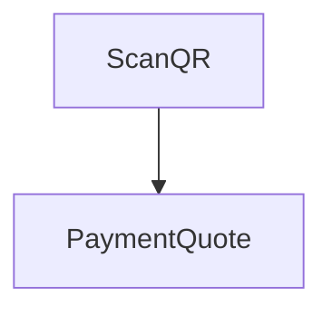

---

# S103 - Payment Quote Screen

## Purpose

Generate payment quote.

---

## Components

### Merchant Information

```text
Merchant Name
Bank Name
Account Number
```

---

### Amount Input

```text
VND Amount
```

---

### Quote Information

```text
Rate
Fee
Required USDT
```

---

### Actions

```text
Continue
Cancel
```

---

## Navigation

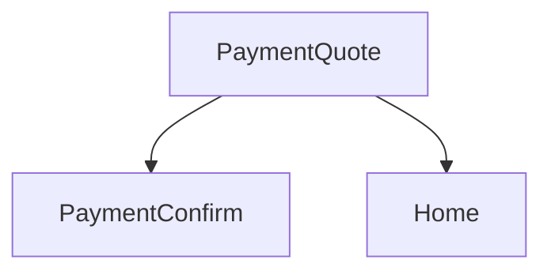

---

# S104 - Payment Confirmation Screen

## Purpose

Review payment before submission.

---

## Components

```text
Merchant Info
VND Amount
Rate
Fee
USDT Amount
```

---

### Authentication

```text
PIN Input
```

---

## Actions

```text
Confirm Payment
Cancel
```

---

## Navigation

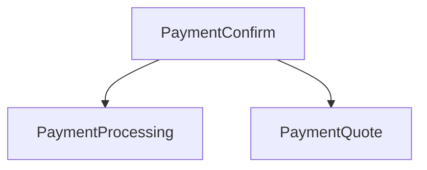

---

# S105 - Payment Processing Screen

## Purpose

Display transaction progress.

---

## Components

```text
Loading Animation
Status Text
Current Step
```

---

## Payment Stages

```text
Waiting Payment
Payment Detected
Payment Confirmed
Processing Payout
```

---

## Navigation

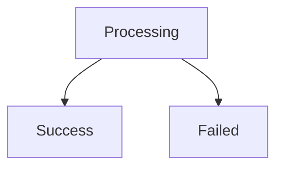

---

# S106 - Payment Success Screen

## Purpose

Display successful payment.

---

## Components

```text
Success Icon
Merchant Name
Amount
Transaction ID
```

---

## Actions

```text
View Details
Back Home
```

---

## Navigation

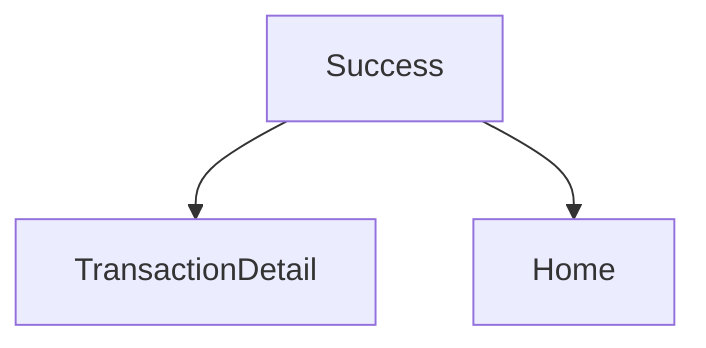

---

# S107 - Payment Failed Screen

## Purpose

Display failed payment.

---

## Components

```text
Error Message
Failure Reason
```

---

## Actions

```text
Try Again
Contact Support
Back Home
```

---

## Navigation

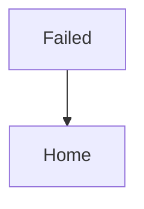

---

# 7. Transaction Screens

---

# S201 - Transaction History Screen

## Purpose

Display payment history.

---

## Components

```text
Search
Filter
Transaction List
```

---

## Transaction Card

```text
Merchant
Amount
Status
Date
```

---

## Navigation

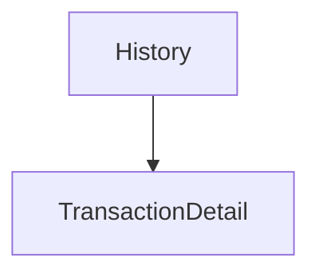

---

# S202 - Transaction Detail Screen

## Purpose

Display full transaction information.

---

## Components

### Basic Information

```text
Transaction ID
Date
Status
```

---

### Payment Information

```text
Merchant
Bank
Amount VND
Amount USDT
Rate
Fee
```

---

### Blockchain Information

```text
Transaction Hash
Network
```

---

### Payout Information

```text
Payout Status
Payout Time
```

---

## Navigation

```text
Back To History
```

---

# 8. Profile Screens

---

# S301 - Profile Screen

## Purpose

Manage account settings.

---

## Components

```text
Avatar
Display Name
Email
Country
```

---

## Actions

```text
Edit Profile
Security Settings
Logout
```

---

## Navigation

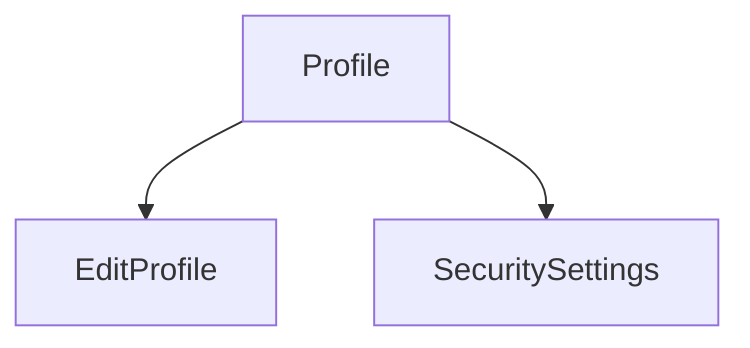

---

# S302 - Edit Profile Screen

## Purpose

Update profile information.

---

## Editable Fields

```text
Display Name
Country
```

---

## Actions

```text
Save
Cancel
```

---

# S303 - Security Settings Screen

## Purpose

Manage account security.

---

## Options

```text
Change PIN
Change Password
```

---

## Navigation

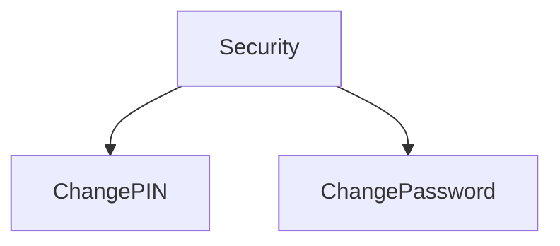

---

# S304 - Change PIN Screen

## Components

```text
Current PIN
New PIN
Confirm PIN
```

---

## Actions

```text
Update PIN
```

---

# S305 - Change Password Screen

## Components

```text
Current Password
New Password
Confirm Password
```

---

## Actions

```text
Update Password
```

---

# 9. Bottom Navigation

## MVP Tabs

```text
Home
Scan
History
Profile
```

---

## Structure

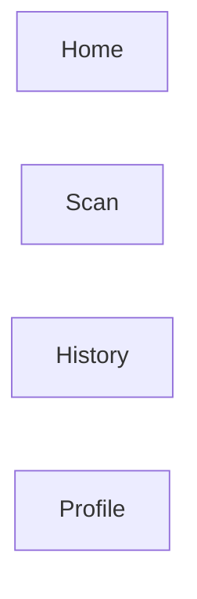

---

# 10. Primary User Journey

## Payment Journey

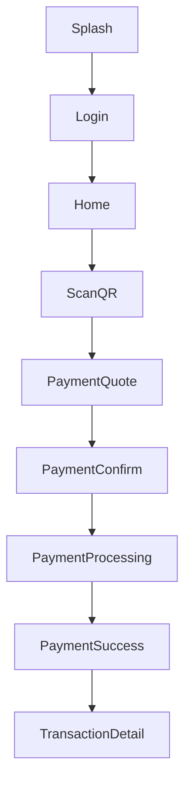

---

# 11. Error Journeys

## Invalid QR

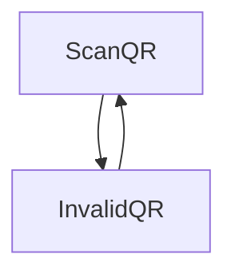

---

## Payment Timeout

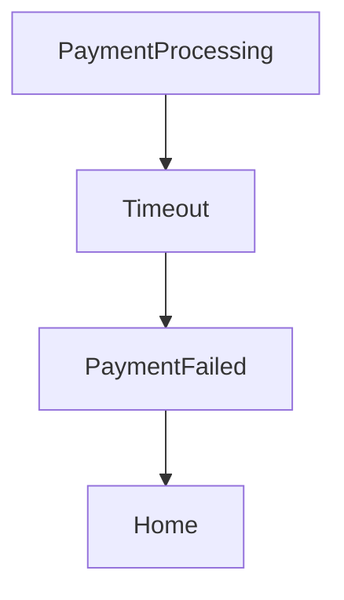

---

## Payout Failure

```mermaid
flowchart TD

PaymentProcessing

PaymentProcessing --> PayoutFailure

PayoutFailure --> PaymentFailed

PaymentFailed --> Home
```

---

# 12. MVP Screen Summary

## Total Screens

```text
Authentication: 5

Main App: 7

Transactions: 2

Profile: 5

Total: 19 Screens
```

---

## MVP Critical Screens

```text
Home

Scan QR

Payment Quote

Payment Confirmation

Payment Processing

Payment Success

Transaction Detail
```

These screens represent the core value proposition of MistyPay and should receive the highest design and development priority.
