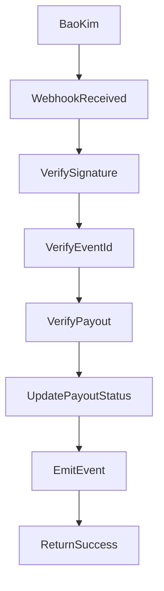
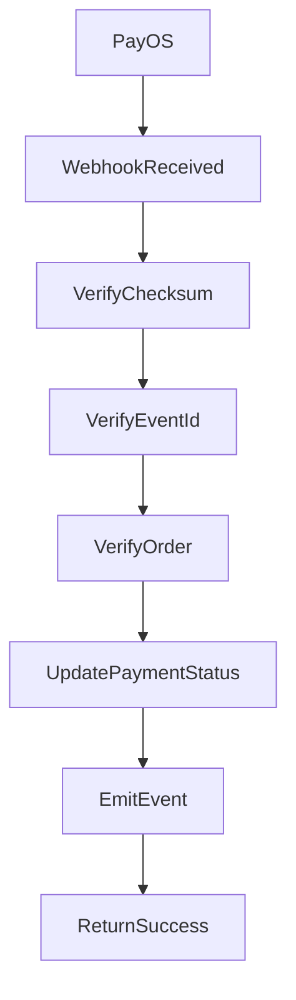

# MistyPay - Webhook Specification Document

> Version: 1.0
> Status: Draft - MVP Phase
> Product: MistyPay
> API Style: REST Webhook
> Last Updated: 2026

---

# 1. Document Purpose

This document defines webhook endpoints used by MistyPay MVP.

Objectives:

- Define provider callback contracts
- Standardize webhook handling
- Support payout status updates
- Prevent duplicate processing
- Support NestJS implementation
- Support audit and monitoring

---

# 2. Webhook Scope

## Included

```text
BaoKim Payout Webhook
PayOS Payment Webhook
```

---

## Excluded From MVP

```text
TronGrid Webhook
Blockchain Webhook
```

Reason:

```text
Blockchain detection uses polling worker in MVP.
```

---

# 3. Webhook Principles

## Rule 1

All webhooks must be:

```text
POST only
```

---

## Rule 2

All webhooks must use:

```text
HTTPS
```

---

## Rule 3

All webhooks must verify:

```text
Signature
Timestamp
Provider Reference
```

---

## Rule 4

All webhook events must be idempotent.

Same event:

```text
Processed once only.
```

---

# 4. Webhook Endpoints

## BaoKim Payout Webhook

```http
POST /api/v1/webhooks/baokim/payout
```

Purpose:

```text
Receive payout result from BaoKim.
```

---

## PayOS Payment Webhook

```http
POST /api/v1/webhooks/payos/payment
```

Purpose:

```text
Receive payment or top-up status from PayOS.
```

---

# 5. BaoKim Payout Webhook

## Endpoint

```http
POST /api/v1/webhooks/baokim/payout
```

---

## Event Types

```text
PAYOUT_PROCESSING
PAYOUT_SUCCESS
PAYOUT_FAILED
```

---

## Example Payload

```json
{
  "eventId": "bk_evt_123456",
  "orderCode": "MP202600001",
  "providerReference": "BK998877",
  "status": "SUCCESS",
  "amount": 500000,
  "currency": "VND",
  "timestamp": "2026-01-01T10:00:00Z",
  "signature": "provider_signature"
}
```

---

## Required Fields

```text
eventId
orderCode
providerReference
status
amount
currency
timestamp
signature
```

---

## Processing Flow



---

## Status Mapping

| BaoKim Status | MistyPay Status   |
| ------------- | ----------------- |
| PROCESSING    | PAYOUT_PROCESSING |
| SUCCESS       | PAYOUT_SUCCESS    |
| FAILED        | PAYOUT_FAILED     |

---

## Success Response

```json
{
  "success": true
}
```

---

## Invalid Signature Response

```json
{
  "success": false,
  "error": {
    "code": "WEBHOOK_INVALID_SIGNATURE",
    "message": "Invalid webhook signature."
  }
}
```

HTTP Status:

```text
401
```

---

# 6. PayOS Payment Webhook

## Endpoint

```http
POST /api/v1/webhooks/payos/payment
```

---

## Event Types

```text
PAYOS_PAID
PAYOS_FAILED
PAYOS_EXPIRED
```

---

## Example Payload

```json
{
  "eventId": "payos_evt_123456",
  "orderCode": "TOPUP202600001",
  "status": "PAID",
  "amount": 10000000,
  "currency": "VND",
  "transactionId": "payos_tx_123",
  "timestamp": "2026-01-01T10:00:00Z",
  "signature": "provider_signature"
}
```

---

## Required Fields

```text
eventId
orderCode
status
amount
currency
transactionId
timestamp
signature
```

---

## Processing Flow



---

## Status Mapping

| PayOS Status | MistyPay Status |
| ------------ | --------------- |
| PAID         | PAYMENT_SUCCESS |
| FAILED       | PAYMENT_FAILED  |
| EXPIRED      | PAYMENT_EXPIRED |

---

# 7. Webhook Security

## Signature Verification

Every webhook must verify provider signature.

---

## Timestamp Validation

Reject webhook if timestamp is older than:

```text
5 minutes
```

unless provider documentation requires otherwise.

---

## Replay Protection

Reject duplicate:

```text
eventId
```

---

## IP Whitelist

Future enhancement:

```text
Provider IP Whitelist
```

---

# 8. Webhook Idempotency

## Rule

A webhook event must never be processed twice.

---

## Unique Key

```text
provider + eventId
```

---

## Duplicate Handling

If duplicate webhook received:

```text
Return 200 OK
Do not process again
```

---

## Reason

Avoid:

```text
Duplicate payout
Duplicate ledger entry
Duplicate notification
```

---

# 9. Webhook Event Table

Recommended table:

```sql
CREATE TABLE webhook_events (
  id UUID PRIMARY KEY,
  provider VARCHAR(50) NOT NULL,
  event_id VARCHAR(255) NOT NULL,
  event_type VARCHAR(100),
  reference_code VARCHAR(255),
  status VARCHAR(50) NOT NULL,
  raw_payload JSONB,
  processed_at TIMESTAMP,
  created_at TIMESTAMP NOT NULL DEFAULT NOW(),

  UNIQUE(provider, event_id)
);
```

---

## Status Values

```text
RECEIVED
PROCESSED
FAILED
IGNORED
```

---

# 10. Error Handling

## Invalid Signature

Action:

```text
Reject
Log Security Warning
```

---

## Unknown Event

Action:

```text
Log
Return 400
```

---

## Duplicate Event

Action:

```text
Ignore
Return 200
```

---

## Missing Reference

Action:

```text
Log
Manual Review
```

---

# 11. Webhook Error Codes

```text
WEBHOOK_INVALID_SIGNATURE
WEBHOOK_DUPLICATE_EVENT
WEBHOOK_UNKNOWN_EVENT
WEBHOOK_MISSING_REFERENCE
WEBHOOK_PROCESSING_FAILED
WEBHOOK_PROVIDER_UNSUPPORTED
```

---

# 12. Audit Logging

Every webhook must create audit log.

---

## Required Audit Events

```text
WEBHOOK_RECEIVED
WEBHOOK_VERIFIED
WEBHOOK_PROCESSED
WEBHOOK_FAILED
WEBHOOK_DUPLICATE
```

---

# 13. Monitoring

Track:

```text
Webhook Received Count
Webhook Failed Count
Webhook Duplicate Count
Webhook Processing Time
```

---

# 14. Alerts

Generate alert when:

```text
5 consecutive webhook failures
```

or:

```text
Invalid signatures exceed threshold
```

or:

```text
Webhook received but matching payout not found
```

---

# 15. Webhook Retry Behavior

Provider may retry webhook.

MistyPay must handle retries safely.

---

## Safe Behavior

```text
Same eventId
↓
Already processed
↓
Return success
↓
No state change
```

---

# 16. Event Emission

After successful processing:

## BaoKim Success

Emit:

```text
PAYOUT_SUCCESS
```

---

## BaoKim Failed

Emit:

```text
PAYOUT_FAILED
```

---

## PayOS Paid

Emit:

```text
PAYMENT_SUCCESS
```

---

# 17. MVP Implementation Notes

## Controller

```text
WebhookController
```

---

## Services

```text
WebhookService
BaoKimWebhookService
PayOSWebhookService
SignatureVerificationService
```

---

## Guards

```text
WebhookSignatureGuard
```

---

# 18. Webhook Summary

## MVP Webhooks

```text
BaoKim Payout Webhook
PayOS Payment Webhook
```

---

## Not Included

```text
TronGrid Webhook
```

---

## Core Principle

```text
Webhook updates status.

Webhook must not create uncontrolled money movement.

Webhook processing must be idempotent.
```
