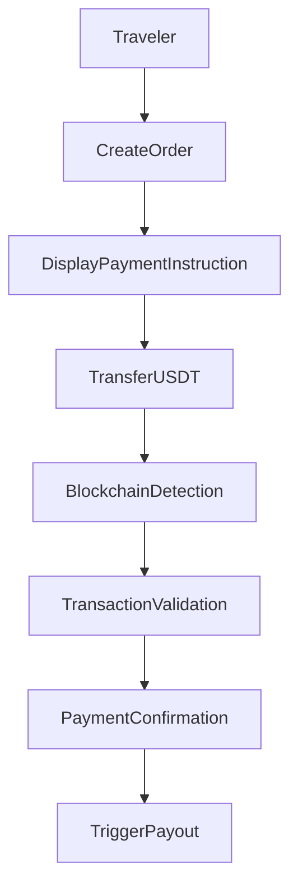
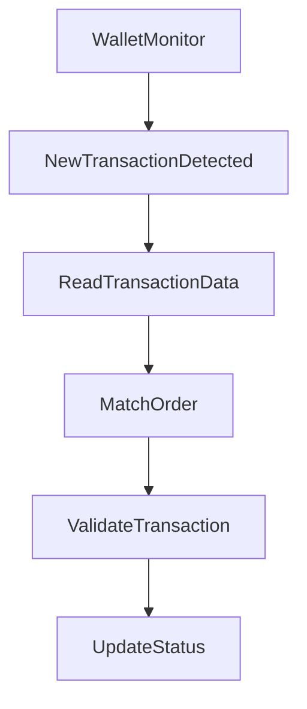
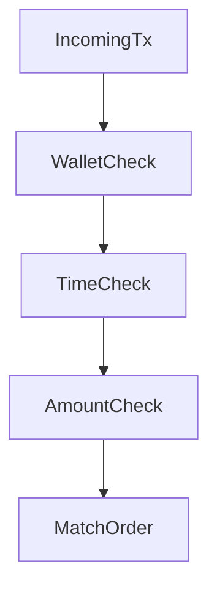
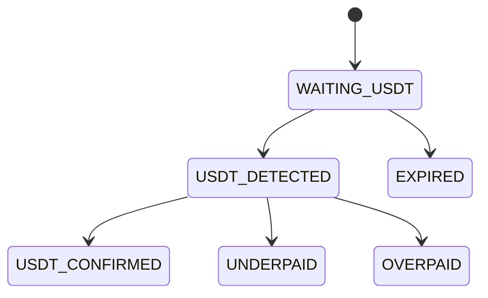
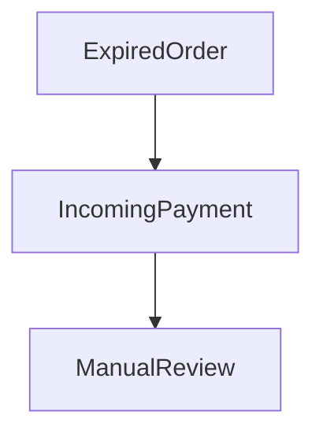

# MistyPay - Blockchain Process Document

> Version: 1.0
> Status: Draft - MVP Phase
> Product: MistyPay
> Last Updated: 2026

---

# 1. Document Purpose

This document defines the blockchain payment process of MistyPay.

Objectives:

- Define how USDT payments are received
- Define transaction verification process
- Define order matching rules
- Define payout trigger rules
- Support backend implementation
- Support blockchain integration

---

# 2. Scope

## Supported Network

```text
TRON
```

---

## Supported Asset

```text
USDT (TRC20)
```

---

## Out Of Scope

```text
Ethereum
Solana
Polygon
Bitcoin
USDC
Multi-chain support
```

---

# 3. High-Level Blockchain Flow



---

# 4. Payment Lifecycle

## Step 1 - Create Payment Order

User confirms quote.

---

### Input

```text
Quote ID
PIN
```

---

### Output

```text
Payment Order
```

---

### Generated Information

```text
Order ID
Order Code
Required USDT
Expiration Time
Settlement Wallet Address
```

---

## Example

```json
{
  "orderCode": "MP202600001",
  "requiredUsdt": 19.43,
  "walletAddress": "TXXXXXXXXXXXXXXXXXX",
  "expiresAt": "2026-01-01T10:05:00Z"
}
```

---

# 5. Settlement Wallet Strategy

## MVP Design

Single settlement wallet.

```text
Traveler
↓
Settlement Wallet
↓
Payout Process
```

---

## Wallet Type

```text
HOT WALLET
```

Purpose:

```text
Receive USDT
```

---

## Future Design

```text
Dedicated Wallet Per Order
```

Not included in MVP.

---

# 6. Payment Instruction Screen & Deep Linking

## Display To User & Automated Action

```text
Amount Required: 19.43 USDT
Network: TRON (TRC-20)
Destination Wallet: TXXXXXXXXXXXXXXXXXX
```

Instead of relying solely on manual copy-pasting, the payment screen supports **App-to-App Deep Linking** (Option B) for automated initiation:
1. **Quick Pay via Wallet:** Users can tap "TronLink", "Trust Wallet", or "Other Crypto Wallet" buttons.
2. **Auto-Population:** The app triggers the respective protocol (`tronlink://`, `trust://`, or standard `tron:`) with pre-filled parameters (`to` address, `amount`, and asset type).
3. **Approval:** The user only needs to authorize the transaction in their native wallet app and switch back.

---

## Rules

User must:

```text
1. Authorize transaction via their selected wallet app (or manually transfer if fallback is used)
2. Use TRON Network (TRC-20)
3. Ensure sufficient TRX for network gas/fees in their wallet
4. Maintain the app in foreground or return quickly to capture verification status
```

---

# 7. Blockchain Monitoring Architecture

## Monitoring Method

MVP:

```text
TronGrid API
```

---

## Monitoring Worker

```text
Blockchain Worker
```

Responsibilities:

```text
Monitor Settlement Wallet
Detect Transactions
Validate Transactions
Update Order Status
```

---

# 8. Blockchain Detection Flow



---

# 9. Transaction Data Collection

## Required Data

```text
Transaction Hash
From Address
To Address
Amount
Token
Network
Block Number
Timestamp
```

---

## Example

```json
{
  "txHash": "abc123",
  "from": "TAAA",
  "to": "TBBB",
  "amount": 19.43,
  "token": "USDT",
  "network": "TRON"
}
```

---

# 10. Transaction Matching Logic

## Purpose

Associate blockchain payment with payment order.

---

## Matching Rules

### Rule 1

Destination wallet must match:

```text
Settlement Wallet
```

---

### Rule 2

Transaction must occur before:

```text
Order Expiration
```

---

### Rule 3

Amount must match required amount.

---

## Matching Flow



---

# 11. Transaction Validation

## Validation Checklist

### Network Validation

Expected:

```text
TRON
```

---

### Token Validation

Expected:

```text
USDT
```

---

### Wallet Validation

Expected:

```text
Settlement Wallet
```

---

### Amount Validation

Expected:

```text
Required Amount
```

---

### Expiration Validation

Expected:

```text
Before Order Expiration
```

---

# 12. Amount Validation Rules

## Exact Match

```text
Required = Received
```

Result:

```text
USDT_CONFIRMED
```

---

## Tolerance

Allowed:

```text
±0.01 USDT
```

Example:

```text
Required: 19.43

Received: 19.4299
```

Accept.

---

## Underpaid

Example:

```text
Required: 19.43

Received: 19.00
```

Result:

```text
UNDERPAID
```

---

## Overpaid

Example:

```text
Required: 19.43

Received: 20.00
```

Result:

```text
OVERPAID
```

---

# 13. Transaction Confirmation

## Confirmation Requirements

### MVP

Required:

```text
1 Blockchain Confirmation
```

---

## Reason

Target:

```text
<10 seconds payment experience
```

---

## Future

Possible:

```text
3 Confirmations
```

for larger amounts.

---

# 14. Blockchain State Flow



---

# 15. Duplicate Transaction Handling

## Scenario

Same transaction processed twice.

---

## Detection

Check:

```text
tx_hash
```

Unique.

---

## Rule

If already exists:

```text
Ignore Transaction
```

---

## Status

```text
BLOCKCHAIN_TX_DUPLICATE
```

---

# 16. Late Payment Handling

## Scenario

User pays after order expiration.

---

## Flow



---

## Result

```text
MANUAL_REVIEW
```

---

# 17. Wrong Network Handling

## Scenario

User sends payment on unsupported network.

Example:

```text
USDT ERC20
```

instead of:

```text
USDT TRC20
```

---

## Result

```text
Payment Not Detected
```

---

## User Message

```text
Please use the TRON network.
```

---

# 18. Blockchain Worker Design

## Worker Name

```text
BlockchainWorker
```

---

## Responsibilities

```text
Monitor Wallet
Read Transactions
Validate Transactions
Update Orders
Trigger Payout
```

---

## Execution Interval

MVP:

```text
Every 2 Seconds
```

---

# 19. Internal Events

## Event

```text
PAYMENT_DETECTED
```

---

Triggered when:

```text
Transaction Found
```

---

## Event

```text
PAYMENT_CONFIRMED
```

---

Triggered when:

```text
Validation Successful
```

---

## Event

```text
PAYMENT_EXPIRED
```

---

Triggered when:

```text
Order Expired
```

---

# 20. Payout Trigger Rules

## Trigger Condition

All conditions must be true.

```text
USDT Detected
USDT Confirmed
Amount Valid
Order Active
```

---

## Trigger Event

```text
PAYMENT_CONFIRMED
```

---

## Next Action

```text
Create Payout Job
```

---

# 21. Monitoring Dashboard Metrics

## Metrics

```text
Transactions Detected

Transactions Confirmed

Underpaid Transactions

Overpaid Transactions

Expired Orders

Detection Time

Confirmation Time
```

---

# 22. Audit Logging

Every blockchain event must be logged.

---

## Example

```json
{
  "event": "PAYMENT_CONFIRMED",
  "orderId": "uuid",
  "txHash": "abc123",
  "amount": 19.43,
  "timestamp": "2026-01-01T10:00:00Z"
}
```

---

# 23. Error Scenarios

## Scenario 1

Wrong Token.

Result:

```text
Reject
```

---

## Scenario 2

Wrong Wallet.

Result:

```text
Reject
```

---

## Scenario 3

Underpaid.

Result:

```text
Manual Review
```

---

## Scenario 4

Overpaid.

Result:

```text
Manual Review
```

---

## Scenario 5

Expired Payment.

Result:

```text
Manual Review
```

---

## Scenario 6

Duplicate Transaction.

Result:

```text
Ignore
```

---

# 24. Future Enhancements

Not included in MVP.

---

## Multi Wallet

```text
One Wallet Per Order
```

---

## Multi Chain

```text
TRON
Solana
Polygon
```

---

## Auto Refund

```text
Overpaid
Expired Payments
```

---

## Treasury Automation

```text
Auto Convert USDT
Auto Balance Management
```

---

# 25. Blockchain Process Summary

## Network

```text
TRON
```

---

## Asset

```text
USDT TRC20
```

---

## Detection

```text
TronGrid
```

---

## Confirmation

```text
1 Confirmation
```

---

## Tolerance

```text
±0.01 USDT
```

---

## Trigger

```text
PAYMENT_CONFIRMED
```

---

## Next Step

```text
Payout Process
```

This concludes the blockchain processing lifecycle for MistyPay MVP.
