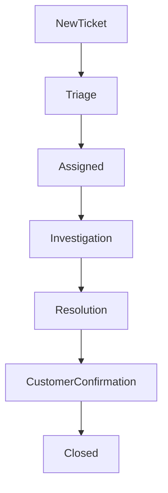
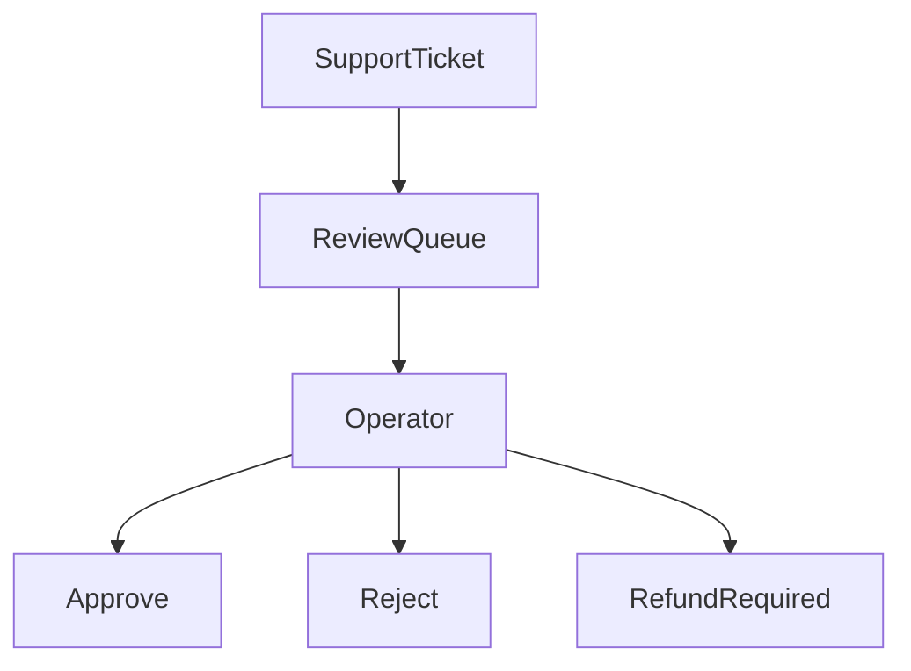

# MistyPay - Customer Support Workflow

> Version: 1.0
> Status: Draft - MVP Phase
> Product: MistyPay
> Last Updated: 2026

---

# 1. Document Purpose

This document defines customer support processes for MistyPay MVP.

Objectives:

- Standardize support handling
- Improve customer experience
- Reduce resolution time
- Protect treasury
- Ensure proper escalation
- Create operational consistency

---

# 2. Support Philosophy

Core Principle:

```text
Fast Response
Accurate Investigation
Controlled Resolution
```

---

Support priority:

```text
Financial Issues
↓
Account Issues
↓
Technical Issues
↓
General Questions
```

---

# 3. Support Channels

## MVP

Supported:

```text
Email
Telegram
Zalo
```

---

## Future

Supported:

```text
In-App Support
Ticket System
Live Chat
```

---

# 4. Ticket Categories

```text
SUP-100 Payment Issues

SUP-200 Payout Issues

SUP-300 Account Issues

SUP-400 Technical Issues

SUP-500 General Questions
```

---

# 5. Ticket Severity

## P1

Customer funds potentially affected.

Examples:

```text
Missing payout

Duplicate payout

Treasury mismatch impact
```

Target response:

```text
15 minutes
```

---

## P2

Transaction delay.

Examples:

```text
USDT received but payout pending

Payment stuck
```

Target response:

```text
1 hour
```

---

## P3

Non-financial issue.

Examples:

```text
Login problem

UI issue

Feature question
```

Target response:

```text
24 hours
```

---

# 6. Ticket Lifecycle



---

# 7. Ticket Statuses

```text
OPEN

ASSIGNED

INVESTIGATING

WAITING_CUSTOMER

RESOLVED

CLOSED
```

---

# 8. Required Ticket Information

Customer should provide:

```text
Transaction ID

Payment ID

Wallet Address

Amount

Issue Description

Screenshot (Optional)
```

---

# 9. Support Workflow

## Step 1

Receive ticket.

---

## Step 2

Categorize issue.

---

## Step 3

Assign severity.

---

## Step 4

Investigate.

---

## Step 5

Resolve.

---

## Step 6

Document outcome.

---

# 10. SUP-101 Missing Payout

## Customer Report

Example:

```text
I paid USDT
but merchant has not received VND.
```

---

## Investigation Checklist

Verify:

```text
Payment Status

Blockchain Transaction

Payout Status

Provider Status

Treasury Status
```

---

## Possible Outcomes

### Payout Pending

```text
Inform Customer
```

---

### Payout Failed

```text
Retry
```

---

### Requires Review

```text
Manual Investigation
```

---

# 11. SUP-102 Payment Not Detected

## Customer Report

```text
USDT sent
but payment still waiting.
```

---

## Investigation

Verify:

```text
Wallet Address

Network

Token

Amount

tx_hash
```

---

## Outcomes

### Transaction Valid

```text
Process Manually
```

---

### Wrong Network

```text
Manual Review
```

---

### Wrong Amount

```text
Manual Review
```

---

# 12. SUP-103 Underpaid Transaction

## Investigation

Verify:

```text
Expected Amount

Received Amount
```

---

## Outcome

```text
Manual Review
```

---

# 13. SUP-104 Overpaid Transaction

## Investigation

Verify:

```text
Expected Amount

Received Amount
```

---

## Outcome

```text
Manual Review
```

---

# 14. SUP-201 Account Access Issues

Examples:

```text
Cannot Login

PIN Locked

Password Reset
```

---

## Verification

Verify:

```text
Email Ownership
```

---

## Resolution

```text
Unlock

Reset Password

Reset PIN
```

---

# 15. SUP-202 Fraud Complaint

Examples:

```text
Unauthorized Activity

Suspicious Transactions
```

---

## Immediate Actions

```text
Flag Account

Investigate Logs

Review Transactions
```

---

## Escalation

```text
Fraud Review Required
```

---

# 16. SUP-301 Technical Issues

Examples:

```text
App Crash

Slow Performance

API Error
```

---

## Investigation

Collect:

```text
App Version

OS Version

Logs

Screenshots
```

---

# 17. Escalation Rules

## Escalate Immediately

```text
Treasury Mismatch

Duplicate Payout

Credential Leak

Fraud Suspicion
```

---

## Escalate Within 1 Hour

```text
Provider Outage

Mass Transaction Failure
```

---

# 18. Manual Review Workflow



---

# 19. Customer Communication Templates

## Transaction Pending

```text
Your transaction has been received and is currently being processed.

We are verifying settlement details.

Please allow additional processing time.
```

---

## Investigation Required

```text
Your transaction requires manual review.

Our team is currently investigating the issue.

We will provide an update as soon as possible.
```

---

## Resolved

```text
Your issue has been resolved successfully.

Thank you for your patience.
```

---

# 20. SLA Targets

| Issue Type | Response | Resolution Target |
| ---------- | -------- | ----------------- |
| P1         | 15 min   | 4 hours           |
| P2         | 1 hour   | 24 hours          |
| P3         | 24 hours | 3 business days   |

---

# 21. Support Dashboard

Track:

```text
Open Tickets

Pending Reviews

Resolved Tickets

Average Response Time

Average Resolution Time
```

---

# 22. Support KPIs

Measure:

```text
First Response Time

Resolution Time

Customer Satisfaction

Ticket Volume

Escalation Rate
```

---

# 23. Ticket Audit Requirements

Each ticket must record:

```text
Ticket ID

Customer

Category

Severity

Assigned Operator

Resolution

Resolution Time
```

---

# 24. Support Documentation

All resolutions should be documented.

Purpose:

```text
Knowledge Base

Future Training

Pattern Detection
```

---

# 25. Common Resolution Paths

## Payment Not Detected

```text
Verify tx_hash
↓
Verify Wallet
↓
Verify Amount
↓
Resolve or Review
```

---

## Missing Payout

```text
Verify Payment
↓
Verify Payout
↓
Verify Provider
↓
Retry or Resolve
```

---

## Account Issue

```text
Verify Identity
↓
Reset Access
↓
Audit Log
```

---

# 26. Future Enhancements

Future versions may include:

```text
Ticket Portal

Live Chat

AI Support Assistant

Self-Service Help Center
```

---

# 27. MVP Support Summary

Most common support issues:

```text
Payment Not Detected

Delayed Payout

Underpaid Transaction

Overpaid Transaction

Login Issues
```

---

Most critical support issues:

```text
Missing Funds

Duplicate Payout

Fraud Reports
```

---

# 28. Final Principle

For MistyPay:

```text
Every support ticket
is a trust signal.
```

---

```text
Customers care about outcomes.

Support must provide:

Visibility
Accuracy
Resolution
```
