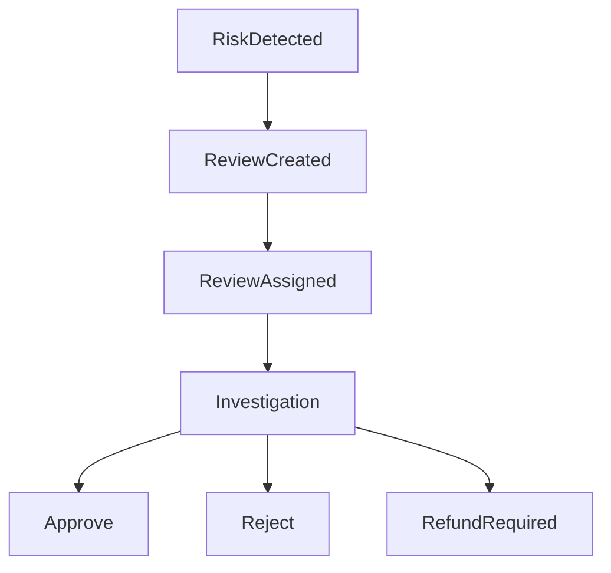

# MistyPay - Fraud Risk Management Document

> Version: 1.0
> Status: Draft - MVP Phase
> Product: MistyPay
> Last Updated: 2026

---

# 1. Document Purpose

This document defines fraud detection, risk assessment and fraud response policies for MistyPay MVP.

Objectives:

- Reduce financial losses
- Detect suspicious activities
- Protect treasury
- Protect merchants
- Protect platform reputation
- Support future AML/KYC enhancements

---

# 2. Fraud Management Philosophy

Core Principle:

```text
Trust users.

Verify transactions.

Protect treasury.
```

---

MVP Strategy:

```text
Simple Rules
+
Manual Review
+
Audit Logging
```

Instead of:

```text
Complex AI Risk Engine
```

---

# 3. Risk Levels

## LOW

Normal behavior.

Action:

```text
Allow Transaction
```

---

## MEDIUM

Suspicious behavior.

Action:

```text
Flag
Monitor
```

---

## HIGH

Strong fraud indicators.

Action:

```text
Manual Review
```

---

## CRITICAL

High probability of abuse.

Action:

```text
Block Transaction
Alert Operator
```

---

# 4. Fraud Categories

```text
FR-100 Payment Fraud

FR-200 Payout Fraud

FR-300 Account Abuse

FR-400 Treasury Abuse

FR-500 System Abuse
```

---

# 5. FR-100 Payment Fraud

## FR-101 Underpaid Transactions

Condition:

```text
USDT < Required Amount
```

Risk:

```text
MEDIUM
```

Action:

```text
Manual Review
```

---

## FR-102 Excessive Underpaid Attempts

Condition:

```text
3 underpaid payments
within 24 hours
```

Risk:

```text
HIGH
```

Action:

```text
Risk Flag
```

---

## FR-103 Overpaid Transactions

Condition:

```text
USDT > Required Amount
```

Risk:

```text
LOW
```

Reason:

```text
User Mistake
```

Possible.

---

Action:

```text
Manual Review
```

---

## FR-104 Expired Payment Settlement

Condition:

```text
USDT arrives
after expiration
```

Risk:

```text
MEDIUM
```

Action:

```text
Manual Review
```

---

## FR-105 Transaction Replay

Condition:

```text
Duplicate tx_hash
```

Risk:

```text
CRITICAL
```

Action:

```text
Reject
Alert
```

---

# 6. FR-200 Payout Fraud

## FR-201 Duplicate Payout Attempt

Condition:

```text
Same Payment
Multiple Payout Requests
```

Risk:

```text
CRITICAL
```

Action:

```text
Block
Alert
Audit
```

---

## FR-202 Payout Retry Abuse

Condition:

```text
Unexpected retry loop
```

Risk:

```text
HIGH
```

Action:

```text
Pause Payout
Review
```

---

## FR-203 Invalid Bank Account

Condition:

```text
Repeated payout failures
same account
```

Risk:

```text
MEDIUM
```

Action:

```text
Review Merchant
```

---

# 7. FR-300 Account Abuse

## FR-301 Brute Force Login

Condition:

```text
10 failed logins
within 10 minutes
```

Risk:

```text
HIGH
```

Action:

```text
Temporary Lock
```

---

## FR-302 PIN Abuse

Condition:

```text
5 failed PIN attempts
```

Risk:

```text
MEDIUM
```

Action:

```text
15-minute Lock
```

---

## FR-303 Multiple Device Abuse

Condition:

```text
Rapid account access
from many devices
```

Risk:

```text
MEDIUM
```

Action:

```text
Flag Account
```

---

## FR-304 Session Anomaly

Condition:

```text
Impossible geographic jump
```

Example:

```text
Vietnam
↓
Germany
↓
Vietnam
within minutes
```

Risk:

```text
HIGH
```

Action:

```text
Require Re-Authentication
```

---

# 8. FR-400 Treasury Abuse

## FR-401 Treasury Mismatch

Condition:

```text
Actual Balance
≠
Ledger Balance
```

Risk:

```text
CRITICAL
```

Action:

```text
Pause Investigation
```

---

## FR-402 Unauthorized Treasury Adjustment

Condition:

```text
Treasury modified
without audit trail
```

Risk:

```text
CRITICAL
```

Action:

```text
Immediate Investigation
```

---

# 9. FR-500 System Abuse

## FR-501 Quote Spam

Condition:

```text
100 quotes
within 1 hour
```

Risk:

```text
MEDIUM
```

Action:

```text
Rate Limit
```

---

## FR-502 Payment Spam

Condition:

```text
Repeated payment creation
without completion
```

Risk:

```text
MEDIUM
```

Action:

```text
Temporary Restriction
```

---

## FR-503 API Abuse

Condition:

```text
Request volume
exceeds threshold
```

Risk:

```text
HIGH
```

Action:

```text
Rate Limit
Block
```

---

# 10. Risk Scoring System

MVP Score Range:

```text
0 - 100
```

---

## Low Risk

```text
0 - 29
```

---

## Medium Risk

```text
30 - 59
```

---

## High Risk

```text
60 - 79
```

---

## Critical Risk

```text
80 - 100
```

---

# 11. Example Risk Scores

## Underpaid

```text
20 points
```

---

## Expired Payment

```text
20 points
```

---

## Repeated Login Failure

```text
30 points
```

---

## Duplicate Payout Attempt

```text
100 points
```

---

## Treasury Mismatch

```text
100 points
```

---

# 12. Risk Actions

## Score < 30

```text
Allow
```

---

## Score 30 - 59

```text
Monitor
```

---

## Score 60 - 79

```text
Manual Review
```

---

## Score >= 80

```text
Block
Alert
```

---

# 13. Manual Review Triggers

Automatically create review for:

```text
Underpaid

Overpaid

Late Payment

Duplicate tx_hash

Retry Exhausted

Treasury Mismatch
```

---

# 14. Review Workflow



---

# 15. Fraud Monitoring Dashboard

Display:

```text
Flagged Accounts

Open Reviews

Blocked Transactions

Risk Events

Fraud Trends
```

---

# 16. Fraud Alerts

Immediate Alert Required:

```text
Duplicate Payout

Treasury Mismatch

Duplicate tx_hash

Provider Callback Abuse
```

---

# 17. Fraud Audit Logging

Must log:

```text
Risk Event

Risk Score

Decision

Operator

Timestamp
```

---

# 18. Fraud KPIs

Track:

```text
Risk Events

Reviews Created

Reviews Resolved

Blocked Transactions

False Positives
```

---

# 19. False Positive Policy

Principle:

```text
Protect Treasury
without harming legitimate users.
```

---

Review regularly:

```text
Blocked Users

Rejected Transactions
```

---

# 20. Incident Escalation

## P1

Examples:

```text
Treasury Mismatch

Duplicate Payout

Credential Compromise
```

Response:

```text
Immediate
```

---

## P2

Examples:

```text
Repeated Fraud Attempts

Mass API Abuse
```

Response:

```text
Within 1 Hour
```

---

## P3

Examples:

```text
Minor User Abuse
```

Response:

```text
Within 24 Hours
```

---

# 21. Future Enhancements

Future versions may add:

```text
Device Fingerprinting

Behavior Analysis

IP Reputation

AML Screening

KYC Verification

Machine Learning Risk Engine
```

---

# 22. MVP Fraud Rules Summary

Critical Fraud Events:

```text
Duplicate tx_hash

Duplicate Payout

Treasury Mismatch

Unauthorized Treasury Changes

Provider Abuse
```

---

High-Risk Events:

```text
Brute Force Login

Session Anomaly

Payout Retry Abuse
```

---

Medium-Risk Events:

```text
Underpaid

Overpaid

Expired Payment

Quote Spam
```

---

# 23. Final Principle

For MistyPay:

```text
Fraud prevention is not about
catching every attacker.

It is about making fraud
more expensive than the reward.
```

---

```text
Protect Treasury First.

Review Suspicious Activity.

Trust Verified Transactions.
```
