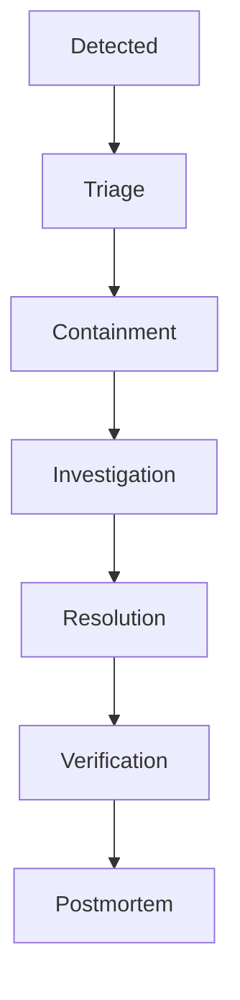

# MistyPay - Incident Response Playbook

> Version: 1.0
> Status: Draft - MVP Phase
> Product: MistyPay
> Last Updated: 2026

---

# 1. Document Purpose

This document defines the procedures for detecting, responding to, mitigating and recovering from incidents affecting MistyPay.

Objectives:

- Minimize financial risk
- Minimize downtime
- Protect treasury
- Protect customer trust
- Standardize incident handling
- Improve recovery speed

---

# 2. Incident Management Principles

Priority order:

```text
1. Protect Funds

2. Protect Treasury

3. Protect Ledger Integrity

4. Restore Services

5. Investigate Root Cause
```

---

Core rule:

```text
When uncertain,
pause financial operations.
```

---

# 3. Incident Severity Levels

## P1 - Critical

Examples:

```text
Treasury Mismatch

Duplicate Payout

Database Corruption

Provider Credential Leak

Unauthorized Treasury Access
```

---

Target Response:

```text
Immediate
```

---

Target Resolution:

```text
Within 4 Hours
```

---

## P2 - High

Examples:

```text
Payout Failure

Blockchain Detection Failure

Redis Failure

Worker Failure

Provider Outage
```

---

Target Response:

```text
Within 15 Minutes
```

---

Target Resolution:

```text
Within 24 Hours
```

---

## P3 - Medium

Examples:

```text
UI Bugs

Minor API Errors

Monitoring Issues
```

---

Target Response:

```text
Within 24 Hours
```

---

# 4. Incident Lifecycle



---

# 5. Incident Roles

## Founder

Responsibilities:

```text
Incident Commander

Treasury Decisions

Recovery Approval

External Communication
```

---

## Operator (Future)

Responsibilities:

```text
Monitoring

Investigation

Execution
```

---

## Auditor (Future)

Responsibilities:

```text
Ledger Verification

Treasury Verification
```

---

# 6. Incident Detection Sources

Sources:

```text
Monitoring Alerts

Fraud Alerts

User Reports

Provider Notifications

Manual Review Findings
```

---

# 7. General Response Procedure

## Step 1

Identify incident.

---

## Step 2

Determine severity.

```text
P1
P2
P3
```

---

## Step 3

Contain damage.

---

## Step 4

Investigate root cause.

---

## Step 5

Restore service.

---

## Step 6

Verify recovery.

---

## Step 7

Document incident.

---

# 8. Playbook - Treasury Mismatch

## Severity

```text
P1
```

---

## Detection

Trigger:

```text
Actual Balance
≠
Ledger Balance
```

---

## Immediate Actions

```text
Pause New Transactions

Pause New Payouts

Freeze Treasury Operations
```

---

## Investigation

Verify:

```text
Ledger Entries

Blockchain Transactions

Provider Payout Records

Manual Adjustments
```

---

## Recovery

```text
Correct Ledger

Verify Treasury

Run Reconciliation
```

---

## Exit Criteria

```text
Mismatch Resolved
Reconciliation Passed
```

---

# 9. Playbook - Duplicate Payout

## Severity

```text
P1
```

---

## Detection

Trigger:

```text
Same Payment
Multiple Payouts
```

---

## Immediate Actions

```text
Pause Payout Worker

Identify Affected Transactions

Block Additional Payouts
```

---

## Investigation

Review:

```text
Idempotency

Provider Callbacks

Retry Logic
```

---

## Recovery

```text
Patch Root Cause

Reconcile Treasury

Resume Payouts
```

---

# 10. Playbook - BaoKim Outage

## Severity

```text
P2
```

---

## Detection

```text
Payout API Errors

Provider Timeout
```

---

## Immediate Actions

```text
Pause New Payout Jobs

Queue Pending Payouts
```

---

## Investigation

Verify:

```text
Provider Status

Network Connectivity
```

---

## Recovery

```text
Retry Payouts

Verify Completion
```

---

# 11. Playbook - TronGrid Outage

## Severity

```text
P2
```

---

## Detection

```text
Blockchain Worker Errors
```

---

## Immediate Actions

```text
Pause Detection Jobs

Keep Existing Payments Pending
```

---

## Recovery

```text
Resume Monitoring

Backfill Missing Transactions
```

---

# 12. Playbook - Database Failure

## Severity

```text
P1
```

---

## Immediate Actions

```text
Stop API

Stop Workers

Prevent New Transactions
```

---

## Recovery

```text
Restore Database

Verify Data Integrity

Run Reconciliation
```

---

## Exit Criteria

```text
Database Healthy
Treasury Verified
```

---

# 13. Playbook - Redis Failure

## Severity

```text
P2
```

---

## Immediate Actions

```text
Restart Redis

Pause Worker Processing
```

---

## Recovery

```text
Restore Redis

Restart Workers

Verify Queues
```

---

# 14. Playbook - Worker Failure

## Severity

```text
P2
```

---

## Detection

```text
No Jobs Processed
```

---

## Recovery

```text
Restart Worker

Verify Queue Health

Requeue Failed Jobs
```

---

# 15. Playbook - Credential Leak

## Severity

```text
P1
```

---

Examples:

```text
BaoKim Secret

JWT Secret

Database Password

API Key
```

---

## Immediate Actions

```text
Rotate Credential

Invalidate Sessions

Review Access Logs
```

---

## Recovery

```text
Deploy New Secrets

Verify Services
```

---

# 16. Playbook - Brute Force Attack

## Severity

```text
P2
```

---

## Detection

```text
Repeated Login Failures
```

---

## Response

```text
Rate Limit

Temporary Lock

Review IPs
```

---

# 17. Playbook - Treasury Low Balance

## Severity

```text
P2
```

---

## Detection

```text
Balance Below Threshold
```

---

## Response

```text
Notify Founder

Prepare Refill
```

---

## Critical Threshold

If:

```text
VND < 5,000,000
```

Then:

```text
Stop New Transactions
```

---

# 18. Communication Policy

## Internal

Notify:

```text
Founder
```

Immediately for:

```text
P1
P2
```

---

## External

Notify users only if:

```text
Service Impact Exists
```

---

# 19. Incident Log

Every incident must record:

```text
Incident ID

Date

Severity

Description

Root Cause

Impact

Resolution

Lessons Learned
```

---

# 20. Incident Timeline Example

```text
10:00 Alert Triggered

10:05 Incident Confirmed

10:10 Payouts Paused

10:30 Root Cause Found

11:00 Fix Applied

11:15 Verification Passed

11:30 Service Restored
```

---

# 21. Recovery Verification Checklist

Verify:

```text
API Healthy

Database Healthy

Redis Healthy

Workers Healthy

Treasury Verified

Reconciliation Passed
```

---

# 22. Postmortem Process

Required for:

```text
All P1 Incidents

Repeated P2 Incidents
```

---

Document:

```text
What Happened

Why It Happened

What Worked

What Failed

Prevention Actions
```

---

# 23. Escalation Matrix

| Severity | Response Time | Approval Required |
| -------- | ------------- | ----------------- |
| P1       | Immediate     | Founder           |
| P2       | 15 Minutes    | Founder           |
| P3       | 24 Hours      | None              |

---

# 24. Service Pause Policy

Pause immediately if:

```text
Treasury Mismatch

Duplicate Payout

Database Corruption

Unauthorized Treasury Access
```

---

# 25. Recovery Success Criteria

Recovery is complete when:

```text
System Operational

Treasury Verified

No Active Incident

Monitoring Healthy

Reconciliation Passed
```

---

# 26. MVP Incident Summary

Highest Priority Incidents:

```text
Treasury Mismatch

Duplicate Payout

Database Failure

Credential Leak
```

---

Most Common Incidents:

```text
Provider Outage

Worker Failure

Redis Failure
```

---

# 27. Final Principle

For MistyPay:

```text
Detection is important.

Containment is critical.

Treasury protection is mandatory.
```

---

```text
When money is involved,

stopping safely

is better than

continuing incorrectly.
```
