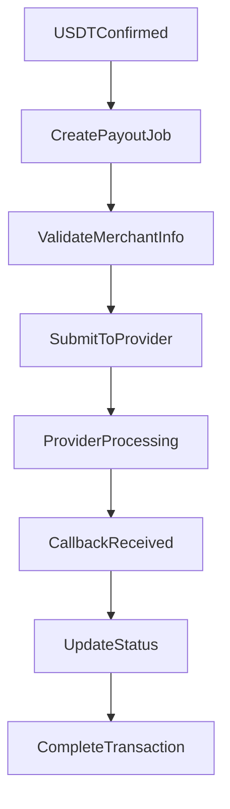
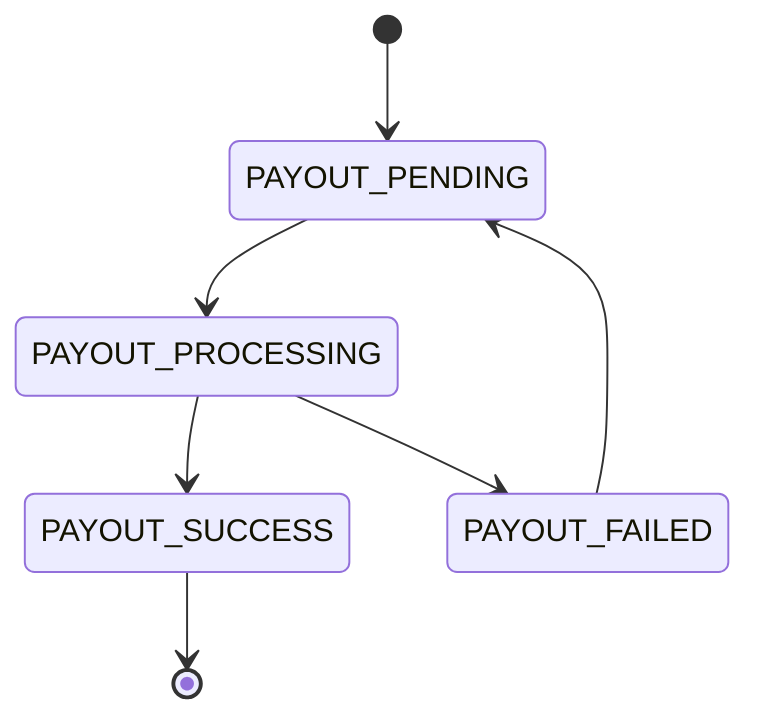

# MistyPay - Payout Process Document

> Version: 1.0
> Status: Draft - MVP Phase
> Product: MistyPay
> Last Updated: 2026

---

# 1. Document Purpose

This document defines the payout process of MistyPay.

Objectives:

- Define how VND is transferred to merchants
- Define payout lifecycle
- Define payout validation rules
- Define retry mechanisms
- Define provider integration flow
- Support backend implementation

---

# 2. Scope

## Supported Providers

```text
BaoKim
PayOS Payout
```

---

## Supported Currency

```text
VND
```

---

## Supported Destination

```text
Vietnamese Bank Accounts
```

---

# 3. Business Objective

Merchant should experience:

```text
Customer Pays
↓
Money Arrives
```

without:

```text
Crypto
USDT
Blockchain
Wallets
```

---

# 4. High-Level Payout Flow



---

# 5. Payout Lifecycle

## Stage 1

Payment Confirmed

```text
PAYMENT_CONFIRMED
```

---

## Stage 2

Payout Created

```text
PAYOUT_PENDING
```

---

## Stage 3

Provider Processing

```text
PAYOUT_PROCESSING
```

---

## Stage 4

Payout Success

```text
PAYOUT_SUCCESS
```

---

## Stage 5

Transaction Completed

```text
SUCCESS
```

---

# 6. Payout Trigger

## Trigger Event

```text
PAYMENT_CONFIRMED
```

---

## Trigger Conditions

All conditions must be true.

```text
USDT Confirmed
Valid Amount
Order Active
Not Expired
No Existing Successful Payout
```

---

# 7. Payout Job Creation

## Created By

```text
Payout Worker
```

---

## Queue

```text
BullMQ
```

Queue Name:

```text
payout_queue
```

---

## Job Payload

```json
{
  "paymentId": "uuid",
  "orderCode": "MP202600001",
  "amountVnd": 500000,
  "bankCode": "970422",
  "accountNumber": "123456789",
  "accountName": "NGUYEN VAN A"
}
```

---

# 8. Merchant Information Validation

## Required Fields

```text
Bank Code
Account Number
Account Name
```

---

## Validation Rules

### Rule 1

Account Number Required.

---

### Rule 2

Bank Code Required.

---

### Rule 3

Amount Must Be Positive.

---

### Rule 4

Payment Must Be Confirmed.

---

# 9. Liquidity Check

## Purpose

Verify sufficient VND balance.

---

## Source

```text
BaoKim Wallet
```

---

## Validation

```text
Current Balance
>=
Required Payout Amount
```

---

## Example

```text
Wallet Balance:

10,000,000 VND

Required:

500,000 VND
```

Result:

```text
PASS
```

---

## Failure

```text
PAYOUT_INSUFFICIENT_BALANCE
```

---

# 10. Payout Submission

## Provider

```text
BaoKim
```

or

```text
PayOS
```

---

## Request

```json
{
  "bankCode": "970422",
  "accountNumber": "123456789",
  "accountName": "NGUYEN VAN A",
  "amount": 500000,
  "reference": "MP202600001"
}
```

---

## Response

```json
{
  "providerReference": "BK123456",
  "status": "PROCESSING"
}
```

---

# 11. Payout State Machine



---

# 12. Callback Processing

## Purpose

Receive provider result.

---

## Provider Callback

```json
{
  "reference": "MP202600001",
  "providerReference": "BK123456",
  "status": "SUCCESS"
}
```

---

## Validation

### Verify Reference

```text
Order Exists
```

---

### Verify Signature

```text
Provider Signature
```

---

### Verify Status

```text
Valid Status
```

---

# 13. Successful Payout

## Conditions

```text
Provider Success
Valid Callback
```

---

## Actions

### Update Payout

```text
PAYOUT_SUCCESS
```

---

### Update Payment

```text
SUCCESS
```

---

### Create Audit Log

```text
PAYOUT_COMPLETED
```

---

### Send Notification

```text
Merchant Paid
```

---

# 14. Failed Payout

## Conditions

```text
Provider Error
Timeout
Network Error
```

---

## Actions

```text
PAYOUT_FAILED
```

---

### Retry

Enabled.

---

# 15. Retry Strategy

## Maximum Retry Count

```text
3
```

---

## Retry Schedule

### Retry 1

```text
1 minute
```

---

### Retry 2

```text
5 minutes
```

---

### Retry 3

```text
15 minutes
```

---

## After Retry Limit

```text
MANUAL_REVIEW
```

---

# 16. Idempotency Protection

## Problem

Provider receives duplicate requests.

---

## Solution

Use:

```text
orderCode
```

as unique reference.

---

## Rule

One payment order:

```text
One successful payout only
```

---

# 17. Timeout Handling

## Scenario

Provider does not respond.

---

## Result

```text
PAYOUT_TIMEOUT
```

---

## Action

```text
Retry
```

---

# 18. Callback Missing Scenario

## Scenario

Provider processes payout.

Callback never arrives.

---

## Solution

Background Reconciliation Job.

---

## Action

```text
Query Provider Status
```

---

## Update Status

Based on provider result.

---

# 19. Duplicate Callback Handling

## Scenario

Provider sends callback multiple times.

---

## Rule

If already:

```text
PAYOUT_SUCCESS
```

Ignore callback.

---

# 20. Audit Logging

Every payout event must be logged.

---

## Example

```json
{
  "event": "PAYOUT_SUCCESS",
  "paymentId": "uuid",
  "amount": 500000,
  "provider": "BaoKim"
}
```

---

# 21. Notifications

## Payment Successful

```text
Payment Successful
```

---

## Payout Successful

```text
The merchant has received the payment.
```

---

## Payout Under Review

```text
Your payment is being reviewed.
```

---

# 22. Monitoring Metrics

## Success Metrics

```text
Payout Success Count
```

---

## Failure Metrics

```text
Payout Failure Count
```

---

## Processing Metrics

```text
Average Payout Time
```

---

## Liquidity Metrics

```text
Available VND Balance
```

---

# 23. Operational Alerts

## Low Balance Alert

Trigger when:

```text
Available Balance
<
5,000,000 VND
```

---

## High Failure Rate Alert

Trigger when:

```text
Failure Rate > 5%
```

---

## Queue Backlog Alert

Trigger when:

```text
Pending Jobs > 100
```

---

# 24. Manual Review Cases

The following scenarios require manual review.

---

## Case 1

```text
Overpaid
```

---

## Case 2

```text
Underpaid
```

---

## Case 3

```text
Expired Payment
```

---

## Case 4

```text
Retry Limit Reached
```

---

## Case 5

```text
Suspicious Activity
```

---

# 25. Future Enhancements

Not Included In MVP.

---

## Multi Provider Routing

```text
BaoKim
PayOS
Napas
```

Automatic routing.

---

## Smart Liquidity Management

```text
Balance Forecasting
Auto Top-up Alerts
```

---

## Merchant Portal

```text
View Payout History
Export Reports
```

---

## Instant Status Sync

```text
Webhook + Polling Hybrid
```

---

# 26. Payout Process Summary

## Trigger

```text
PAYMENT_CONFIRMED
```

---

## Queue

```text
BullMQ
```

---

## Provider

```text
BaoKim
PayOS
```

---

## Retry

```text
3 Attempts
```

---

## Final Success

```text
PAYOUT_SUCCESS
```

---

## Final Failure

```text
MANUAL_REVIEW
```

---

## Business Outcome

```text
Traveler pays with USDT
↓
Merchant receives VND
↓
Transaction completed
```

This concludes the payout lifecycle for MistyPay MVP.
