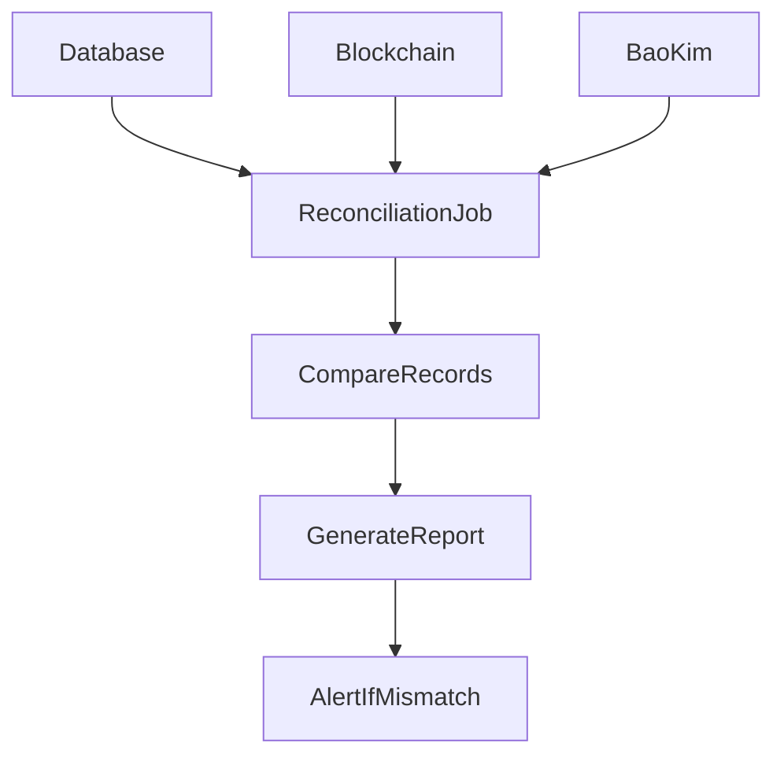
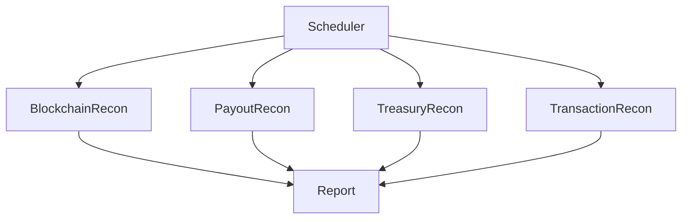

# MistyPay - Reconciliation Process Document

> Version: 1.0
> Status: Draft - MVP Phase
> Product: MistyPay
> Last Updated: 2026

---

# 1. Document Purpose

This document defines the reconciliation process for MistyPay.

Objectives:

- Verify financial accuracy
- Detect missing transactions
- Detect payout inconsistencies
- Detect liquidity mismatches
- Support auditing
- Support financial operations

---

# 2. What Is Reconciliation?

Reconciliation is the process of verifying that all records across:

```text
MistyPay Database
TRON Wallet
BaoKim Wallet
Payout Provider
```

match correctly.

---

# 3. Business Principle

For every successful transaction:

```text
USDT Received
↓
VND Paid
↓
Recorded Correctly
```

All three conditions must be true.

---

# 4. Assets Under Management

## Asset 1

USDT Treasury

Location:

```text
TRON Settlement Wallet
```

---

## Asset 2

VND Treasury

Location:

```text
BaoKim Wallet
```

---

# 5. Daily Reconciliation Overview



---

# 6. Reconciliation Frequency

## MVP

Daily

Execution Time:

```text
00:30 AM
```

---

## Future

```text
Hourly
Real-time
```

---

# 7. Reconciliation Types

## Type 1

Blockchain Reconciliation

---

## Type 2

Payout Reconciliation

---

## Type 3

Treasury Reconciliation

---

## Type 4

Transaction Reconciliation

---

# 8. Blockchain Reconciliation

## Objective

Verify all confirmed blockchain payments exist in database.

---

## Source A

TRON Wallet

---

## Source B

blockchain_transactions table

---

## Validation

Compare:

```text
tx_hash
amount
timestamp
status
```

---

## Expected Result

```text
100% Match
```

---

# 9. Blockchain Reconciliation Example

## Wallet

```text
TX001
19.43 USDT

TX002
7.62 USDT
```

---

## Database

```text
TX001
19.43 USDT

TX002
7.62 USDT
```

---

## Result

```text
PASS
```

---

# 10. Missing Blockchain Transaction

## Wallet

```text
TX003
15 USDT
```

---

## Database

```text
Not Found
```

---

## Result

```text
BLOCKCHAIN_MISMATCH
```

---

## Action

```text
Manual Review
```

---

# 11. Payout Reconciliation

## Objective

Verify payout records.

---

## Source A

BaoKim

---

## Source B

payout_transactions table

---

## Compare

```text
reference
amount
status
providerReference
```

---

# 12. Payout Reconciliation Example

## BaoKim

```text
MP202600001

500,000 VND

SUCCESS
```

---

## Database

```text
MP202600001

500,000 VND

SUCCESS
```

---

## Result

```text
PASS
```

---

# 13. Missing Payout Scenario

## Provider

```text
SUCCESS
```

---

## Database

```text
PAYOUT_PROCESSING
```

---

## Result

```text
STATUS_MISMATCH
```

---

## Action

```text
Auto Update
```

or

```text
Manual Review
```

---

# 14. Treasury Reconciliation

## Objective

Verify treasury balances.

---

## Assets

```text
USDT Treasury

VND Treasury
```

---

# 15. Treasury Formula

## Expected USDT Balance

```text
Opening Balance

+
Received USDT

-
Withdrawn USDT

=
Closing Balance
```

---

## Expected VND Balance

```text
Opening Balance

+
Top Up

-
Payouts

=
Closing Balance
```

---

# 16. Example

## Opening Balance

```text
1000 USDT
```

---

## Received Today

```text
+200 USDT
```

---

## Withdrawal

```text
-50 USDT
```

---

## Expected

```text
1150 USDT
```

---

## Actual Wallet

```text
1150 USDT
```

---

## Result

```text
PASS
```

---

# 17. Treasury Mismatch

## Expected

```text
1150 USDT
```

---

## Actual

```text
1140 USDT
```

---

## Result

```text
TREASURY_MISMATCH
```

---

## Action

Immediate investigation.

---

# 18. Transaction Reconciliation

## Objective

Verify payment lifecycle consistency.

---

## Rule

Every:

```text
SUCCESS
```

payment must have:

```text
USDT_CONFIRMED
+
PAYOUT_SUCCESS
```

---

# 19. Success Verification

## Payment

```text
SUCCESS
```

---

## Blockchain

```text
USDT_CONFIRMED
```

---

## Payout

```text
PAYOUT_SUCCESS
```

---

## Result

```text
VALID
```

---

# 20. Invalid Success Scenario

## Payment

```text
SUCCESS
```

---

## Payout

```text
PAYOUT_FAILED
```

---

## Result

```text
DATA_INCONSISTENCY
```

---

## Action

Critical Alert.

---

# 21. Reconciliation Job Architecture



---

# 22. Reconciliation Report

Generated daily.

---

## Report Structure

```json
{
  "date": "2026-01-01",

  "blockchain": {
    "checked": 500,
    "matched": 499,
    "mismatched": 1
  },

  "payout": {
    "checked": 500,
    "matched": 500
  },

  "treasury": {
    "status": "PASS"
  }
}
```

---

# 23. Severity Levels

## Low

```text
Minor Data Mismatch
```

---

## Medium

```text
Missing Record
```

---

## High

```text
Payout Mismatch
```

---

## Critical

```text
Treasury Mismatch
```

---

# 24. Alert Rules

## Treasury Mismatch

Alert:

```text
Immediately
```

---

## Missing Blockchain Records

Alert:

```text
Immediately
```

---

## Missing Payout

Alert:

```text
Immediately
```

---

# 25. Audit Requirements

Every reconciliation run must store:

```text
Execution Time
Result
Mismatch Count
Report ID
```

---

# 26. Database Tables

Future Tables:

```sql
reconciliation_reports

reconciliation_items
```

---

## reconciliation_reports

Stores:

```text
Daily Summary
```

---

## reconciliation_items

Stores:

```text
Individual Mismatches
```

---

# 27. Manual Review Queue

Transactions enter review queue when:

```text
Blockchain Mismatch

Payout Mismatch

Treasury Mismatch

Status Mismatch
```

---

# 28. KPIs

## Reconciliation Success Rate

Target:

```text
99.9%
```

---

## Treasury Accuracy

Target:

```text
100%
```

---

## Missing Record Count

Target:

```text
0
```

---

# 29. Future Enhancements

Not Included In MVP.

---

## Real-Time Reconciliation

```text
Every Transaction
```

---

## Automated Corrections

```text
Status Repair
Record Repair
```

---

## Multi Provider Reconciliation

```text
BaoKim
PayOS
Napas
```

---

# 30. Reconciliation Summary

## Sources

```text
Database

TRON Wallet

BaoKim Wallet
```

---

## Purpose

```text
Verify Every Transaction
Verify Every Payout
Verify Treasury Balances
```

---

## Frequency

```text
Daily
```

---

## Critical Goal

```text
No Money Missing
No Transaction Missing
No Balance Mismatch
```

This concludes the reconciliation process for MistyPay MVP.
