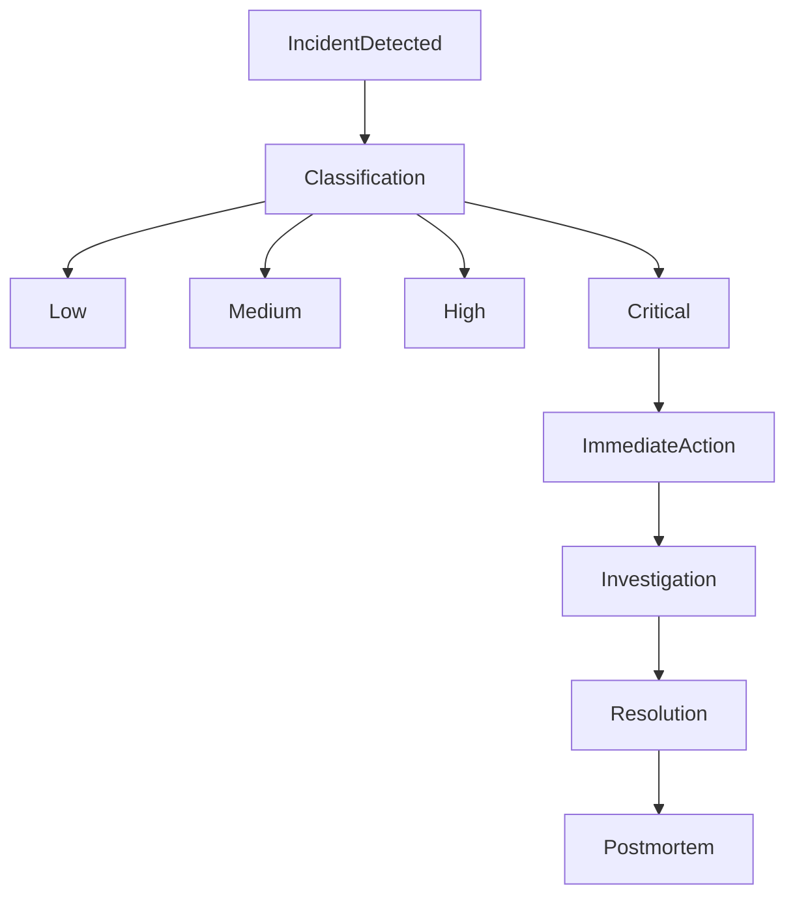

# MistyPay - Risk Management Document

> Version: 1.0
> Status: Draft - MVP Phase
> Product: MistyPay
> Last Updated: 2026

---

# 1. Document Purpose

This document defines the operational, financial, technical, and business risks of MistyPay MVP and the corresponding mitigation strategies.

Objectives:

- Identify risks
- Define response procedures
- Reduce financial loss
- Protect treasury assets
- Improve operational stability
- Support future compliance efforts

---

# 2. Risk Management Principles

## Principle 1

Never assume external systems are always available.

Examples:

```text
TRON
TronGrid
BaoKim
PayOS
Binance API
```

---

## Principle 2

Never trust user input.

Examples:

```text
Amount
QR Content
Wallet Address
```

---

## Principle 3

Every transaction must be traceable.

Requirements:

```text
Audit Logs
Transaction History
Event History
```

---

## Principle 4

Money movement must be reversible when possible.

---

# 3. Risk Classification

| Level    | Description                          |
| -------- | ------------------------------------ |
| Low      | Minor inconvenience                  |
| Medium   | Affects individual transactions      |
| High     | Affects multiple users               |
| Critical | Financial loss or system-wide impact |

---

# 4. Payment Risks

---

# RISK-001

## Name

Underpaid Transaction

---

## Severity

```text
Medium
```

---

## Example

Required:

```text
19.43 USDT
```

Received:

```text
18.00 USDT
```

---

## Impact

```text
Merchant receives less money
```

---

## Mitigation

```text
No automatic payout
Move to Manual Review
```

---

## Final Status

```text
UNDERPAID
```

---

# RISK-002

## Name

Overpaid Transaction

---

## Severity

```text
Medium
```

---

## Example

Required:

```text
19.43 USDT
```

Received:

```text
25 USDT
```

---

## Impact

```text
Potential accounting issues
```

---

## Mitigation

```text
Manual Review
```

---

## Final Status

```text
OVERPAID
```

---

# RISK-003

## Name

Expired Payment

---

## Severity

```text
Medium
```

---

## Scenario

User sends payment after order expiration.

---

## Mitigation

```text
Manual Review
```

---

# 5. Blockchain Risks

---

# RISK-004

## Name

Wrong Network

---

## Severity

```text
High
```

---

## Example

User sends:

```text
USDT ERC20
```

instead of:

```text
USDT TRC20
```

---

## Impact

```text
Funds may become unrecoverable
```

---

## Mitigation

```text
Clear payment instructions
Network warning
Manual investigation
```

---

# RISK-005

## Name

Wrong Token

---

## Severity

```text
High
```

---

## Example

User sends:

```text
USDC
```

instead of:

```text
USDT
```

---

## Mitigation

```text
Reject payment
Manual Review
```

---

# RISK-006

## Name

Duplicate Blockchain Detection

---

## Severity

```text
Medium
```

---

## Impact

```text
Duplicate payout
```

---

## Mitigation

```text
Unique tx_hash
Idempotent processing
```

---

# RISK-007

## Name

Blockchain Provider Outage

---

## Severity

```text
High
```

---

## Example

```text
TronGrid unavailable
```

---

## Mitigation

```text
Retry
Fallback Provider (Future)
Monitoring Alerts
```

---

# 6. Treasury Risks

---

# RISK-008

## Name

Insufficient VND Liquidity

---

## Severity

```text
Critical
```

---

## Scenario

BaoKim balance:

```text
1,000,000 VND
```

Required payout:

```text
2,000,000 VND
```

---

## Impact

```text
Merchant cannot receive money
```

---

## Mitigation

```text
Low Balance Alerts
Treasury Monitoring
Top-up Procedures
```

---

# RISK-009

## Name

Treasury Balance Mismatch

---

## Severity

```text
Critical
```

---

## Impact

```text
Potential financial loss
```

---

## Mitigation

```text
Daily Reconciliation
Immediate Investigation
```

---

# 7. Payout Risks

---

# RISK-010

## Name

Payout Timeout

---

## Severity

```text
Medium
```

---

## Mitigation

```text
Retry Logic
Status Query
```

---

# RISK-011

## Name

Payout Callback Missing

---

## Severity

```text
High
```

---

## Impact

```text
Actual status unknown
```

---

## Mitigation

```text
Reconciliation Job
Provider Status Check
```

---

# RISK-012

## Name

Duplicate Payout

---

## Severity

```text
Critical
```

---

## Impact

```text
Direct financial loss
```

---

## Mitigation

```text
Idempotency
Unique Order Reference
```

---

# 8. Exchange Rate Risks

---

# RISK-013

## Name

Rate Provider Failure

---

## Severity

```text
Medium
```

---

## Example

```text
Binance API unavailable
```

---

## Mitigation

```text
Cache Last Known Rate
Retry
Fallback Provider (Future)
```

---

# RISK-014

## Name

Rate Volatility

---

## Severity

```text
Medium
```

---

## Example

```text
USDT price changes rapidly
```

---

## Mitigation

```text
60-second quote validity
```

---

# 9. Security Risks

---

# RISK-015

## Name

Brute Force Login

---

## Severity

```text
High
```

---

## Mitigation

```text
Rate Limiting
Temporary Lock
IP Monitoring
```

---

# RISK-016

## Name

PIN Guessing Attack

---

## Severity

```text
High
```

---

## Mitigation

```text
Attempt Limit
Temporary Lock
```

---

# RISK-017

## Name

Token Theft

---

## Severity

```text
High
```

---

## Mitigation

```text
JWT Expiration
Refresh Token Rotation
```

---

# 10. Fraud Risks

---

# RISK-018

## Name

QR Manipulation

---

## Severity

```text
High
```

---

## Example

Attacker replaces merchant QR.

---

## Mitigation

```text
Display merchant information before payment
Require confirmation
```

---

# RISK-019

## Name

Money Laundering Abuse

---

## Severity

```text
Critical
```

---

## Example

User intentionally overpays to convert crypto into VND.

---

## Mitigation

```text
No cash withdrawal
No arbitrary amount transfer
Manual Review
Future KYC
```

---

# RISK-020

## Name

Suspicious Transaction Pattern

---

## Severity

```text
High
```

---

## Examples

```text
Many payments in short time
Repeated overpayments
Repeated failures
```

---

## Mitigation

```text
Risk Rules
Monitoring Dashboard
Manual Review
```

---

# 11. Operational Risks

---

# RISK-021

## Name

Admin Mistake

---

## Severity

```text
Medium
```

---

## Example

Wrong rate configuration.

---

## Mitigation

```text
Audit Logs
Admin Permissions
Change Tracking
```

---

# RISK-022

## Name

Server Downtime

---

## Severity

```text
Critical
```

---

## Impact

```text
No payments processed
```

---

## Mitigation

```text
Monitoring
Backups
Fast Recovery Procedures
```

---

# RISK-023

## Name

Database Failure

---

## Severity

```text
Critical
```

---

## Mitigation

```text
Daily Backup
Database Monitoring
Restore Procedures
```

---

# 12. User Experience Risks

---

# RISK-024

## Name

Slow Payment Completion

---

## Severity

```text
Medium
```

---

## Target

```text
< 10 Seconds
```

---

## Mitigation

```text
Optimize Detection
Optimize Payout
Performance Monitoring
```

---

# RISK-025

## Name

Confusing Crypto Terminology

---

## Severity

```text
Low
```

---

## Mitigation

```text
Hide blockchain concepts
Use travel-payment language
```

---

# 13. Risk Escalation Matrix

| Severity | Action                  |
| -------- | ----------------------- |
| Low      | Log                     |
| Medium   | Monitor                 |
| High     | Alert + Review          |
| Critical | Immediate Investigation |

---

# 14. Manual Review Triggers

Transactions enter Manual Review when:

```text
UNDERPAID

OVERPAID

EXPIRED PAYMENT

WRONG TOKEN

WRONG NETWORK

PAYOUT FAILED

RETRY LIMIT REACHED

SUSPICIOUS ACTIVITY
```

---

# 15. Monitoring Dashboard Requirements

Track:

```text
Pending Payments

Failed Payments

Pending Payouts

Failed Payouts

Treasury Balance

Liquidity Alerts

Suspicious Transactions
```

---

# 16. Incident Response Process



---

# 17. Future Enhancements

Not Included In MVP.

---

## KYC

```text
Identity Verification
```

---

## Risk Scoring

```text
Transaction Risk Score
```

---

## Fraud Detection

```text
Behavior Analysis
```

---

## AML Monitoring

```text
Anti-Money Laundering Rules
```

---

# 18. Risk Management Summary

## Most Critical Risks

```text
Insufficient VND Liquidity

Duplicate Payout

Treasury Mismatch

Money Laundering Abuse

Server Downtime
```

---

## Most Likely Risks

```text
Underpaid

Overpaid

Expired Payment

Provider Timeout

Rate Provider Failure
```

---

## MVP Goal

```text
Protect User Funds

Protect Merchant Funds

Protect Treasury Funds

Maintain Operational Stability
```

This document serves as the primary risk framework for MistyPay MVP.
