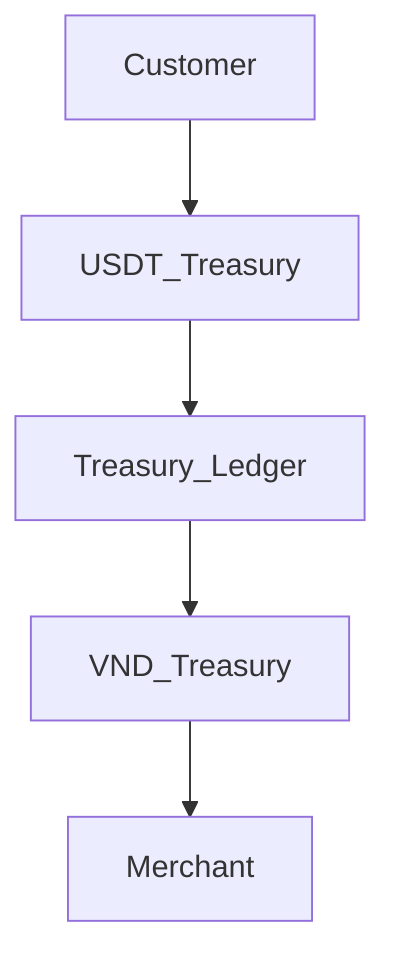

# MistyPay - Treasury Management Document

> Version: 1.0
> Status: Draft - MVP Phase
> Product: MistyPay
> Last Updated: 2026

---

# 1. Document Purpose

This document defines treasury management, liquidity management and settlement policies for MistyPay.

Objectives:

- Ensure payout liquidity
- Prevent treasury shortages
- Support financial operations
- Define treasury monitoring rules
- Define treasury risk controls
- Support business growth

---

# 2. Treasury Overview

MistyPay treasury acts as the settlement layer between:

```text
User
↓
Pays USDT
↓
MistyPay Treasury
↓
Pays VND
↓
Merchant
```

---

Core responsibility:

```text
Convert incoming USDT
into outgoing VND
safely and reliably.
```

---

# 3. Treasury Components

## USDT Treasury

Purpose:

```text
Receive customer USDT
Store crypto reserves
Support liquidity management
```

---

## VND Treasury

Purpose:

```text
Execute merchant payouts
Maintain daily liquidity
```

---

## Ledger

Purpose:

```text
Track balances
Track settlement
Track treasury movements
```

---

# 4. Treasury Architecture



---

# 5. Treasury Accounts

## Treasury Wallet

Asset:

```text
USDT
```

---

Usage:

```text
Receive payments
Store operational reserves
```

---

## Treasury Bank Account

Asset:

```text
VND
```

---

Usage:

```text
Merchant payouts
Operating liquidity
```

---

# 6. MVP Treasury Structure

Recommended:

```text
1 USDT Wallet
1 Bank Account
```

---

Reason:

```text
Simple
Easy reconciliation
Easy monitoring
```

---

# 7. Treasury Ledger

Every movement must be recorded.

---

Example:

```text
Customer Payment
USDT +20

Merchant Payout
VND -500,000

Treasury Refill
VND +10,000,000
```

---

# 8. Ledger Principles

Rule:

```text
No money movement
without ledger entry.
```

---

Required fields:

```text
Reference ID
Asset Type
Amount
Direction
Source
Destination
Timestamp
```

---

# 9. Treasury Balance Types

## Actual Balance

Real balance from:

```text
Bank account
Blockchain wallet
```

---

## Ledger Balance

Balance calculated from transactions.

---

## Available Balance

Balance available for payout.

---

Formula:

```text
Available =
Actual
-
Reserved
```

---

# 10. Reserved Balance

Purpose:

```text
Protect liquidity
```

---

Example:

```text
Bank Balance:
50,000,000

Reserve:
10,000,000

Available:
40,000,000
```

---

# 11. Liquidity Levels

## Healthy

```text
VND > 50,000,000
```

Status:

```text
NORMAL
```

---

## Warning

```text
VND < 20,000,000
```

Status:

```text
WARNING
```

---

## Critical

```text
VND < 5,000,000
```

Status:

```text
CRITICAL
```

---

# 12. Treasury Alerts

## Alert 1

TREASURY_LOW_BALANCE

Trigger:

```text
VND < Warning Threshold
```

---

## Alert 2

TREASURY_CRITICAL_BALANCE

Trigger:

```text
VND < Critical Threshold
```

---

## Alert 3

TREASURY_MISMATCH

Trigger:

```text
Actual ≠ Ledger
```

---

# 13. Treasury Dashboard

Must display:

```text
USDT Balance
VND Balance
Reserved Balance
Available Balance
Pending Payouts
```

---

# 14. Treasury KPIs

Track:

```text
Daily Volume
Weekly Volume
Monthly Volume
Average Payout Size
Liquidity Ratio
```

---

# 15. Liquidity Ratio

Formula:

```text
Available VND
÷
Expected Payout Volume
```

---

Example:

```text
Available:
100,000,000

Expected:
50,000,000

Ratio:
2.0
```

---

Target:

```text
≥ 2.0
```

---

# 16. Treasury Refill Process

When:

```text
Liquidity Warning
```

---

Action:

```text
Transfer VND
to treasury account
```

---

Record:

```text
TREASURY_REFILL
```

---

# 17. Treasury Withdrawal Process

When:

```text
Excess liquidity
```

---

Action:

```text
Move surplus funds
```

---

Record:

```text
TREASURY_WITHDRAWAL
```

---

# 18. USDT Management

Track:

```text
Incoming USDT
Current USDT Balance
Operational Reserve
```

---

Monitor:

```text
Wallet Health
Transaction History
```

---

# 19. Treasury Settlement Cycle

## MVP

Manual settlement.

---

Frequency:

```text
Daily
```

---

Process:

```text
Review USDT inflows

Review VND outflows

Verify balances

Record settlement
```

---

# 20. Daily Treasury Review

Checklist:

```text
Verify VND Balance

Verify USDT Balance

Verify Pending Payouts

Verify Failed Payouts

Verify Treasury Alerts
```

---

# 21. Treasury Reconciliation

Frequency:

```text
Daily
```

Recommended:

```text
00:30
```

---

Compare:

```text
Actual Balance

vs

Ledger Balance
```

---

# 22. Treasury Mismatch Handling

If mismatch detected:

```text
Pause investigation
```

---

Actions:

```text
Review transactions

Review payouts

Review blockchain records
```

---

Escalation:

```text
Founder Review Required
```

---

# 23. Treasury Freeze Conditions

System may stop new transactions if:

```text
Critical VND shortage

Treasury mismatch

Provider outage

Security incident
```

---

# 24. Payout Protection Rules

Never payout if:

```text
Available Balance
<
Required Payout
```

---

Never payout if:

```text
Treasury mismatch unresolved
```

---

Never payout if:

```text
Payment not confirmed
```

---

# 25. Growth Stages

## Stage 1

```text
1 Wallet
1 Bank Account
```

---

## Stage 2

```text
Multiple Bank Accounts
```

---

## Stage 3

```text
Treasury Automation
```

---

## Stage 4

```text
Multi-Currency Treasury
```

---

# 26. Treasury Metrics

Daily:

```text
Total USDT Received

Total VND Paid

Treasury Balance

Liquidity Ratio
```

---

Monthly:

```text
Settlement Volume

Payout Success Rate

Treasury Growth
```

---

# 27. Treasury Risks

## Risk 1

Liquidity shortage.

---

Mitigation:

```text
Low balance alerts
Reserve policy
```

---

## Risk 2

Treasury mismatch.

---

Mitigation:

```text
Daily reconciliation
Audit logs
```

---

## Risk 3

Duplicate payout.

---

Mitigation:

```text
Idempotency
State machine
Audit review
```

---

# 28. Treasury Monitoring

Critical alerts:

```text
TREASURY_LOW_BALANCE

TREASURY_CRITICAL_BALANCE

TREASURY_MISMATCH

DUPLICATE_PAYOUT_ATTEMPT
```

---

Delivery:

```text
Telegram
Email (future)
```

---

# 29. Treasury Success Criteria

Treasury is healthy when:

```text
Liquidity Ratio ≥ 2.0

No unresolved mismatch

No failed reconciliation

No payout delays
```

---

# 30. MVP Treasury Rules

Minimum operating policy:

```text
Maintain VND reserve

Review treasury daily

Run reconciliation daily

Monitor liquidity continuously
```

---

# 31. Final Principle

For MistyPay:

```text
Revenue comes from transactions.

Transactions depend on payouts.

Payouts depend on treasury.

Treasury is the heart of the system.
```

---

```text
No liquidity
=
No business.
```
