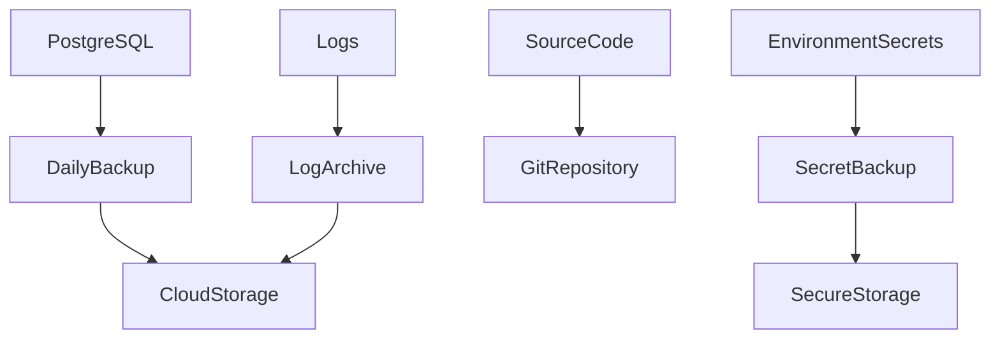

# MistyPay - Backup & Recovery Document

> Version: 1.0
> Status: Draft - MVP Phase
> Product: MistyPay
> Last Updated: 2026

---

# 1. Document Purpose

This document defines backup, recovery, disaster recovery and business continuity procedures for MistyPay MVP.

Objectives:

- Protect financial records
- Protect transaction history
- Minimize data loss
- Minimize downtime
- Ensure recovery from infrastructure failures
- Support operational resilience

---

# 2. Backup Philosophy

Core principle:

```text
Assume failure will happen.
Prepare recovery before failure happens.
```

---

Financial principle:

```text
No completed transaction should be lost.
```

---

# 3. Recovery Objectives

## RPO (Recovery Point Objective)

Maximum acceptable data loss.

Target:

```text
≤ 6 hours
```

Meaning:

```text
Maximum 6 hours of data may need reconstruction.
```

---

## RTO (Recovery Time Objective)

Maximum acceptable downtime.

Target:

```text
≤ 4 hours
```

Meaning:

```text
System should be operational again within 4 hours.
```

---

# 4. Critical Assets

Priority order:

---

## Tier 1

```text
PostgreSQL Database
```

Contains:

```text
Users
Quotes
Payments
Payouts
Audit Logs
Treasury Records
```

---

## Tier 2

```text
Environment Variables
```

Contains:

```text
JWT Secrets
Provider Credentials
API Keys
```

---

## Tier 3

```text
Source Code
```

Contains:

```text
Backend
Mobile App
Infrastructure Config
```

---

## Tier 4

```text
Monitoring Data
```

Contains:

```text
Application Logs
Operational Logs
```

---

# 5. Backup Strategy Overview



---

# 6. Database Backup Policy

## Backup Frequency

### Full Backup

```text
Daily
```

Recommended:

```text
02:00 AM
```

---

### Incremental Backup

Future Phase

```text
Every 6 Hours
```

---

## MVP Approach

```text
Daily Full Backup
```

is sufficient.

---

# 7. PostgreSQL Backup

## Command

```bash
pg_dump \
-U mistypay \
-F c \
-d mistypay_production \
-f backup.dump
```

---

## Output

```text
backup.dump
```

---

## Naming Convention

```text
mistypay_YYYYMMDD_HHMM.dump
```

Example:

```text
mistypay_20260701_0200.dump
```

---

# 8. Backup Retention Policy

## Daily Backups

Keep:

```text
7 days
```

---

## Weekly Backups

Keep:

```text
4 weeks
```

---

## Monthly Backups

Keep:

```text
6 months
```

---

## Archive Backups

Keep:

```text
1 year
```

---

# 9. Backup Storage Locations

## Primary

```text
VPS Local Storage
```

---

## Secondary

```text
Cloud Object Storage
```

Examples:

```text
Cloudflare R2
Backblaze B2
AWS S3
```

---

## Rule

Never store only one copy.

Required:

```text
At least 2 backup locations.
```

---

# 10. Environment Secret Backup

Backup:

```text
.env.production
.env.staging
```

---

Never store:

```text
Plain text in Git repository
```

---

Recommended:

```text
Bitwarden
1Password
Proton Pass
```

---

# 11. Source Code Backup

Primary:

```text
GitHub Private Repository
```

---

Recommended:

```text
GitHub
+
Local Clone
```

---

Rule:

```text
Every merge must be pushed.
```

---

# 12. Log Backup

Backup:

```text
Audit Logs
Transaction Logs
Security Logs
```

---

Retention:

```text
365 Days
```

---

Storage:

```text
Compressed Archive
```

---

# 13. Recovery Scenarios

## Scenario 1

Database Corruption

---

Impact:

```text
Critical
```

---

Recovery:

```text
Restore latest backup
Run reconciliation
Verify treasury
```

---

Target:

```text
< 4 hours
```

---

# 14. Scenario 2

VPS Failure

---

Impact:

```text
Critical
```

---

Recovery Steps

```text
Provision new VPS
Deploy infrastructure
Restore database
Restore environment
Restart services
Run health checks
```

---

Target:

```text
< 4 hours
```

---

# 15. Scenario 3

Redis Failure

---

Impact:

```text
Medium
```

---

Recovery:

```text
Restart Redis
Restart Workers
Rebuild queues
```

---

Expected Data Loss

```text
None
```

because:

```text
Source of truth = PostgreSQL
```

---

# 16. Scenario 4

Worker Failure

---

Impact:

```text
Medium
```

---

Recovery:

```text
Restart Worker
Requeue Jobs
Verify processing
```

---

# 17. Scenario 5

Lost API Credentials

---

Examples:

```text
TronGrid Key
BaoKim Credentials
PayOS Credentials
```

---

Recovery:

```text
Rotate credentials
Update environment
Redeploy services
```

---

# 18. Disaster Recovery Procedure

## Step 1

Identify failure.

---

## Step 2

Pause transactions if required.

---

## Step 3

Restore infrastructure.

---

## Step 4

Restore database.

---

## Step 5

Restore secrets.

---

## Step 6

Run verification.

---

## Step 7

Resume operations.

---

# 19. Recovery Verification Checklist

Verify:

```text
Database restored

API operational

Redis operational

Workers operational

Treasury balances verified

Reconciliation completed
```

---

# 20. Treasury Verification

Before reopening system:

Verify:

```text
USDT Balance

VND Balance

Pending Payments

Pending Payouts
```

---

Must confirm:

```text
No treasury mismatch
```

---

# 21. Recovery Testing

Recovery plan must be tested.

---

Frequency:

```text
Quarterly
```

---

Tests:

```text
Database Restore Test

VPS Recovery Test

Secret Recovery Test
```

---

# 22. Backup Monitoring

Alert if:

```text
Backup failed

Backup file missing

Backup size abnormal
```

---

Severity:

```text
HIGH
```

---

# 23. Backup Automation

Recommended Cron Job

```bash
0 2 * * * backup_database.sh
```

---

Workflow:

```text
Backup
Compress
Upload
Verify
Notify
```

---

# 24. Recovery Roles

## Founder

Responsibilities:

```text
Decision Making
Treasury Verification
Release Approval
```

---

## Operator (Future)

Responsibilities:

```text
Backup Monitoring
Recovery Execution
Incident Documentation
```

---

# 25. Incident Documentation

Every recovery event must record:

```text
Date
Cause
Impact
Recovery Steps
Recovery Time
Lessons Learned
```

---

# 26. Backup Security

Backup files must be:

```text
Encrypted
Access Controlled
Private
```

---

Never expose:

```text
Customer Data
Provider Credentials
JWT Secrets
```

---

# 27. MVP Backup Stack

Recommended:

```text
PostgreSQL Dump
Cloudflare R2
GitHub Private Repository
Bitwarden
```

---

# 28. Business Continuity Principles

Priority Order:

```text
Protect Funds
Protect Ledger
Protect Audit Trail
Restore Services
```

---

# 29. Recovery Success Criteria

Recovery is successful when:

```text
System online

Database restored

Treasury verified

No missing completed transaction

No unresolved mismatch
```

---

# 30. Final Principle

For MistyPay:

```text
Infrastructure can fail.

Servers can fail.

Workers can fail.

Backups must not fail.
```

---

```text
No completed financial transaction
should ever become unrecoverable.
```
