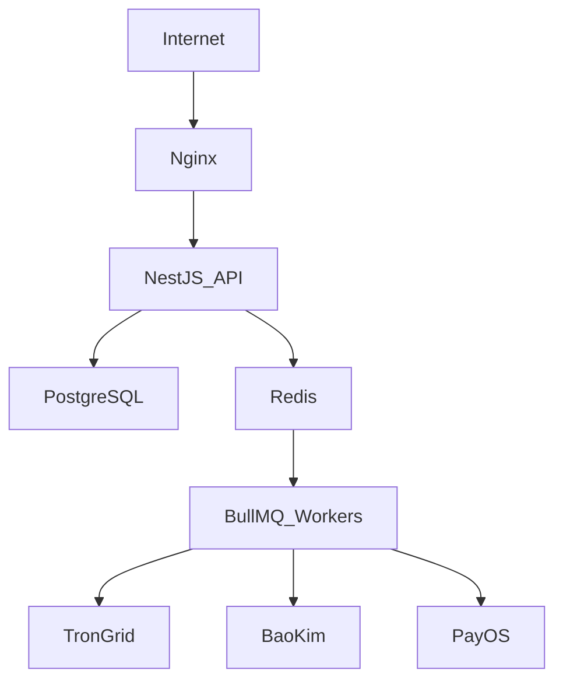
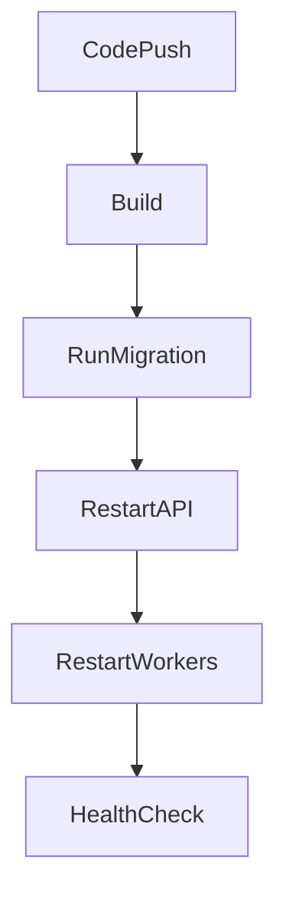

# MistyPay - Deployment Guide

> Version: 1.0
> Status: Draft - MVP Phase
> Product: MistyPay
> Infrastructure Target: VPS Ubuntu
> Last Updated: 2026

---

# 1. Document Purpose

This document defines the deployment strategy for MistyPay MVP.

Objectives:

- Define server architecture
- Define deployment environment
- Define backend deployment process
- Define database deployment process
- Define Redis and worker deployment
- Support stable MVP operation

---

# 2. MVP Deployment Strategy

MistyPay MVP uses:

```text
Single VPS Deployment
```

This is suitable for:

```text
MVP
Internal Testing
TestFlight
Closed Beta
```

---

# 3. Recommended Server

## Minimum

```text
2 vCPU
4 GB RAM
60 GB SSD
Ubuntu 22.04 or 24.04
```

## Recommended

```text
4 vCPU
8 GB RAM
100 GB SSD
Ubuntu 24.04
```

---

# 4. Deployment Architecture



---

# 5. Server Components

## Nginx

Purpose:

```text
Reverse proxy
SSL termination
Route traffic to NestJS API
```

---

## NestJS API

Purpose:

```text
REST API
Authentication
Payment creation
Admin APIs
```

---

## PostgreSQL

Purpose:

```text
Store users
Transactions
Quotes
Payouts
Audit logs
```

---

## Redis

Purpose:

```text
Queue backend
Temporary cache
Rate cache
```

---

## BullMQ Workers

Purpose:

```text
Blockchain monitoring
Payout processing
Notification jobs
Reconciliation jobs
```

---

# 6. Deployment Method

## MVP Recommended

```text
Docker Compose
```

Reason:

```text
Easy to reproduce
Simple deployment
Easy local/staging parity
Good for solo founder
```

---

# 7. Docker Compose Services

Recommended services:

```text
api
worker
postgres
redis
nginx
```

---

## Example Structure

```text
mistypay/
├── backend/
├── mobile/
├── infra/
│   ├── docker-compose.yml
│   ├── nginx/
│   └── scripts/
└── docs/
```

---

# 8. Environment Types

## Local

Purpose:

```text
Development
```

---

## Staging

Purpose:

```text
Testing
TestFlight
Internal beta
```

---

## Production

Purpose:

```text
Real users
Real transactions
```

---

# 9. Backend Deployment Flow



---

# 10. Deployment Steps

## Step 1 - Prepare VPS

```bash
sudo apt update
sudo apt upgrade -y
```

Install:

```bash
sudo apt install -y git curl ufw nginx
```

---

## Step 2 - Install Docker

```bash
curl -fsSL https://get.docker.com | sh
```

---

## Step 3 - Clone Repository

```bash
git clone <repository-url> mistypay
cd mistypay
```

---

## Step 4 - Configure Environment

Create:

```text
.env
```

from:

```text
.env.example
```

---

## Step 5 - Start Services

```bash
docker compose up -d
```

---

## Step 6 - Run Database Migration

```bash
docker compose exec api npx prisma migrate deploy
```

---

## Step 7 - Verify Services

```bash
docker compose ps
```

---

# 11. Nginx Configuration

## Domain

Example:

```text
api.mistypay.vn
```

---

## Reverse Proxy

```nginx
server {
    server_name api.mistypay.vn;

    location / {
        proxy_pass http://127.0.0.1:3000;
        proxy_http_version 1.1;

        proxy_set_header Host $host;
        proxy_set_header X-Real-IP $remote_addr;
        proxy_set_header X-Forwarded-For $proxy_add_x_forwarded_for;
        proxy_set_header X-Forwarded-Proto $scheme;
    }
}
```

---

# 12. SSL

Use:

```text
Let's Encrypt
```

Install:

```bash
sudo apt install certbot python3-certbot-nginx -y
```

Generate SSL:

```bash
sudo certbot --nginx -d api.mistypay.vn
```

---

# 13. Database Deployment

## PostgreSQL

Run inside Docker Compose.

Required:

```text
Database name
Username
Password
Volume persistence
```

---

## Migration

Use Prisma migration:

```bash
npx prisma migrate deploy
```

---

## Backup

Must be enabled before real transactions.

---

# 14. Redis Deployment

Redis should be used for:

```text
BullMQ queues
Cache
Temporary locks
```

Redis must not be publicly accessible.

---

# 15. Worker Deployment

Workers should run separately from API.

Recommended:

```text
api container
worker container
```

---

## Worker Types

```text
blockchain-worker
payout-worker
notification-worker
reconciliation-worker
```

---

# 16. Health Checks

## API Health

Endpoint:

```http
GET /health
```

Expected:

```json
{
  "status": "ok"
}
```

---

## Worker Health

Check:

```text
Queue active
Queue failed jobs
Last processed job time
```

---

# 17. Deployment Checklist

Before deployment:

```text
.env configured
Database connected
Redis connected
Nginx configured
SSL installed
Migrations applied
Workers running
Health check passed
```

---

# 18. Staging Deployment Checklist

```text
Mock or sandbox providers
Test database
Test wallet
Test payout provider
Test TronGrid key
```

---

# 19. Production Deployment Checklist

```text
Production database
Production Redis
Production TronGrid key
Production BaoKim credentials
Production PayOS credentials
SSL enabled
Backup enabled
Monitoring enabled
```

---

# 20. Rollback Plan

If deployment fails:

```text
Stop new deployment
Revert to previous image/version
Restore previous environment if needed
Check database migration impact
```

---

# 21. Deployment Risks

## Risk 1

Database migration breaks production.

Mitigation:

```text
Test migration on staging first
Backup before migration
```

---

## Risk 2

Worker stops processing jobs.

Mitigation:

```text
Worker monitoring
Restart policy
```

---

## Risk 3

Redis data loss.

Mitigation:

```text
Redis persistence
Queue recovery strategy
```

---

# 22. MVP Deployment Summary

Deployment style:

```text
Docker Compose on Ubuntu VPS
```

Core services:

```text
NestJS API
PostgreSQL
Redis
BullMQ Workers
Nginx
```

Primary goal:

```text
Stable enough for TestFlight and Closed Beta
```
