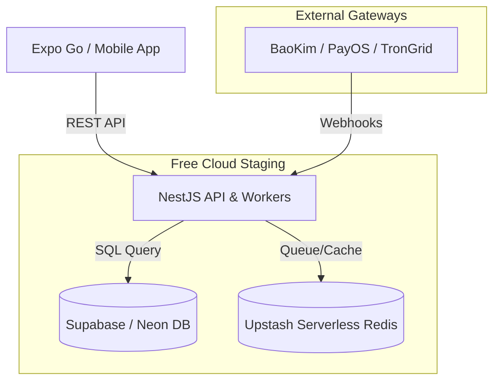
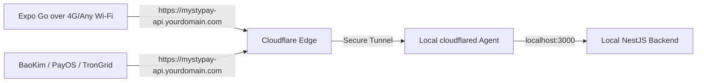

# MistyPay - Free Hosting & Development Guide

> Version: 1.0
> Status: Active - MVP Phase
> Product: MistyPay
> Infrastructure Target: Free Cloud Services & Cloudflare Tunnel
> Last Updated: 2026

---

# 1. Document Purpose

This document provides alternative hosting configurations for MistyPay during the MVP phase. It solves the inconvenience of running the stack locally on a PC and connecting it to Expo Go.

Objectives:
- Address Expo Go connectivity and webhook callback limitations.
- Propose a 100% Free Cloud staging architecture (No paid VPS).
- Detail how to optimize local development using Cloudflare Tunnels (Zero cost, static URLs).

---

# 2. Local Development Pain Points

Currently, running NestJS + PostgreSQL + Redis + Expo Go locally introduces several issues:

```text
1. Wi-Fi Dependency:
Expo Go requires the mobile device and the development computer to be connected to the exact same Wi-Fi network.

2. Dynamic IP Address Changes:
The Metro Bundler IP address changes frequently. The mobile Axios instance dynamic config in `api.ts` breaks when the developer shifts locations or restarts the router.

3. Webhook Delivery (BaoKim/PayOS/TronGrid):
External payment gateways cannot send callback webhooks directly to `http://localhost:3000`.

4. Local Machine Uptime:
Collaborators cannot test the app unless the developer's PC is powered on and running the backend/database/tunnels.
```

---

# 3. Recommended Free Staging Architecture

To decouple development from local computers, we can host a staging environment in the cloud for $0/month.



---

# 4. Component Analysis & Free Providers

### 4.1 PostgreSQL Database
Standard databases require servers, but we can host PostgreSQL for free.

- **Supabase (Recommended)**
  - *Free Tier*: 1 Project, 500MB Database storage.
  - *Pros*: Runs 24/7, high availability, excellent web dashboard, uses standard PostgreSQL connection pool.
  - *Cons*: Pauses after 1 week of inactivity (easily unpaused in 1 click).

- **Neon.tech**
  - *Free Tier*: 1 Project, 0.5 GiB Database storage.
  - *Pros*: Serverless PostgreSQL, instant wakeup, doesn't get permanently paused.
  - *Cons*: Slight latency (500ms - 1s) on first query after a period of inactivity due to serverless sleep.

---

### 4.2 Redis (BullMQ Queue)
BullMQ needs a high-performance Redis database.

- **Upstash Redis (Recommended)**
  - *Free Tier*: 10,000 commands per day.
  - *Pros*: 100% Serverless, supports TLS connection, setup in seconds, zero maintenance.
  - *Cons*: 10k request limit is perfect for dev/staging, but too low for high-volume production.

---

### 4.3 NestJS Backend & Queue Workers
Because MistyPay has long-running workers (polling TronGrid and handling queues), serverless functions (like Vercel) are **not suitable**. We need a continuous container/compute service.

- **Koyeb (Recommended)**
  - *Free Tier*: 1 Web Service (512MB RAM, 0.1 vCPU).
  - *Pros*: Runs 24/7 without sleeping (unlike Render). Directly deploys from GitHub or Docker. Builds your project automatically.
  - *Cons*: Limited to one application instance on the free tier.

- **Hugging Face Spaces (Docker Space)**
  - *Free Tier*: 16GB RAM, 2 vCPUs (very generous compute resource).
  - *Pros*: Extremely powerful, completely free, runs standard Dockerfile.
  - *Cons*: Goes to sleep after 48 hours of complete inactivity (needs a visit or webhook to wake up).

- **Render**
  - *Free Tier*: Web Service.
  - *Pros*: Simple GitHub integration.
  - *Cons*: Spins down after 15 minutes of inactivity. Takes 30-50 seconds to wake up on the next request.

---

# 5. Step-by-Step Staging Setup (100% Free Cloud)

### Step 1: Set up the Database
1. Go to [Supabase](https://supabase.com) or [Neon](https://neon.tech) and create a free project.
2. Retrieve the transaction connection string (e.g. `postgresql://...`).
3. Set the database URL in the environment configuration.

### Step 2: Set up the Redis instance
1. Go to [Upstash](https://upstash.com) and create a free Redis database.
2. Copy the endpoint address, port, and password.
3. Turn on SSL/TLS connection (NestJS configurations support Upstash TLS).

### Step 3: Deploy the NestJS Backend to Koyeb
1. Create a free account on [Koyeb](https://koyeb.com).
2. Create a new service, connect it to your GitHub Repository.
3. Configure the environment variables in Koyeb dashboard:
   - `DATABASE_URL` = (From Step 1)
   - `REDIS_HOST` = (From Step 2)
   - `REDIS_PORT` = (From Step 2)
   - `REDIS_PASSWORD` = (From Step 2)
   - `APP_ENV` = `staging`
   - `APP_PORT` = `8000` (Koyeb maps HTTP port automatically)
4. Deploy. Koyeb will run the `Dockerfile` inside `/backend` and compile the app.
5. In Koyeb settings, run the migrations:
   ```bash
   npx prisma migrate deploy
   ```

### Step 4: Point Expo Go to the Staging Backend
Modify `mobile/src/services/api.ts` to connect directly to the Koyeb URL during testing.

---

# 6. Alternative: Enhanced Local Development (Zero Cost)

If you still prefer to develop locally but want to eliminate network headaches (Wi-Fi, changing IP, Webhooks), you can use **Cloudflare Tunnels**.

Unlike Ngrok, Cloudflare Tunnels are completely free, support unlimited bandwidth, and let you expose your local port with a static domain.



### 6.1 Steps to Configure Cloudflare Tunnel:
1. Install Cloudflare daemon on Windows (via Chocolatey or downloading the binary):
   ```powershell
   winget install Cloudflare.cloudflared
   ```
2. Log in to your Cloudflare account (requires a free custom domain registered on Cloudflare):
   ```bash
   cloudflared tunnel login
   ```
3. Create a tunnel:
   ```bash
   cloudflared tunnel create mistypay-local
   ```
4. Configure the tunnel route to your local backend:
   ```bash
   cloudflared tunnel route dns mistypay-local api.yourdomain.com
   ```
5. Run the tunnel (exposing port 3000 where NestJS runs):
   ```bash
   cloudflared tunnel run --url http://localhost:3000 mistypay-local
   ```

Now, your local backend is securely exposed at `https://api.yourdomain.com`:
- **Expo Go** will connect to this URL without needing to be on the same Wi-Fi.
- **BaoKim / PayOS webhooks** will send callbacks to this URL and route straight to your local PC.
- The URL remains **static**, so you never have to change your mobile client code.

---

# 7. Summary Recommendation

| Strategy | Speed / Setup | Connection | Webhook Support | Best For |
| :--- | :--- | :--- | :--- | :--- |
| **Local + Wifi** | Fast setup, slow dev | Restrained to local LAN | No (unless port-forwarded) | Basic initial setup |
| **Local + Cloudflare Tunnel** | 10 mins setup | Connect from anywhere | **Yes (Static URL)** | Active coding & local debugging |
| **Koyeb + Supabase + Upstash** | 20 mins setup | Connect from anywhere | **Yes (Static URL)** | Staging, remote testing, TestFlight, MVP demo |
