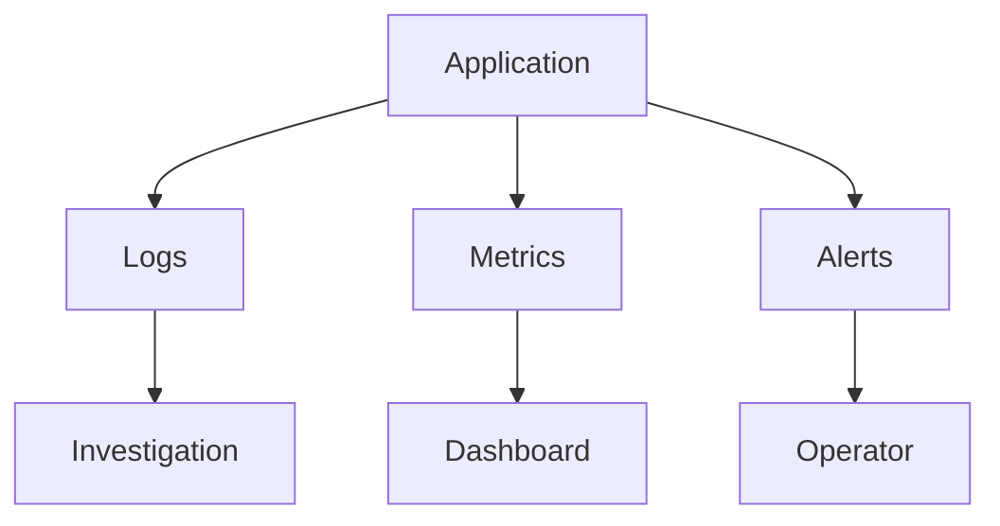

# MistyPay - Logging & Monitoring Document

> Version: 1.0
> Status: Draft - MVP Phase
> Product: MistyPay
> Last Updated: 2026

---

# 1. Document Purpose

This document defines logging, monitoring, alerting and observability standards for MistyPay.

Objectives:

- Detect incidents quickly
- Protect financial operations
- Support troubleshooting
- Support reconciliation
- Support security investigations
- Reduce operational risk

---

# 2. Observability Philosophy

For MistyPay:

```text
No money movement should occur without visibility.
```

---

Core principle:

```text
Every important action
must leave evidence.
```

---

# 3. Observability Layers



---

# 4. Logging Categories

## Business Logs

Purpose:

```text
Track payment activity
Track payout activity
Track treasury activity
```

Examples:

```text
Payment Created
USDT Confirmed
Payout Success
Treasury Alert
```

---

## Technical Logs

Purpose:

```text
Track system health
Track API issues
Track infrastructure failures
```

Examples:

```text
Database Error
Redis Timeout
Worker Crash
```

---

## Security Logs

Purpose:

```text
Track suspicious activity
Track access attempts
Track admin actions
```

Examples:

```text
Failed Login
PIN Lock
Admin Access
```

---

# 5. Logging Standards

All logs should be JSON.

---

Example:

```json
{
  "timestamp": "2026-01-01T10:00:00Z",
  "level": "info",
  "service": "payment-service",
  "event": "PAYMENT_CREATED",
  "paymentId": "uuid",
  "userId": "uuid"
}
```

---

# 6. Log Levels

## DEBUG

Used for:

```text
Development
Local troubleshooting
```

---

## INFO

Used for:

```text
Normal business events
```

Examples:

```text
PAYMENT_CREATED
USDT_CONFIRMED
PAYOUT_SUCCESS
```

---

## WARN

Used for:

```text
Unexpected but recoverable situations
```

Examples:

```text
Underpaid Payment
Retry Scheduled
Rate Provider Unavailable
```

---

## ERROR

Used for:

```text
Failed operations
```

Examples:

```text
Payout Failed
Database Error
Worker Failure
```

---

## FATAL

Used for:

```text
Critical incidents
```

Examples:

```text
Treasury Mismatch
Duplicate Payout
Data Corruption
```

---

# 7. Required Business Logs

## Payment Logs

Must log:

```text
PAYMENT_CREATED
PAYMENT_EXPIRED
USDT_DETECTED
USDT_CONFIRMED
PAYMENT_UNDERPAID
PAYMENT_OVERPAID
```

---

## Payout Logs

Must log:

```text
PAYOUT_CREATED
PAYOUT_PROCESSING
PAYOUT_SUCCESS
PAYOUT_FAILED
PAYOUT_RETRY
```

---

## Treasury Logs

Must log:

```text
TREASURY_LOW_BALANCE
TREASURY_MISMATCH
```

---

## Reconciliation Logs

Must log:

```text
RECONCILIATION_STARTED
RECONCILIATION_COMPLETED
RECONCILIATION_FAILED
```

---

# 8. Required Security Logs

Must log:

```text
LOGIN_SUCCESS
LOGIN_FAILED
PIN_FAILED
PIN_LOCKED
JWT_INVALID
ADMIN_LOGIN
ADMIN_ACTION
```

---

# 9. Sensitive Data Rules

Never log:

```text
Passwords
PINs
JWT Tokens
Private Keys
Provider Secrets
```

---

Mask:

```text
Wallet Address
Email
Bank Account
```

---

Example:

```text
john***@gmail.com
```

```text
9704********1234
```

---

# 10. Monitoring Targets

## API

Monitor:

```text
Availability
Latency
Error Rate
Request Count
```

---

## Database

Monitor:

```text
Connection Count
CPU
Disk Usage
Query Errors
```

---

## Redis

Monitor:

```text
Memory Usage
Connection Count
Queue Size
```

---

## Workers

Monitor:

```text
Worker Online
Jobs Processed
Jobs Failed
Retry Count
```

---

# 11. Business Metrics

## Payments

Track:

```text
Payments Created
Payments Confirmed
Payments Expired
Underpaid Payments
Overpaid Payments
```

---

## Payouts

Track:

```text
Payout Success
Payout Failure
Retry Count
```

---

## Treasury

Track:

```text
VND Balance
USDT Balance
Liquidity Health
```

---

# 12. KPI Dashboard

## Daily KPIs

```text
Transactions Count
Successful Transactions
Failed Transactions
Payment Volume
Payout Volume
```

---

## Weekly KPIs

```text
Success Rate
Failure Rate
Average Processing Time
```

---

# 13. Critical Alerts

Immediate notification required.

---

## ALERT-001

TREASURY_LOW_BALANCE

Condition:

```text
VND balance below threshold
```

Severity:

```text
HIGH
```

---

## ALERT-002

TREASURY_MISMATCH

Condition:

```text
Database balance != actual balance
```

Severity:

```text
CRITICAL
```

---

## ALERT-003

DUPLICATE_PAYOUT_ATTEMPT

Condition:

```text
Same payout executed twice
```

Severity:

```text
CRITICAL
```

---

## ALERT-004

PAYOUT_FAILED

Condition:

```text
Provider returns failure
```

Severity:

```text
HIGH
```

---

## ALERT-005

PAYOUT_REQUIRES_REVIEW

Condition:

```text
Retry limit exceeded
```

Severity:

```text
HIGH
```

---

# 14. Infrastructure Alerts

## API Down

Condition:

```text
Health endpoint unavailable
```

Severity:

```text
CRITICAL
```

---

## Database Down

Condition:

```text
Database unreachable
```

Severity:

```text
CRITICAL
```

---

## Redis Down

Condition:

```text
Redis unreachable
```

Severity:

```text
HIGH
```

---

## Worker Offline

Condition:

```text
No job processed in expected window
```

Severity:

```text
HIGH
```

---

# 15. Security Alerts

## Login Attack

Condition:

```text
100 failed logins in 10 minutes
```

Severity:

```text
HIGH
```

---

## PIN Attack

Condition:

```text
Repeated PIN failures
```

Severity:

```text
MEDIUM
```

---

## Admin Abuse

Condition:

```text
Unexpected admin actions
```

Severity:

```text
HIGH
```

---

# 16. Alert Channels

## MVP

Recommended:

```text
Telegram Bot
```

---

Why:

```text
Free
Fast
Simple
```

---

## Future

```text
Email
Slack
Discord
PagerDuty
```

---

# 17. Telegram Alert Examples

## Treasury Alert

```text
🚨 TREASURY_LOW_BALANCE

VND Balance:
4,500,000

Threshold:
5,000,000

Action Required.
```

---

## Payout Alert

```text
🚨 PAYOUT_FAILED

Payment ID:
xxxx

Amount:
500,000 VND

Provider:
BaoKim
```

---

# 18. Monitoring Dashboard

Recommended MVP stack:

```text
Grafana
Prometheus
Loki
```

---

## Metrics Dashboard

Track:

```text
API Health
Database Health
Queue Health
Transaction Volume
Treasury Balance
```

---

# 19. Queue Monitoring

Monitor:

```text
Active Jobs
Completed Jobs
Failed Jobs
Delayed Jobs
```

---

Alert if:

```text
Failed jobs > 10
```

or

```text
Queue delay > 5 minutes
```

---

# 20. Reconciliation Monitoring

Run:

```text
Daily
```

Recommended:

```text
00:30 Asia/Ho_Chi_Minh
```

---

Alert if:

```text
Treasury mismatch detected
```

---

# 21. Audit Logging

All financial state transitions must be audited.

Examples:

```text
USDT_CONFIRMED
PAYOUT_CREATED
PAYOUT_SUCCESS
MANUAL_REVIEW
```

---

Audit record must contain:

```text
Timestamp
Operator
Entity
Previous State
New State
Reason
```

---

# 22. Incident Response Levels

## P1

Examples:

```text
Treasury mismatch
Duplicate payout
Missing funds
```

Response:

```text
Immediate
```

---

## P2

Examples:

```text
Payout failures
Blockchain delays
```

Response:

```text
Within 1 hour
```

---

## P3

Examples:

```text
UI issues
Minor API bugs
```

Response:

```text
Next working day
```

---

# 23. Log Retention

## MVP

Recommended:

```text
30 days
```

---

## Financial Logs

Recommended:

```text
365 days
```

---

## Audit Logs

Recommended:

```text
Permanent
```

---

# 24. Monitoring Success Criteria

Monitoring is considered effective when:

```text
System failures detected automatically

Financial incidents detected automatically

Treasury issues detected automatically

Operator receives alerts before users report problems
```

---

# 25. MVP Monitoring Summary

Most important metrics:

```text
Payment Success Rate
Payout Success Rate
Treasury Balance
Queue Health
```

Most important alerts:

```text
TREASURY_MISMATCH
DUPLICATE_PAYOUT_ATTEMPT
PAYOUT_FAILED
TREASURY_LOW_BALANCE
API_DOWN
```

Core principle:

```text
If money moves,
the system must know.

If the system fails,
the operator must know immediately.
```
