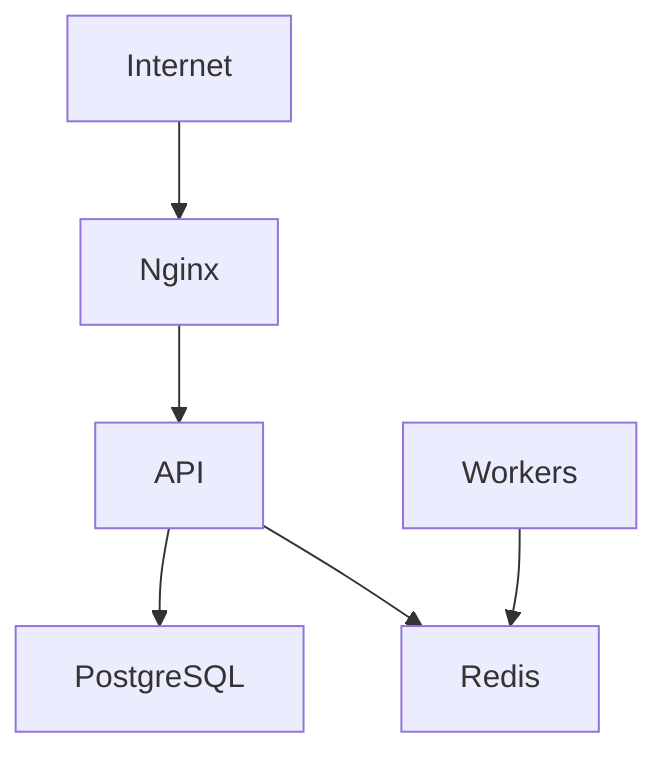

# MistyPay - Security Infrastructure Document

> Version: 1.0
> Status: Draft - MVP Phase
> Product: MistyPay
> Infrastructure: Ubuntu VPS + Docker Compose
> Last Updated: 2026

---

# 1. Document Purpose

This document defines security standards for MistyPay infrastructure.

Objectives:

- Protect customer funds
- Protect financial records
- Protect infrastructure
- Protect API endpoints
- Protect administrative access
- Reduce attack surface

---

# 2. Security Philosophy

For MistyPay:

```text
Assume every public endpoint will be attacked.
```

---

Core principle:

```text
Defense in Depth
```

Multiple layers:

```text
Network
↓
Server
↓
Application
↓
Database
↓
Operations
```

---

# 3. Security Priorities

Priority order:

```text
1. Treasury

2. Database

3. Admin Access

4. Provider Credentials

5. User Accounts
```

---

# 4. Threat Model

Potential threats:

```text
Credential Theft

API Abuse

Brute Force Login

JWT Theft

Server Compromise

Provider Credential Leakage

Database Breach

Duplicate Payout Attacks
```

---

# 5. VPS Security

## Operating System

Recommended:

```text
Ubuntu 24.04 LTS
```

---

## Update Policy

Weekly:

```bash
sudo apt update
sudo apt upgrade
```

---

Critical updates:

```text
Immediately
```

---

# 6. SSH Security

## Disable Password Login

Use:

```text
SSH Key Authentication
```

Only.

---

## SSH Config

File:

```text
/etc/ssh/sshd_config
```

---

Recommended:

```text
PermitRootLogin no

PasswordAuthentication no

PubkeyAuthentication yes
```

---

Restart:

```bash
sudo systemctl restart ssh
```

---

# 7. Root Access

Rule:

```text
Never login as root.
```

---

Create:

```text
mistypay-admin
```

user.

---

Use:

```bash
sudo
```

when required.

---

# 8. Firewall

Use:

```text
UFW
```

---

Default:

```bash
sudo ufw default deny incoming
sudo ufw default allow outgoing
```

---

Allow:

```bash
sudo ufw allow 22/tcp
sudo ufw allow 80/tcp
sudo ufw allow 443/tcp
```

---

Enable:

```bash
sudo ufw enable
```

---

# 9. Fail2Ban

Purpose:

```text
Block brute-force attacks.
```

---

Install:

```bash
sudo apt install fail2ban
```

---

Protect:

```text
SSH
Nginx
```

---

# 10. Docker Security

## Rule

Never expose:

```text
PostgreSQL
Redis
```

to the public internet.

---

Only expose:

```text
Nginx
```

---

## Example

Allowed:

```text
443
80
```

---

Not allowed:

```text
5432
6379
```

---

# 11. Network Security

Public:

```text
Nginx
```

---

Private:

```text
API
Database
Redis
Workers
```

---

Architecture:



---

# 12. Secret Management

Secrets include:

```text
JWT Secrets
Provider Credentials
Database Passwords
API Keys
```

---

Never store:

```text
Source Code
Git Repository
```

---

Store in:

```text
Environment Variables
Bitwarden
1Password
```

---

# 13. Secret Rotation

Rotate:

```text
JWT Secrets
Provider Keys
```

Recommended:

```text
Every 6 Months
```

---

Immediately rotate if:

```text
Credential leak suspected.
```

---

# 14. Database Security

## Rule

Database must not be publicly accessible.

---

Only allow:

```text
Internal Docker Network
```

---

## Credentials

Use:

```text
Strong Random Passwords
```

Minimum:

```text
24 characters
```

---

# 15. Redis Security

Redis should:

```text
Require Password
```

---

Must not:

```text
Bind to public network
```

---

# 16. JWT Security

## Access Token

Lifetime:

```text
15 minutes
```

---

## Refresh Token

Lifetime:

```text
30 days
```

---

Store:

```text
Hashed
```

in database.

---

# 17. Authentication Security

## Password Policy

Minimum:

```text
8 characters
```

Recommended:

```text
12+ characters
```

---

Must contain:

```text
Uppercase
Lowercase
Number
```

---

# 18. PIN Security

PIN length:

```text
6 digits
```

---

Store:

```text
Hashed
```

Never plaintext.

---

## Lock Policy

After:

```text
5 failed attempts
```

Lock:

```text
15 minutes
```

---

# 19. Rate Limiting

## Login

```text
10 requests/minute
```

---

## Quote Creation

```text
30 requests/minute
```

---

## Payment Creation

```text
20 requests/minute
```

---

# 20. API Security Headers

Enable:

```text
Helmet
```

---

Required:

```text
X-Frame-Options

X-Content-Type-Options

Content-Security-Policy
```

---

# 21. CORS Security

Allowed origins only.

---

Example:

```text
https://app.mistypay.vn
```

---

Never:

```text
*
```

in production.

---

# 22. Webhook Security

All webhooks must verify:

```text
Signature
Timestamp
```

---

Reject:

```text
Invalid Signature
```

---

# 23. Treasury Protection

## Rule

No payout without:

```text
USDT_CONFIRMED
```

---

Must verify:

```text
Payment State
Amount
Provider Status
```

before payout.

---

# 24. Duplicate Payout Protection

Unique constraints:

```text
payment_id
provider_reference
```

---

Idempotency required.

---

Rule:

```text
One payment
One payout
```

---

# 25. Admin Security

Admin accounts:

```text
Separate from user accounts
```

---

Must support:

```text
Role-Based Access Control
```

---

Roles:

```text
ADMIN
OPERATOR
AUDITOR
```

---

# 26. Admin Audit Logging

Log:

```text
Login
Logout
Review Actions
Payout Actions
Configuration Changes
```

---

# 27. Security Monitoring

Alert immediately:

```text
Repeated Login Failures

Repeated PIN Failures

Admin Login

Treasury Mismatch

Duplicate Payout Attempt
```

---

# 28. Dependency Security

Scan dependencies:

```bash
npm audit
```

---

Frequency:

```text
Weekly
```

---

# 29. Backup Security

Backup files:

```text
Encrypted
Private
```

---

Never public.

---

# 30. Mobile App Security

Never store:

```text
JWT Secret
Provider Keys
Wallet Private Keys
```

inside mobile app.

---

Allowed:

```text
Public API URL
```

only.

---

# 31. Expo Security

Use:

```text
expo-secure-store
```

for:

```text
Access Token
Refresh Token
```

---

Do not use:

```text
AsyncStorage
```

for sensitive credentials.

---

# 32. Logging Security

Never log:

```text
Passwords
PINs
Tokens
Secrets
```

---

Mask:

```text
Email
Bank Account
Wallet Address
```

---

# 33. Security Incident Levels

## P1

Examples:

```text
Treasury Mismatch

Duplicate Payout

Data Leak
```

Response:

```text
Immediate
```

---

## P2

Examples:

```text
Provider Credential Leak

Admin Compromise
```

Response:

```text
Within 1 Hour
```

---

## P3

Examples:

```text
Login Abuse

Rate Limit Abuse
```

Response:

```text
Within 24 Hours
```

---

# 34. Security Checklist Before Production

Verify:

```text
SSH Password Login Disabled

Firewall Enabled

Fail2Ban Enabled

SSL Enabled

Database Private

Redis Private

JWT Configured

Rate Limiting Enabled

Monitoring Enabled

Backups Enabled
```

---

# 35. MVP Security Summary

Most critical protections:

```text
SSH Security
Firewall
JWT Security
PIN Security
Webhook Verification
Duplicate Payout Prevention
```

---

Core Rule:

```text
No payout without confirmed funds.
No secret in source code.
No public access to database or Redis.
```

---

# 36. Final Principle

For MistyPay:

```text
Users trust money.

Money trusts security.

Security must be designed before scale.
```
