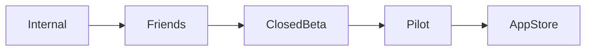

# MistyPay - TestFlight Plan Document

> Version: 1.0
> Status: Draft - MVP Validation Phase
> Product: MistyPay
> Platform: iOS
> Distribution: Apple TestFlight
> Last Updated: 2026

---

# 1. Document Purpose

This document defines the TestFlight strategy for MistyPay MVP.

Objectives:

- Validate real user behavior
- Verify payment flow stability
- Verify payout reliability
- Identify UX issues
- Collect feedback before App Store release
- Reduce launch risk

---

# 2. TestFlight Goals

The primary goal is NOT growth.

The primary goal is:

```text
Validate the complete payment flow.
```

Specifically:

```text
Traveler
↓
Scan QR
↓
Generate Quote
↓
Pay USDT
↓
System Detects Payment
↓
Merchant Receives VND
↓
Success
```

---

# 3. Success Criteria

TestFlight is considered successful if:

```text
95%+ payment success rate

No duplicate payouts

No missing funds

No critical crashes

Average payment completion < 10 seconds
```

---

# 4. Testing Phases



---

# 5. Phase 1 - Internal Testing

## Objective

Verify technical correctness.

---

## Participants

```text
Founder
```

Initially only:

```text
James
```

---

## Duration

```text
1-2 weeks
```

---

## Focus

```text
Authentication

QR Scan

Quote

Payment Flow

Blockchain Detection

Payout Flow
```

---

## Success Criteria

```text
20 successful test transactions

0 duplicate payouts

0 treasury mismatch
```

---

# 6. Phase 2 - Friends Testing

## Objective

Validate usability.

---

## Participants

Recommended:

```text
3-5 trusted friends
```

---

## Duration

```text
1 week
```

---

## Focus

```text
UI clarity

Error messages

Payment understanding

Payment speed
```

---

## Questions

Ask testers:

```text
Was anything confusing?

Did you understand the payment process?

Would you trust this app?
```

---

# 7. Phase 3 - Closed Beta

## Objective

Validate real-world usage.

---

## Participants

```text
10-20 users
```

Recommended:

```text
Foreign students

Foreign coworkers

Foreign travelers
```

---

## Duration

```text
2-4 weeks
```

---

## Focus

```text
Real devices

Different countries

Different payment sizes

Different network conditions
```

---

## Test Amounts

```text
50,000 VND

100,000 VND

500,000 VND

1,000,000 VND
```

---

# 8. Phase 4 - Pilot Travelers

## Objective

Validate business model.

---

## Participants

```text
20-50 real travelers
```

---

## Duration

```text
1 month
```

---

## Focus

```text
Actual merchant payments

Real-world transaction speed

Support requests

Operational workload
```

---

# 9. Participant Selection Rules

## Preferred

```text
English speakers

Frequent travelers

Crypto users

USDT holders
```

---

## Avoid

```text
People unfamiliar with smartphones

People unfamiliar with crypto

Large-scale public testing
```

for MVP.

---

# 10. TestFlight Build Strategy

## Build Naming

Format:

```text
1.0.0 (1)
1.0.0 (2)
1.0.0 (3)
```

---

## Example

```text
1.0.0 (1)
Internal

1.0.0 (5)
Friends

1.0.0 (10)
Closed Beta
```

---

# 11. Test Categories

Each build should test:

---

## Category 1

Authentication

```text
Register
Login
Logout
PIN
```

---

## Category 2

QR

```text
Scan QR
Parse VietQR
```

---

## Category 3

Quote

```text
Calculate USDT
Apply Fee
Expiration
```

---

## Category 4

Payment

```text
Create Order
Display Wallet
Display Amount
```

---

## Category 5

Blockchain

```text
Detect USDT
Validate Amount
```

---

## Category 6

Payout

```text
Send VND
Update Status
```

---

# 12. Test Transaction Matrix

| Amount VND | Frequency |
| ---------- | --------- |
| 50,000     | High      |
| 100,000    | High      |
| 500,000    | Medium    |
| 1,000,000  | Medium    |
| 2,000,000  | Low       |

---

# 13. Device Testing Matrix

## iPhone Models

Minimum:

```text
iPhone 11
```

---

Recommended:

```text
iPhone 11
iPhone 12
iPhone 13
iPhone 14
iPhone 15
```

---

## iOS Versions

Target:

```text
iOS 17+
```

---

# 14. Metrics To Track

## User Metrics

```text
Registrations

Successful Logins

Completed Payments

Failed Payments
```

---

## Payment Metrics

```text
Quote Created

Payment Created

USDT Detected

Payout Success
```

---

## Technical Metrics

```text
Crash Count

API Errors

Blockchain Errors

Payout Errors
```

---

# 15. Feedback Collection

## Method

Recommended:

```text
Google Form

Notion Form

Telegram Group

Discord Channel
```

---

## Questions

```text
Was the payment process clear?

Was the app easy to use?

Was anything confusing?

Would you use this again?

Would you recommend it?
```

---

# 16. Critical Issues (Stop Testing)

If any occur:

---

## Issue 1

```text
Missing funds
```

---

## Issue 2

```text
Duplicate payout
```

---

## Issue 3

```text
Wrong payout amount
```

---

## Issue 4

```text
Treasury mismatch
```

---

## Issue 5

```text
Repeated payment failures
```

---

## Action

```text
Pause rollout immediately
Investigate
Fix
Retest
```

---

# 17. Go / No-Go Decision

## GO

Requirements:

```text
95%+ successful transactions

No critical financial bugs

No duplicate payouts

Treasury fully reconciled
```

---

## NO-GO

If any exist:

```text
Missing funds

Treasury mismatch

Duplicate payout

High crash rate
```

---

# 18. Release Readiness Checklist

| Item                         | Status |
| ---------------------------- | ------ |
| Payment Flow Stable          | ☐     |
| Blockchain Detection Stable  | ☐     |
| Payout Stable                | ☐     |
| Reconciliation Stable        | ☐     |
| No Critical Bugs             | ☐     |
| TestFlight Feedback Positive | ☐     |

---

# 19. App Store Submission Criteria

Before App Store submission:

```text
Minimum 100 successful transactions

Minimum 20 unique testers

Minimum 2 weeks stable operation

No unresolved critical issues
```

---

# 20. Final Objective

The TestFlight phase is successful when:

```text
A foreign traveler can pay a Vietnamese merchant
using USDT

and

The merchant receives VND

in under 10 seconds

without needing support.
```

This is the core validation milestone before App Store release.
