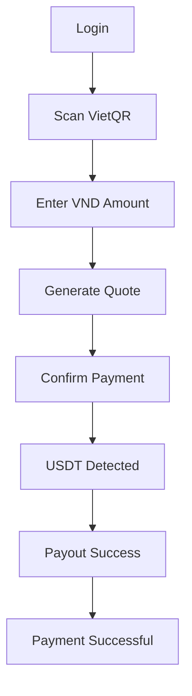
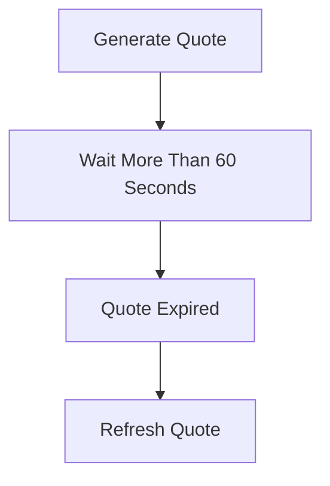
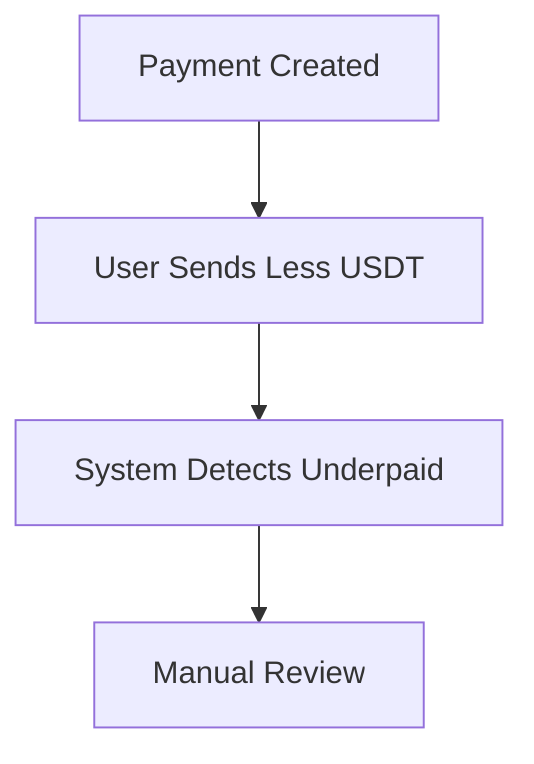
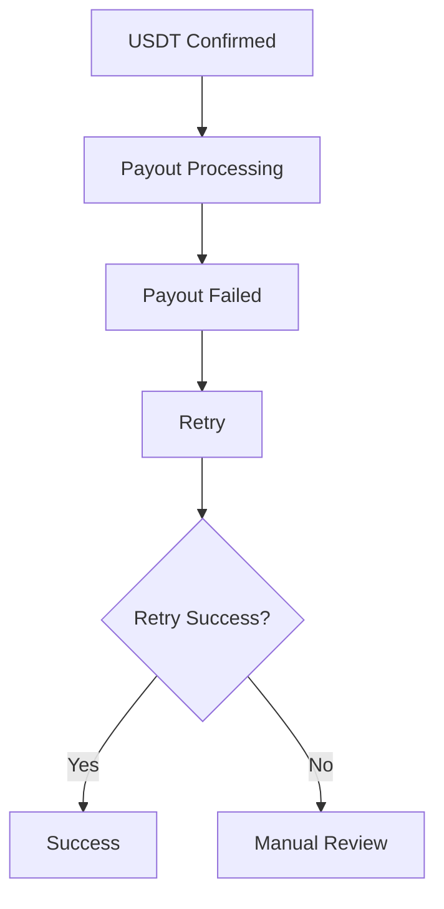

# MistyPay - Test Plan Document

> Version: 1.0
> Status: Draft - MVP Phase
> Product: MistyPay
> Last Updated: 2026

---

# 1. Document Purpose

This document defines the testing strategy for MistyPay MVP.

Objectives:

- Define testing scope
- Define testing types
- Define testing responsibilities
- Define testing environments
- Define pass/fail criteria
- Support AI-assisted development
- Reduce transaction and payout risks

---

# 2. Testing Goals

The testing process must verify that MistyPay can:

```text
Scan VietQR
Generate quote
Create payment order
Detect USDT payment
Trigger VND payout
Complete transaction
Handle errors safely
```

---

# 3. Testing Scope

## In Scope

```text
Mobile App
Backend API
Database
Blockchain Monitoring
Payout Process
Transaction State Machine
Admin / Operator Flows
Error Handling
```

---

## Out of Scope

```text
Multi-chain support
Merchant Portal
Referral Program
Cashback
KYC
Travel Booking
eSIM Marketplace
```

---

# 4. Test Environments

## Local Environment

Purpose:

```text
Developer testing
API testing
Mock service testing
```

Components:

```text
React Native Expo
NestJS
PostgreSQL Local
Redis Local
Mock TronGrid
Mock PayOS
```

---

## Staging Environment

Purpose:

```text
End-to-end testing
Internal testing
Pre-TestFlight testing
```

Components:

```text
Staging API
Staging Database
Staging Redis
TRON test environment if available
PayOS/BaoKim sandbox if available
```

---

## Production Environment

Purpose:

```text
Live operation
Real users
Real transactions
```

Production testing must be limited and controlled.

---

# 5. Testing Types

## 5.1 Functional Testing

Verify each feature works as expected.

Examples:

```text
Register
Login
Scan QR
Generate Quote
Create Payment
View History
```

---

## 5.2 API Testing

Verify backend APIs.

Examples:

```text
POST /auth/login
POST /quotes
POST /payments
GET /payments/:id
```

---

## 5.3 Integration Testing

Verify communication between modules.

Examples:

```text
Quote → Payment
Payment → Blockchain
Blockchain → Payout
Payout → Transaction Success
```

---

## 5.4 End-to-End Testing

Verify full user journey.

```text
Scan QR
↓
Enter Amount
↓
Generate Quote
↓
Confirm Payment
↓
USDT Detected
↓
Payout Success
↓
Payment Successful
```

---

## 5.5 Error Handling Testing

Verify system handles failures safely.

Examples:

```text
Invalid QR
Quote Expired
Underpaid
Overpaid
Payout Failed
Provider Timeout
```

---

## 5.6 Security Testing

Verify basic protection.

Examples:

```text
Invalid token
Expired token
Wrong PIN
Rate limit
Unauthorized admin access
```

---

## 5.7 Performance Testing

Verify acceptable speed.

Targets:

```text
API response < 500ms
Payment status polling stable
Payment completion < 10 seconds
```

---

## 5.8 Regression Testing

Verify existing functions still work after changes.

---

# 6. Key Test Areas

## Authentication

```text
Register
Login
Logout
Refresh token
Forgot password
PIN verification
```

---

## QR

```text
Valid VietQR
Invalid QR
Unsupported QR
Missing bank info
Missing account info
```

---

## Quote

```text
Valid quote
Expired quote
Rate unavailable
Invalid amount
Fee calculation
```

---

## Payment

```text
Create order
Payment pending
Payment confirmed
Payment expired
Payment failed
```

---

## Blockchain

```text
USDT detected
Wrong amount
Duplicate tx
Late payment
Wrong token
Wrong network
```

---

## Payout

```text
Payout success
Payout failed
Payout timeout
Retry payout
Duplicate callback
```

---

## Reconciliation

```text
Blockchain match
Payout match
Treasury match
Missing records
Status mismatch
```

---

# 7. Critical User Journeys

## Journey 1 - Successful Payment



---

## Journey 2 - Quote Expired



---

## Journey 3 - Underpaid Payment



---

## Journey 4 - Payout Failed



---

# 8. Test Data

## User Test Data

```text
test.traveler@example.com
test.admin@example.com
test.operator@example.com
```

---

## QR Test Data

Required:

```text
Valid VietQR
Invalid QR
Unsupported QR
QR missing bank info
QR missing account info
```

---

## Payment Test Data

```text
Amount: 50,000 VND
Amount: 500,000 VND
Amount: 2,000,000 VND
```

---

## Blockchain Test Data

```text
Correct USDT amount
Underpaid amount
Overpaid amount
Duplicate tx_hash
Late payment
```

---

# 9. Entry Criteria

Testing can begin when:

```text
Feature implementation completed
API available
Database migration applied
Test data prepared
Environment running
```

---

# 10. Exit Criteria

Testing is considered complete when:

```text
All critical test cases pass
No critical bug remains
No high severity payment bug remains
Payout flow verified
Blockchain detection verified
Transaction history verified
```

---

# 11. Bug Severity Levels

## Critical

Examples:

```text
Duplicate payout
Wrong amount payout
Funds missing
User cannot complete payment
```

---

## High

Examples:

```text
Payment stuck
Payout failed without alert
Wrong transaction status
```

---

## Medium

Examples:

```text
Incorrect UI message
Slow API response
Notification not sent
```

---

## Low

Examples:

```text
Minor UI spacing issue
Text typo
```

---

# 12. Pass / Fail Criteria

## Pass

A test case passes when:

```text
Actual result matches expected result
No unexpected errors occur
Database state is correct
User-facing status is correct
```

---

## Fail

A test case fails when:

```text
System result differs from expected behavior
Incorrect state transition occurs
Wrong money amount is calculated
Payout is triggered incorrectly
```

---

# 13. Testing Responsibilities

## Product Owner

Responsibilities:

```text
Review business correctness
Approve UAT
Review transaction logic
```

---

## Developer

Responsibilities:

```text
Run unit tests
Run API tests
Fix bugs
```

---

## Operator Tester

Responsibilities:

```text
Test payout failures
Test manual review
Test reconciliation
```

---

# 14. Recommended Testing Tools

## API Testing

```text
Postman
Insomnia
Thunder Client
```

---

## Mobile Testing

```text
Expo Go
iOS Simulator
TestFlight
```

---

## Database Testing

```text
pgAdmin
DBeaver
TablePlus
```

---

## Load Testing

```text
k6
Artillery
```

---

# 15. Automation Strategy

## MVP

Manual testing first.

Automate only:

```text
Critical API tests
Payment state transitions
Fee calculation
Quote expiration
```

---

## Future

Automate:

```text
Regression tests
E2E tests
Payout simulation
Blockchain simulation
```

---

# 16. MVP Testing Priority

## Priority 1

```text
Successful payment flow
Quote calculation
Payment state machine
Blockchain detection
Payout success
Duplicate payout prevention
```

---

## Priority 2

```text
Underpaid
Overpaid
Expired payment
Payout failed
Rate provider unavailable
```

---

## Priority 3

```text
Profile
Notifications
History filters
UI polish
```

---

# 17. Final MVP Acceptance Criteria

MistyPay MVP can be accepted when:

```text
User can scan VietQR successfully
User can generate quote correctly
User can create payment order
System can detect USDT payment
System can trigger VND payout
Merchant payout can complete
Transaction status is correctly displayed
Failed transactions do not lose money
Duplicate payouts cannot happen
```

---

# 18. Test Plan Summary

The core testing focus of MistyPay is:

```text
Financial correctness
Transaction safety
Payout reliability
User clarity
```

The MVP is considered stable only when payment, blockchain, and payout flows work consistently under both normal and failure scenarios.
