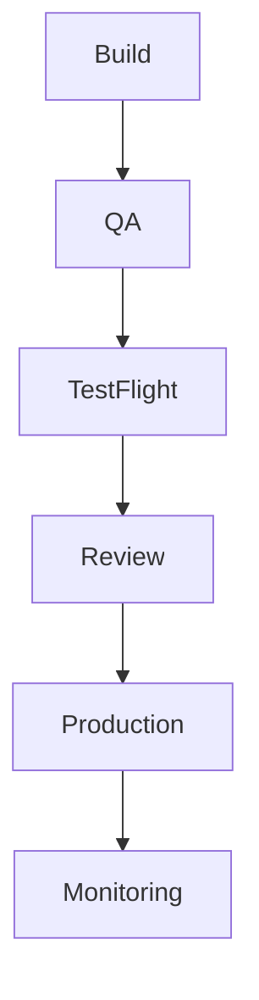

# MistyPay - App Store Submission Guide

> Version: 1.0
> Status: Draft - MVP Phase
> Product: MistyPay
> Platform: iOS (Apple App Store)
> Last Updated: 2026

> IMPORTANT:
>
> Apple App Review policies change frequently.
>
> This document is an operational guide and does not guarantee App Store approval.
>
> Final submission requirements must always be verified against the latest Apple Developer documentation.

---

# 1. Document Purpose

This document defines the release process for:

```text
TestFlight
App Store Connect
App Store Review
Production Release
```

for MistyPay.

---

# 2. Release Roadmap


---

# 3. Release Stages

## Stage 1

Internal Development

Users:

```text
Founder
Developer
```

---

## Stage 2

Internal TestFlight

Users:

```text
Founder
Internal Testers
```

---

## Stage 3

Closed Beta

Users:

```text
Selected Testers
```

---

## Stage 4

Public Release

Users:

```text
General Users
```

---

# 4. Apple Developer Account

Required:

```text
Apple Developer Program
```

---

Recommended:

```text
Organization Account
```

---

Alternative:

```text
Individual Account
```

for MVP.

---

# 5. App Store Connect Setup

Required:

```text
App Name

Bundle ID

Primary Language

Category

Privacy Information
```

---

Recommended Category:

```text
Finance
```

---

# 6. Bundle Information

Example:

```text
App Name:
MistyPay

Bundle ID:
com.mistyteam.mistypay
```

---

## Versioning

Format:

```text
1.0.0
1.0.1
1.1.0
2.0.0
```

---

# 7. TestFlight Preparation

Before upload:

Verify:

```text
Build passes QA

No critical bugs

No debug logs

No test credentials exposed
```

---

# 8. TestFlight Internal Testing

Recommended Testers:

```text
Founder

Developer

Operations Tester

Business Tester
```

---

Testing Focus:

```text
Authentication

Quote Flow

USDT Flow

Payout Flow

Error Handling
```

---

# 9. TestFlight External Testing

Recommended:

```text
10-50 Testers
```

---

Collect:

```text
Bug Reports

UX Feedback

Performance Feedback
```

---

# 10. App Metadata

Required:

```text
App Name

Subtitle

Description

Keywords

Support URL

Privacy Policy URL
```

---

# 11. App Description

Example Positioning:

```text
MistyPay is a digital payment platform designed to facilitate secure transaction processing and payment management.
```

---

Avoid:

```text
Guaranteed Profit

Investment Claims

Misleading Financial Claims
```

---

# 12. Screenshots

Required:

```text
iPhone Screenshots
```

---

Recommended:

```text
Login

Home

Quote Screen

Payment Screen

Transaction History
```

---

# 13. App Preview

Optional:

```text
Short Product Video
```

---

Recommended Length:

```text
15-30 Seconds
```

---

# 14. App Privacy

Required:

```text
Privacy Policy URL
```

---

Must disclose:

```text
Contact Information

Usage Data

Identifiers

Diagnostics
```

when applicable.

---

# 15. Data Collection Disclosure

Review actual implementation before submission.

---

Possible Categories:

```text
Email

Device Information

Usage Information

Transaction Information
```

---

# 16. Review Notes

Provide Apple with:

```text
Test Account

Testing Instructions

Important Workflows
```

---

Example:

```text
Use test@example.com
Password: ********

Test payment flow through sandbox environment.
```

---

# 17. Sandbox Environment

For review:

```text
Use non-production environment
```

when possible.

---

Benefits:

```text
Safer Review

No real funds required
```

---

# 18. App Review Risks

Potential concerns:

```text
Financial Services

Digital Assets

Crypto References

Payment Processing
```

---

Apple may request:

```text
Additional Explanations

Business Information

Compliance Information
```

---

# 19. Crypto-Related Considerations

MistyPay MVP includes:

```text
USDT Transaction Processing
```

---

Potential Review Questions:

```text
What is the role of the app?

How are transactions processed?

Does the app provide exchange services?

Does the app custody user assets?
```

---

# 20. Recommended Positioning

Focus on:

```text
Payment Facilitation

Transaction Management

Merchant Payments
```

---

Avoid unnecessary emphasis on:

```text
Speculation

Trading

Investment Features
```

---

# 21. Non-Custodial Explanation

If applicable:

```text
Users authorize transactions.

MistyPay facilitates transaction processing.

MistyPay does not market investment products.
```

---

Actual implementation should match this statement.

---

# 22. Compliance Documentation

Keep available:

```text
Privacy Policy

Terms of Service

Support Information

Business Information
```

---

# 23. App Review Response Process

If Apple requests clarification:

```text
Respond promptly

Provide screenshots

Provide workflow explanations

Provide test instructions
```

---

# 24. Release Checklist

Before submission:

```text
Privacy Policy Published

Terms of Service Published

Support Channel Active

Monitoring Enabled

Critical Bugs Fixed
```

---

# 25. Security Checklist

Verify:

```text
HTTPS Only

No Hardcoded Secrets

Token Protection

API Security

Logging Review
```

---

# 26. UX Checklist

Verify:

```text
No Broken Screens

Clear Error Messages

Consistent Navigation

Responsive Layout
```

---

# 27. Testing Checklist

Verify:

```text
Authentication

Quote Flow

Payment Flow

Payout Flow

History

Logout
```

---

# 28. Operational Checklist

Verify:

```text
Treasury Monitoring

Alerting

Backup

Recovery Procedures
```

---

# 29. Post-Release Monitoring

Monitor:

```text
Crash Rate

API Errors

Payout Failures

User Feedback
```

---

# 30. Version Release Process



---

# 31. Rollback Strategy

If critical issue detected:

```text
Disable Feature

Pause Processing

Hotfix Release

Emergency Communication
```

---

# 32. Support Preparation

Before launch:

```text
Support Email

Support Documentation

Incident Process
```

must be ready.

---

# 33. MVP Success Criteria

Ready for TestFlight when:

```text
Core Flows Stable

No Critical Bugs

Monitoring Active

Documentation Complete
```

---

Ready for Production when:

```text
TestFlight Successful

Review Approved

Support Ready

Treasury Ready
```

---

# 34. Future Release Milestones

Version 1.x

```text
MVP Launch
```

---

Version 2.x

```text
Expanded Integrations
Enhanced Monitoring
Improved Operations
```

---

Version 3.x

```text
Advanced Risk Controls

Additional Services
```

---

# 35. Final Principle

For MistyPay:

```text
App Store approval
is not the goal.

A stable and trustworthy product
is the goal.
```

---

```text
Release slowly.

Monitor carefully.

Scale responsibly.
```
