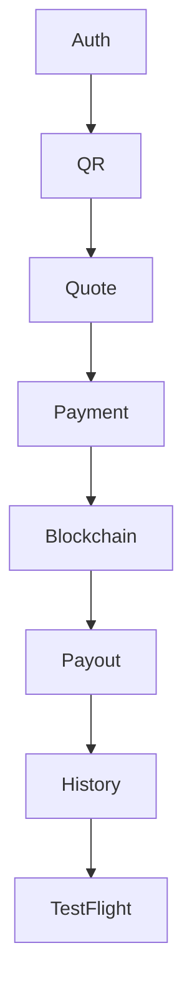

# MistyPay - MVP Task Breakdown Document

> Version: 1.0
> Status: Draft
> Product: MistyPay
> Product Owner: Le Vu Bao Nhat
> Development Model: Solo Founder + AI Assisted Development
> Last Updated: 2026

---

# 1. Document Purpose

This document converts the MistyPay MVP backlog into actionable implementation tasks.

Objectives:

- Break down MVP scope into executable work
- Define implementation order
- Support sprint planning
- Support AI-assisted development
- Track development progress

---

# 2. Development Phases


---

# EPIC-00 Foundation

## Objective

Setup development environment and project architecture.

---

## FOUNDATION-001

### Project Repositories

Tasks:

- Create Git repository
- Define branch strategy
- Setup README
- Setup issue template

Status:

```text
TODO
```

---

## FOUNDATION-002

### React Native Setup

Tasks:

- Create Expo project
- Configure TypeScript
- Configure ESLint
- Configure Prettier

Status:

```text
TODO
```

---

## FOUNDATION-003

### NestJS Setup

Tasks:

- Create NestJS project
- Configure environment loader
- Configure module structure
- Configure validation pipeline

Status:

```text
TODO
```

---

## FOUNDATION-004

### Database Setup

Tasks:

- Install PostgreSQL
- Setup Prisma ORM
- Configure migrations
- Create database environments

Status:

```text
TODO
```

---

## FOUNDATION-005

### Redis Setup

Tasks:

- Install Redis
- Configure Redis connection
- Verify connection

Status:

```text
TODO
```

---

## FOUNDATION-006

### BullMQ Setup

Tasks:

- Create queue module
- Configure worker framework
- Create retry strategy

Status:

```text
TODO
```

---

# EPIC-01 Authentication

## AUTH-001 User Entity

Tasks:

- Create User table
- Create Prisma schema
- Create migration

Status:

```text
TODO
```

---

## AUTH-002 Registration

Tasks:

- Register DTO
- Register API
- Email validation
- Password hashing

Status:

```text
TODO
```

---

## AUTH-003 Login

Tasks:

- Login DTO
- Login API
- Password verification
- JWT generation

Status:

```text
TODO
```

---

## AUTH-004 JWT Security

Tasks:

- Access token
- Refresh token
- Auth guards
- Token expiration

Status:

```text
TODO
```

---

## AUTH-005 PIN Management

Tasks:

- Create PIN API
- Update PIN API
- Verify PIN API
- PIN hashing

Status:

```text
TODO
```

---

## AUTH-006 Profile

Tasks:

- Profile API
- Update profile API
- Profile screen

Status:

```text
TODO
```

---

# EPIC-02 Mobile UI Foundation

## UX-001 Navigation

Tasks:

- React Navigation setup
- Auth stack
- Main stack

Status:

```text
TODO
```

---

## UX-002 Design System

Tasks:

- Color tokens
- Typography
- Button components
- Input components

Status:

```text
TODO
```

---

## UX-003 Authentication Screens

Tasks:

- Login screen
- Register screen
- Create PIN screen

Status:

```text
TODO
```

---

## UX-004 Home Screen

Tasks:

- Dashboard
- Scan button
- History shortcut

Status:

```text
TODO
```

---

# EPIC-03 QR & Quote

## QR-001 QR Scanner

Tasks:

- Camera permissions
- QR scanner integration
- QR validation

Status:

```text
TODO
```

---

## QR-002 VietQR Parser

Tasks:

- Parse bank code
- Parse account number
- Parse merchant name

Status:

```text
TODO
```

---

## QUOTE-001 Rate Service

Tasks:

- Binance integration
- Rate caching
- Fallback handling

Status:

```text
TODO
```

---

## QUOTE-002 Fee Calculator

Tasks:

- Service fee calculation
- Total USDT calculation
- Precision handling

Status:

```text
TODO
```

---

## QUOTE-003 Quote Engine

Tasks:

- Create quote
- Quote expiration
- Quote validation

Status:

```text
TODO
```

---

## QUOTE-004 Quote Screen

Tasks:

- Amount input
- Fee display
- Quote summary
- Countdown timer

Status:

```text
TODO
```

---

# EPIC-04 Payment

## PAY-001 Payment Entity

Tasks:

- Payment table
- Payment status enum
- Payment migration

Status:

```text
TODO
```

---

## PAY-002 Create Payment

Tasks:

- Create payment API
- Payment validation
- Order generation

Status:

```text
TODO
```

---

## PAY-003 Payment State Machine

Tasks:

- WAITING_USDT
- USDT_DETECTED
- USDT_CONFIRMED
- EXPIRED
- UNDERPAID
- OVERPAID

Status:

```text
TODO
```

---

## PAY-004 Payment Screen

Tasks:

- Wallet address display
- Amount display
- Status polling
- Status updates

Status:

```text
TODO
```

---

# EPIC-05 Blockchain

## BC-001 TronGrid Integration

Tasks:

- API integration
- Connection testing

Status:

```text
TODO
```

---

## BC-002 Wallet Monitor

Tasks:

- Monitor wallet
- Poll transactions
- Save transactions

Status:

```text
TODO
```

---

## BC-003 Transaction Matching

Tasks:

- Match order
- Match amount
- Match expiration

Status:

```text
TODO
```

---

## BC-004 Validation Engine

Tasks:

- Token validation
- Network validation
- Duplicate detection

Status:

```text
TODO
```

---

## BC-005 Blockchain Worker

Tasks:

- Detection worker
- Processing worker
- Event publishing

Status:

```text
TODO
```

---

# EPIC-06 Payout

## PO-001 Merchant Entity

Tasks:

- Merchant table
- Bank information

Status:

```text
TODO
```

---

## PO-002 Payout Entity

Tasks:

- Payout table
- Payout statuses

Status:

```text
TODO
```

---

## PO-003 BaoKim Integration

Tasks:

- Authentication
- Payout API
- Status query

Status:

```text
TODO
```

---

## PO-004 Payout Worker

Tasks:

- Queue processing
- Payout creation
- Status updates

Status:

```text
TODO
```

---

## PO-005 Retry Logic

Tasks:

- Retry schedule
- Retry counter
- Failure handling

Status:

```text
TODO
```

---

## PO-006 Callback Handler

Tasks:

- Callback endpoint
- Signature verification
- Status synchronization

Status:

```text
TODO
```

---

# EPIC-07 Transaction History

## TXN-001 History API

Tasks:

- Transaction list API
- Pagination
- Sorting

Status:

```text
TODO
```

---

## TXN-002 Detail API

Tasks:

- Transaction detail API

Status:

```text
TODO
```

---

## TXN-003 History Screens

Tasks:

- History list screen
- Detail screen

Status:

```text
TODO
```

---

# EPIC-08 Operations

## OPS-001 Audit Logging

Tasks:

- Audit table
- Event logging
- Audit APIs

Status:

```text
TODO
```

---

## OPS-002 Reconciliation

Tasks:

- Reconciliation service
- Daily job
- Reports

Status:

```text
TODO
```

---

## OPS-003 Manual Review Queue

Tasks:

- Review table
- Review APIs
- Review workflow

Status:

```text
TODO
```

---

## OPS-004 Monitoring

Tasks:

- Error monitoring
- Queue monitoring
- Treasury monitoring

Status:

```text
TODO
```

---

# EPIC-09 Admin Panel

## ADM-001 Admin Authentication

Tasks:

- Admin login
- Admin roles

Status:

```text
TODO
```

---

## ADM-002 Transaction Dashboard

Tasks:

- Transaction overview
- Status monitoring

Status:

```text
TODO
```

---

## ADM-003 Manual Review Dashboard

Tasks:

- Review queue
- Review actions

Status:

```text
TODO
```

---

## ADM-004 Treasury Dashboard

Tasks:

- USDT balance
- VND balance
- Liquidity alerts

Status:

```text
TODO
```

---

# EPIC-10 Testing & Release

## TEST-001 API Testing

Tasks:

- Postman collection
- API validation

Status:

```text
TODO
```

---

## TEST-002 UAT

Tasks:

- Execute UAT checklist
- Verify acceptance criteria

Status:

```text
TODO
```

---

## TEST-003 TestFlight

Tasks:

- Apple setup
- Build upload
- Tester invitation

Status:

```text
TODO
```

---

# 3. MVP Critical Path

The following sequence must be completed first:



---

# 4. First Demo Goal

The first meaningful demo is achieved when:

```text
User Login
↓
Scan VietQR
↓
Enter 500,000 VND
↓
Generate Quote
↓
Create Payment
↓
Simulate USDT Detection
↓
Fake Payout Success
↓
Transaction Complete
```

This milestone should be reached before integrating real BaoKim payouts.

---

# 5. MVP Completion Definition

MVP is complete when:

```text
Authentication Complete

QR Complete

Quote Complete

Payment Complete

Blockchain Complete

Payout Complete

History Complete

Admin Complete

Testing Complete
```

and

```text
A real USDT payment
can trigger
a real VND payout
successfully.
```
