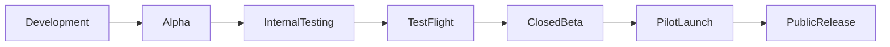

# MistyPay - Release Plan Document

> Version: 1.0
> Status: Draft
> Product: MistyPay
> Product Owner: Le Vu Bao Nhat
> Last Updated: 2026

---

# 1. Document Purpose

This document defines the release strategy for MistyPay MVP.

Objectives:

- Define release stages
- Define release criteria
- Define testing milestones
- Define rollout strategy
- Reduce operational and financial risks

---

# 2. Release Philosophy

MistyPay is a fintech product.

Therefore:

```text
Trust > Speed

Safety > Features

Reliability > Growth
```

---

# 3. Release Lifecycle



---

# 4. Release Stages Overview

| Stage            | Users            | Real Money | Goal                |
| ---------------- | ---------------- | ---------- | ------------------- |
| Development      | Founder          | No         | Build features      |
| Alpha            | Founder          | Limited    | Validate flow       |
| Internal Testing | Founder + Team   | Limited    | Validate system     |
| TestFlight       | Friends          | Optional   | Validate UX         |
| Closed Beta      | Small user group | Yes        | Validate product    |
| Pilot Launch     | Real users       | Yes        | Validate operations |
| Public Release   | Public           | Yes        | Scale product       |

---

# 5. Stage 1 - Development

## Objective

Build MVP features.

---

## Scope

```text
Authentication
QR
Quote
Payment
Blockchain
Payout
History
Admin
```

---

## Exit Criteria

```text
All MVP modules implemented
```

---

# 6. Stage 2 - Alpha

## Objective

Validate end-to-end transaction flow.

---

## Participants

```text
Founder Only
```

---

## Transactions

```text
Mock Transactions

Small Real Transactions
```

---

## Goal

Validate:

```text
QR
↓
Quote
↓
Payment
↓
Blockchain
↓
Payout
```

---

## Exit Criteria

```text
10 Successful Transactions
```

---

# 7. Stage 3 - Internal Testing

## Objective

Validate system stability.

---

## Participants

```text
Founder

Trusted Collaborators
```

---

## Focus

```text
Error Handling

Payout Reliability

Treasury Monitoring

Manual Review
```

---

## Exit Criteria

```text
20 Successful Transactions

No Critical Financial Bugs
```

---

# 8. Stage 4 - TestFlight

## Objective

Validate usability.

---

## Participants

```text
3-5 Testers
```

---

## Focus

```text
User Experience

Navigation

Payment Understanding

Error Messages
```

---

## Exit Criteria

```text
50 Successful Transactions

Positive Feedback
```

---

# 9. Stage 5 - Closed Beta

## Objective

Validate real-world operation.

---

## Participants

```text
10-20 Users
```

---

## Suggested Audience

```text
Foreign Students

Digital Nomads

Travelers

Crypto Users
```

---

## Focus

```text
Real Payments

Real Payouts

Support Workload

Operational Processes
```

---

## Exit Criteria

```text
100 Successful Transactions

95% Success Rate
```

---

# 10. Stage 6 - Pilot Launch

## Objective

Validate business viability.

---

## Participants

```text
20-50 Users
```

---

## Focus

```text
Merchant Adoption

Transaction Volume

Operational Scalability
```

---

## Metrics

```text
Transaction Count

User Retention

Support Requests
```

---

## Exit Criteria

```text
500 Successful Transactions
```

---

# 11. Stage 7 - Public Release

## Objective

Launch to wider audience.

---

## Channels

```text
App Store

Landing Page

Social Media

Communities
```

---

## Requirements

```text
Stable Operations

Monitoring Active

Support Process Ready
```

---

# 12. Release Gates

Every stage must pass before moving forward.

---

## Gate 1

Payment Flow

Requirements:

```text
Quote Works

Payment Created

USDT Detected
```

---

## Gate 2

Payout Flow

Requirements:

```text
Payout Success

Retry Works

No Duplicate Payout
```

---

## Gate 3

Operations

Requirements:

```text
Audit Logs

Monitoring

Reconciliation
```

---

## Gate 4

User Experience

Requirements:

```text
Users Understand Process

No Critical UX Problems
```

---

# 13. Critical Stop Conditions

Release must stop immediately if:

---

## Financial Issues

```text
Missing Funds

Duplicate Payout

Wrong Payout Amount

Treasury Mismatch
```

---

## Security Issues

```text
Unauthorized Access

Data Exposure

Authentication Bypass
```

---

## Operational Issues

```text
High Failure Rate

Unrecoverable Transactions

Repeated System Outages
```

---

# 14. Success Metrics

## Product Metrics

```text
Registrations

Active Users

Transaction Count
```

---

## Payment Metrics

```text
Payment Success Rate

Payout Success Rate

Transaction Completion Time
```

---

## Operational Metrics

```text
Manual Reviews

Treasury Accuracy

Support Tickets
```

---

# 15. MVP Launch KPIs

Target:

```text
Payment Success Rate > 95%

Payout Success Rate > 99%

Duplicate Payout = 0

Treasury Mismatch = 0
```

---

# 16. Rollback Plan

If critical issues occur:

---

## Action 1

```text
Pause New Transactions
```

---

## Action 2

```text
Disable Payout Worker
```

---

## Action 3

```text
Investigate Issue
```

---

## Action 4

```text
Restore Service
```

---

# 17. Release Communication Plan

## Internal

```text
Founder

Contributors
```

---

## External

```text
Testers

Pilot Users

Merchants
```

---

## Channels

```text
Email

Telegram

Discord

Zalo
```

---

# 18. Public Release Requirements

Before public launch:

```text
100+ Successful Transactions

20+ Unique Testers

No Critical Bugs

Stable Treasury

Stable Monitoring
```

---

# 19. Future Releases

Post-MVP Releases May Include:

```text
Push Notifications

Referral Program

Merchant Dashboard

KYC

Multi-Language Support

Multi-Chain Support
```

---

# 20. Release Plan Summary

Current Goal:

```text
Reach TestFlight Safely
```

Release Path:

```text
Development
↓
Alpha
↓
Internal Testing
↓
TestFlight
↓
Closed Beta
↓
Pilot Launch
↓
Public Release
```

Success Definition:

```text
A foreign traveler can pay a Vietnamese merchant
using USDT

and

The merchant receives VND

quickly, safely and reliably.
```
