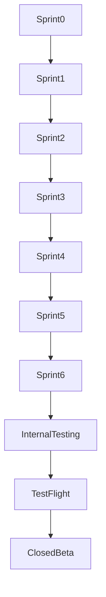

# MistyPay - Sprint Plan Document

> Version: 1.0
> Status: Draft
> Product: MistyPay
> Development Model: Solo Founder + AI Assisted Development
> Tech Stack: React Native (Expo) + NestJS + PostgreSQL + Redis + BullMQ
> Last Updated: 2026

---

# 1. Document Purpose

This document defines the MVP development plan for MistyPay.

Objectives:

- Convert roadmap into executable work
- Define development order
- Reduce technical risk
- Reach first TestFlight release quickly
- Focus on validating business model

---

# 2. Development Philosophy

For MistyPay MVP:

```text
Validate Business First
Optimize Later
```

Priority:

```text
Working Payment Flow
>
Perfect Code
```

---

# 3. MVP Success Definition

MVP is successful when:

```text
Traveler
↓
Scan VietQR
↓
Generate Quote
↓
Send USDT
↓
USDT Detected
↓
Merchant Receives VND
↓
Success
```

works end-to-end.

---

# 4. Sprint Structure

## Sprint Duration

```text
2 Weeks
```

---

## Total MVP Duration

```text
10 - 12 Weeks
```

---

## Total Sprints

```text
6 Sprints
```

---

# 5. Sprint 0 - Project Foundation

## Duration

```text
3 - 5 Days
```

---

## Objective

Setup project structure.

---

## Deliverables

### Frontend

```text
Create Expo Project

Folder Structure

Navigation Setup

Environment Setup
```

---

### Backend

```text
Create NestJS Project

Module Structure

Database Setup

Redis Setup

BullMQ Setup
```

---

### DevOps

```text
Git Repository

Branch Strategy

Development VPS

Database Server
```

---

## Exit Criteria

```text
Frontend Runs

Backend Runs

Database Connected
```

---

# 6. Sprint 1 - Authentication & User Management

## Objective

Users can register and login.

---

## Features

### Authentication

```text
Register

Login

Logout

Refresh Token
```

---

### Profile

```text
User Profile

Edit Profile
```

---

### Security

```text
PIN Setup

PIN Validation
```

---

## APIs

```text
/auth/register

/auth/login

/auth/refresh

/users/me
```

---

## Exit Criteria

```text
User can create account

User can login

PIN works
```

---

# 7. Sprint 2 - QR & Quote Module

## Objective

Generate payment quote.

---

## Features

### QR

```text
Scan VietQR

Parse Merchant Info
```

---

### Quote

```text
Enter Amount

Rate Retrieval

Fee Calculation

Quote Expiration
```

---

## APIs

```text
/qr/parse

/quotes
```

---

## Exit Criteria

```text
User can scan QR

User can generate quote

Fees calculated correctly
```

---

# 8. Sprint 3 - Payment Module

## Objective

Create payment orders.

---

## Features

### Payment

```text
Create Payment Order

Display Wallet Address

Display Required USDT

Payment Status
```

---

### State Machine

```text
WAITING_USDT

USDT_DETECTED

USDT_CONFIRMED
```

---

## APIs

```text
/payments

/payments/:id

/payments/:id/status
```

---

## Exit Criteria

```text
Payment order created successfully

Status updates correctly
```

---

# 9. Sprint 4 - Blockchain Integration

## Objective

Detect USDT payments.

---

## Features

### Blockchain Worker

```text
Wallet Monitoring

Transaction Detection

Transaction Validation
```

---

### Validation

```text
Wrong Token

Wrong Network

Underpaid

Overpaid

Duplicate TX
```

---

### Events

```text
PAYMENT_DETECTED

PAYMENT_CONFIRMED
```

---

## Integrations

```text
TronGrid API
```

---

## Exit Criteria

```text
System detects valid USDT

System validates correctly
```

---

# 10. Sprint 5 - Payout Module

## Objective

Transfer VND to merchants.

---

## Features

### Payout

```text
Create Payout

Retry Logic

Callback Handling
```

---

### Queue

```text
BullMQ

Payout Worker
```

---

### Treasury

```text
Liquidity Check

Low Balance Alert
```

---

## Integrations

```text
BaoKim

PayOS
```

---

## Exit Criteria

```text
Merchant receives VND

Retry logic works

No duplicate payout
```

---

# 11. Sprint 6 - Operations & Admin

## Objective

Operational readiness.

---

## Features

### History

```text
Transaction List

Transaction Details
```

---

### Admin

```text
Dashboard

Manual Review Queue
```

---

### Operations

```text
Audit Logs

Reconciliation

Monitoring
```

---

## Exit Criteria

```text
Operator can manage system

Transactions auditable
```

---

# 12. Internal Testing Phase

## Duration

```text
1 Week
```

---

## Activities

```text
Execute UAT

Run Critical Test Cases

Verify Treasury

Verify Payout
```

---

## Goal

```text
20 Successful Transactions
```

---

# 13. TestFlight Phase

## Duration

```text
2 Weeks
```

---

## Participants

```text
Founder

Friends

Trusted Testers
```

---

## Goal

```text
50 Successful Transactions
```

---

# 14. Closed Beta Phase

## Duration

```text
2 - 4 Weeks
```

---

## Participants

```text
10-20 Users
```

---

## Goal

```text
100 Successful Transactions
```

---

# 15. Sprint Dependencies



---

# 16. Risk Areas By Sprint

## Sprint 1

```text
Authentication Security
```

---

## Sprint 2

```text
QR Parsing
Rate Accuracy
```

---

## Sprint 3

```text
Payment State Machine
```

---

## Sprint 4

```text
Blockchain Detection
```

---

## Sprint 5

```text
Duplicate Payout

Treasury Management
```

---

## Sprint 6

```text
Reconciliation Accuracy
```

---

# 17. MVP Release Gate

All conditions must pass.

```text
Authentication Stable

QR Stable

Quote Stable

Payment Stable

Blockchain Stable

Payout Stable

Reconciliation Stable

No Critical Bugs
```

---

# 18. Founder Weekly Focus

## Weeks 1-2

```text
Infrastructure

Authentication
```

---

## Weeks 3-4

```text
QR

Quote
```

---

## Weeks 5-6

```text
Payment
```

---

## Weeks 7-8

```text
Blockchain
```

---

## Weeks 9-10

```text
Payout
```

---

## Weeks 11-12

```text
Operations

Testing
```

---

# 19. First Public Milestone

The first major milestone is:

```text
One complete transaction

USDT
↓
Detection
↓
Payout
↓
Success
```

using real funds.

---

# 20. Sprint Plan Summary

Current Priority:

```text
Build MVP
```

Development Order:

```text
Foundation
↓
Authentication
↓
QR & Quote
↓
Payment
↓
Blockchain
↓
Payout
↓
Operations
```

Target Outcome:

```text
First TestFlight Release
Within 10-12 Weeks
```
