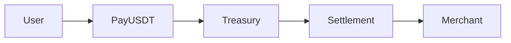

# MistyPay

> MVP Documentation Repository
> Version: 1.0
> Status: Planning & Architecture Complete

---

# Overview

MistyPay is a payment facilitation platform designed to bridge:

```text
USDT (TRC20)
↓
MistyPay Treasury
↓
VND Settlement
↓
Merchant
```

The platform focuses on:

```text
Transaction Processing

Merchant Settlement

Treasury Management

Operational Reliability

Fraud Prevention
```

---

# Current Project Status

## Phase

```text
Product Design & System Architecture
```

---

## Status

```text
Documentation Complete

Source Code Not Started
```

---

## Next Phase

```text
Sprint 1

Project Setup
Backend Foundation
Mobile Foundation
Infrastructure Setup
```

---

# Start Here

All contributors, developers and AI assistants should begin with:

```text
00_Project_Guide/
└── AI_Project_Context_v1.0.md
```

This document defines:

```text
Project Scope

Architecture Principles

Business Rules

Documentation Reading Order

Development Rules
```

---

# Documentation Structure

```text
MistyPay/

├── README.md

├── 00_Project_Guide/
│
├── 01_Product/
│
├── 02_Architecture/
│
├── 03_UX/
│
├── 04_API/
│
├── 05_Operations/
│
├── 06_Infrastructure/
│
├── 07_Testing/
│
├── 08_Compliance_Legal/
│
└── 09_Project_Management/
```

---

# Recommended Reading Order

## Step 1

Read:

```text
00_Project_Guide/
└── AI_Project_Context_v1.0.md
```

---

## Step 2

Read:

```text
01_Product/
```

Key files:

```text
PRD_v1.0.md

Product_Decisions_Log.md

User_Flow_v1.0.md

Use_Cases_v1.0.md
```

---

## Step 3

Read:

```text
02_Architecture/
```

Key files:

```text
System_Architecture_v1.0.md

Database_Design_v1.0.md

State_Machine_v1.0.md

Event_Driven_Architecture_v1.0.md
```

---

## Step 4

Read:

```text
05_Operations/
```

Key files:

```text
Business_Rules_v1.0.md

Treasury_Management_v1.0.md

Fraud_Risk_Management_v1.0.md
```

---

## Step 5

Read:

```text
04_API/
```

Key files:

```text
API_Specification_v1.0.md

API_Error_Codes_v1.0.md

Webhook_Specification_v1.0.md
```

---

# MVP Scope

## Included

```text
TRC20 USDT

Merchant Settlement

BaoKim Payout

Treasury Management

Telegram Monitoring

iOS Application
```

---

## Excluded

```text
KYC

AML

Multi-Chain

Multi-Currency

Android Release

Web Application
```

---

# Core Business Flow



---

# Core Product Principles

## Security First

```text
Protect Funds
Protect Treasury
Protect Users
```

---

## Treasury First

```text
No payout without confirmed funds.
```

---

## Auditability

```text
Every financial operation
must be traceable.
```

---

## Idempotency

```text
No duplicate payout.

No duplicate ledger entry.
```

---

# Technical Stack

## Mobile

```text
React Native
Expo
```

---

## Backend

```text
NestJS
```

---

## Database

```text
PostgreSQL
```

---

## Queue

```text
BullMQ
```

---

## Cache

```text
Redis
```

---

## Infrastructure

```text
Ubuntu VPS

Docker Compose

Nginx
```

---

# External Integrations

## Critical

```text
TronGrid

BaoKim
```

---

## Operational

```text
Telegram
```

---

## Optional

```text
PayOS
```

---

# Documentation Governance

## Source of Truth Priority

```text
1. Product_Decisions_Log.md

2. PRD_v1.0.md

3. Business_Rules_v1.0.md

4. State_Machine_v1.0.md

5. Database_Design_v1.0.md

6. API_Specification_v1.0.md
```

---

Rule:

```text
Product_Decisions_Log
always wins.
```

---

# Development Rules

Never:

```text
Change database schema
without updating
Database_Design_v1.0.md
```

---

Never:

```text
Change API contracts
without updating
API_Specification_v1.0.md
```

---

Never:

```text
Change business rules
without updating
Business_Rules_v1.0.md
```

---

All major decisions must be recorded in:

```text
Product_Decisions_Log.md
```

---

# Compliance

Completed MVP documents:

```text
Privacy Policy

Terms of Service

Legal Risk Assessment

Compliance Checklist

App Store Submission Guide
```

Located in:

```text
08_Compliance_Legal/
```

---

# Testing

Completed planning documents:

```text
Test Cases

UAT Plan

TestFlight Plan
```

Located in:

```text
07_Testing/
```

---

# Current Milestone

```text
Documentation Complete
```

---

# Next Milestone

```text
Sprint 1

Repository Setup

NestJS Setup

Prisma Setup

PostgreSQL Setup

Redis Setup

BullMQ Setup

Expo Setup
```

---

# For AI Assistants

Before generating code:

```text
1. Read README.md

2. Read AI_Project_Context_v1.0.md

3. Follow documentation reading order

4. Respect Product Decisions Log

5. Do not invent business rules
```

---

# Final Principle

For MistyPay:

```text
Product documents define intent.

Architecture documents define structure.

Business rules define behavior.

Source code implements all three.
```

---

```text
Understand the business first.

Then write the code.
```
